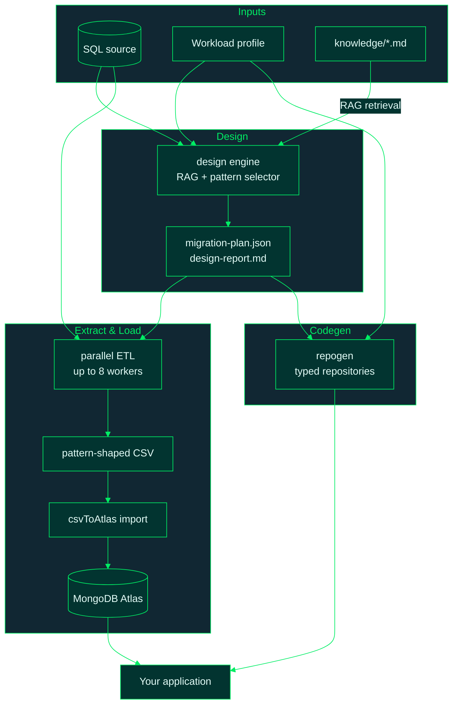

# hvyMETL

**hvyMETL** (**H**igh **V**olume **M**ongoDB **ETL**) is a RAG-driven SQL-to-MongoDB
migration toolkit. Instead of naive table-to-collection translation, hvyMETL grounds
every schema decision in a retrievable knowledge base of MongoDB design patterns and
your workload telemetry (read:write ratio, peak RPM, data growth), then runs a
parallel, pattern-aware ETL into MongoDB Atlas.

Full per-module reference documentation lives in [docs/](docs/README.md), including a
mapping of every automated pattern to MongoDB's
[Building with Patterns series](https://www.mongodb.com/company/blog/building-with-patterns-a-summary).

## How it works



More diagrams (workflow sequence, schema transforms, JSON plan structure, ETL worker
pool, merge modes): **[docs/diagrams.md](docs/diagrams.md)**.

1. **Knowledge base + RAG** (`knowledge/`, `src/rag/`): eleven curated pattern
   documents (Bucket, Outlier, Extended Reference, Computed, Subset, Attribute,
   Polymorphic, Schema Versioning, Tree, Pre-allocation, Embed-vs-Reference) with
   applicability rules and verified code blocks. Retrieval is deterministic BM25 by
   default; set `MONGODB_MODEL_KEY` (MongoDB Model Key from Atlas) for hybrid BM25 +
   Voyage 4 search merged with Reciprocal Rank Fusion, or `OPENAI_API_KEY` alone
   for vector-only retrieval.
2. **Workload profiles** (`src/profiles/`): eight presets (catalog, cms, iot, mobile,
   personalization, realtime-analytics, single-view, ledger) selectable at runtime,
   each carrying telemetry, preferred patterns, write concern, and pool tuning.
   `--custom` accepts exact numbers instead.
3. **Design engine** (`src/design/`): introspects tables, foreign keys, row counts,
   and child-count skew, then deterministically maps (structure x telemetry) to
   patterns. Output: `migration-plan.json` ($jsonSchema validators, index specs,
   deterministic `_id` rules) and `design-report.md` (per-decision justification
   citing the knowledge source).
4. **Parallel ETL** (`src/etl/`): up to 8 worker threads extract non-overlapping
   primary-key ranges (window-aligned time ranges for bucketed collections), shaping
   rows inside SQL: pre-joined Extended Reference columns, initialized Computed
   counters, capped Subset arrays, grouped Bucket documents. Streams to CSV with O(1)
   memory. `--dry-run` extracts exactly 3 chunks of 1,000 records with validation logs.
5. **csvToAtlas import** ([cvsToAtlas](https://github.com/7erry/cvsToAtlas)): requires `CSV_TO_ATLAS_PATH` in `.env`; analysis (`--analyze`), join/embed merging,
   and concurrency-safe bulk upserts keyed on the deterministic `_id`, so parallel
   chunk imports are idempotent and race-free.
6. **Repository generator** (`src/repogen/`): emits typed repository modules using
   atomic modifiers only (`$inc`, `$push` + `$position` + `$slice`, bucket upserts)
   plus a connection module tuned to the profile.

**What each output is for:** see **[docs/15-migration-artifacts.md](docs/15-migration-artifacts.md)**
— migration plan, design report, the three RAG production prompts (schema design
architect, parallel ETL generator, repository layer), and generated repository code.

## Setup

```bash
npm install
npm run build
cp .env.example .env
```

| Variable | Required for | Description |
| --- | --- | --- |
| `CSV_TO_ATLAS_PATH` | ETL, import, `run-all-examples` | Path to [cvsToAtlas](https://github.com/7erry/cvsToAtlas) clone |
| `MONGODB_URI` | Atlas import, `run-all-examples` | Cluster connection string |
| `MONGODB_MODEL_KEY` | Hybrid RAG (optional) | MongoDB Model Key; enables BM25 + Voyage 4 + RRF |
| `OPENAI_API_KEY` | Vector-only RAG (optional) | Used only when Model Key is unset |

Requires Node.js 20+. Design and unit tests run offline; ETL needs `CSV_TO_ATLAS_PATH` set (validated at runtime).

## Web UI (optional)

MongoDB-branded **Migration Studio** for visual ER diagrams, instant DDL import,
templates (Laravel, Django, Twitter, …), and AI-powered migration export. The CLI
remains fully available.

```bash
npm run dev:ui      # http://localhost:5173 (API on :3847)
npm run start:ui    # production build on http://localhost:3847
```

See **[web/README.md](web/README.md)** (screenshots & how-to) and **[docs/13-web-ui.md](docs/13-web-ui.md)** (API reference).

## Run all examples against Atlas

With `MONGODB_URI` and `CSV_TO_ATLAS_PATH` set in `.env`, one command seeds, designs, extracts, imports, and
validates **all seven example domains** (~50 seconds on a typical connection):

```bash
npm run run-all-examples
```

Each domain imports into an isolated database (`hvymetl_catalog`, `hvymetl_iot`, …)
so collection names never collide. Validation checks document counts against the ETL
manifest, duplicate `_id` absence, `schemaVersion` presence, and bucket integrity
(`sum(count)` in Atlas === source SQL row count).

Full reference: **[docs/11-run-all-examples.md](docs/11-run-all-examples.md)**.

## End-to-end walkthrough

```bash
# 1. Build the seven example SQLite databases (~250k rows, deterministic).
npm run seed-examples

# 2. Design: pick a source and a workload profile (omit --profile for a menu).
npm run hvymetl -- design --source examples/iot.db --profile iot --out out/iot

# 3. Inspect out/iot/design-report.md, then dry-run the ETL (safe gate).
npm run hvymetl -- etl --plan out/iot/migration-plan.json --out out/iot --dry-run

# 4. Full extraction with 8 parallel workers.
npm run hvymetl -- etl --plan out/iot/migration-plan.json --out out/iot

# 5. Import the chunked CSVs into Atlas (idempotent upserts by _id).
npm run import-cli -- out/iot/csv/sensorReadings.chunk0.csv out/iot/csv/sensorReadings.chunk1.csv sensorReadings

# 6. Generate the concurrency-safe repository layer.
npm run hvymetl -- repogen --plan out/iot/migration-plan.json --out out/iot/repositories

# Optional: emit the three RAG-grounded production prompts for LLM/Cursor use.
npm run hvymetl -- prompt --source examples/iot.db --profile iot
```

`out/<name>/etl-manifest.json` lists every produced CSV with the exact import
command per collection.

## The example domains

| Database | Default profile | What it exercises |
| --- | --- | --- |
| `examples/catalog.db` | `catalog` (95:5) | Extended Reference, Subset, Outlier (skewed reviews), Attribute (EAV), Computed, Tree |
| `examples/cms.db` | `cms` (90:10) | Polymorphic blocks, Tree pages, embeds, junction tags |
| `examples/iot.db` | `iot` (10:90) | Bucket (60k readings), Computed counters, references |
| `examples/mobile.db` | `mobile` (80:20) | Bucket events, Subset sessions, Extended Reference |
| `examples/personalization.db` | `personalization` (70:30) | Computed affinities, Attribute traits, junction segments |
| `examples/analytics.db` | `realtime-analytics` (30:70) | Bucket firehose, Pre-allocation rollups, Computed |
| `examples/singleview.db` | `single-view` (85:15) | Customer-360 merge, Subset orders, Outlier mega accounts |

Any profile can be applied to any source: `--profile ledger` against `catalog.db`
produces a reference-first plan with `w: "majority"` durability.

## Workload profiles

Run `npm run hvymetl -- profiles` to see all eight presets with their telemetry,
preferred patterns, write concern, and pool settings. Custom telemetry:

```bash
npm run hvymetl -- design --source my.db --custom --read-write 20:80 --rpm 250000 --growth 1TB/week --critical
```

## Concurrency-safety guarantees

- **Non-overlapping range splits**: workers extract half-open `[start, end)` key
  ranges; no row is read twice, none missed.
- **Window-aligned time splits**: bucket chunk boundaries snap to whole windows, so
  no two workers can produce partial versions of the same bucket document.
- **Deterministic `_id`**: derived from SQL primary keys (`pk` or `pk1|pk2` or
  `groupKey|windowStart`), making every import an idempotent `replaceOne` upsert.
- **Atomic repositories**: generated code uses `$inc`, `$push`+`$slice`+`$position`,
  and `$setOnInsert` upserts exclusively; read-modify-write loops do not exist.

## Tests

```bash
npm test                              # unit tests (offline)
npm run validate-hybrid-rag           # live hybrid RAG check (needs MONGODB_MODEL_KEY)
npm run validate-csv-to-atlas         # verify CSV_TO_ATLAS_PATH + csvToAtlas smoke test
npm run run-all-examples              # full pipeline + Atlas validation (needs MONGODB_URI)
```

Unit tests cover the pattern selector, range splitter, CSV shaper, RRF fusion, and
Model API base URL routing. Hybrid RAG validation calls the live Model API when a key
is configured — see [docs/12-validate-hybrid-rag.md](docs/12-validate-hybrid-rag.md).

## csvToAtlas CLI reference

hvyMETL wraps the external [cvsToAtlas](https://github.com/7erry/cvsToAtlas) tool:

```bash
npm run import-cli -- <file.csv...> [collection] [flags]
```

See the [cvsToAtlas README](https://github.com/7erry/cvsToAtlas) for `--analyze`, `--join`, `--embed`, `--drop`, and column naming rules. hvyMETL adds `--db <name>` (sets `MONGODB_DB` for the external CLI).

Files sharing identical headers are treated as partitions of one dataset (the
parallel ETL's chunk output) and upserted concurrently-safely by `_id`.
