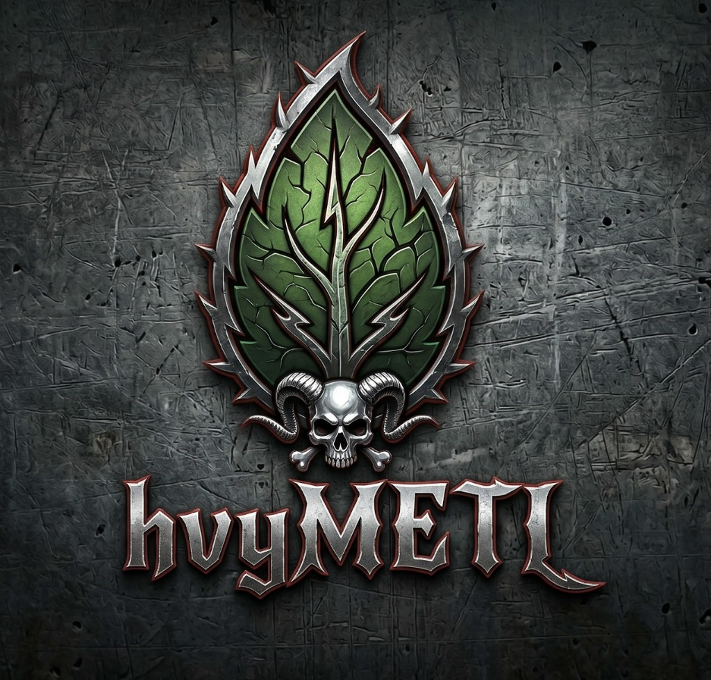
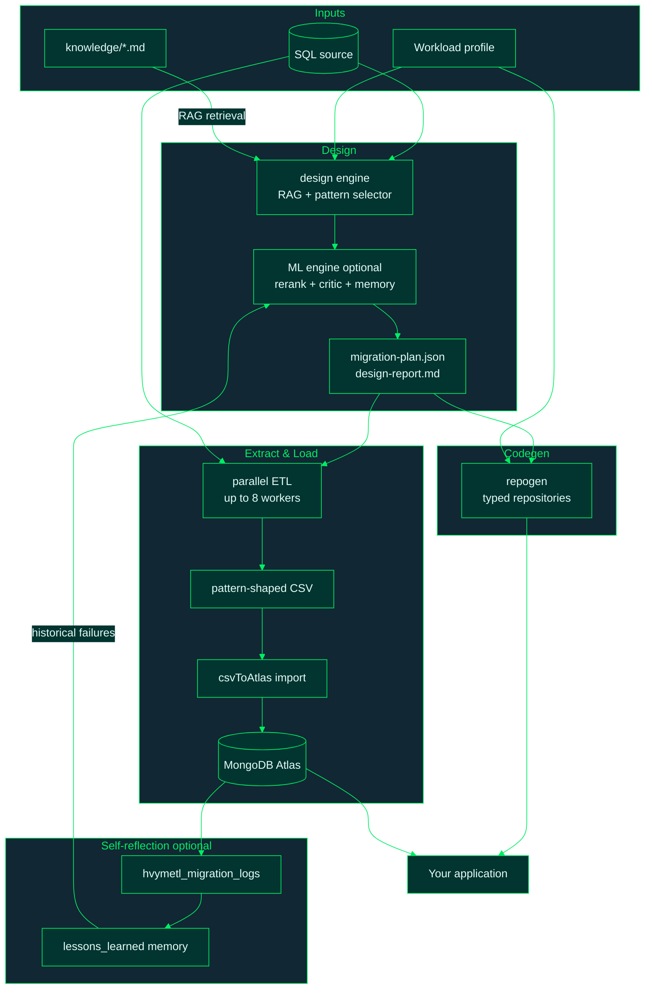

<h1>
  
  hvyMETL
</h1>

**hvyMETL** (**H**igh **V**olume **M**ongoDB **ETL**) is a RAG-driven SQL-to-MongoDB
migration toolkit. Instead of naive table-to-collection translation, hvyMETL grounds
every schema decision in a retrievable knowledge base of MongoDB design patterns and
your workload telemetry (read:write ratio, peak RPM, data growth), then runs a
parallel, pattern-aware ETL into MongoDB Atlas.

**Release:** `1.0.0`

An optional **ML engine** (`src/ml_engine/`) adds telemetry-aware reranking
([Voyage rerank-2.5](https://docs.voyageai.com/reference/reranker-api) when
`MONGODB_MODEL_KEY` is set), a predictive performance critic before ETL handoff, and
an **in-context self-reflection loop** that logs migration outcomes and writes
*lessons learned* back into vector memory so future runs avoid past mistakes.

Full per-module reference documentation lives in [docs/](docs/README.md), including a
mapping of every automated pattern to MongoDB's
[Building with Patterns series](https://www.mongodb.com/company/blog/building-with-patterns-a-summary).

## How it works



More diagrams (workflow sequence, schema transforms, JSON plan structure, ETL worker
pool, merge modes): **[docs/diagrams.md](docs/diagrams.md)**.

**Full step-by-step guide:** **[docs/16-pipeline-steps.md](docs/16-pipeline-steps.md)** —
purpose, outputs, commands, and pipeline wiring for all six stages:

| # | Stage | Primary output |
| --- | --- | --- |
| 1 | Knowledge base + RAG | Retrieved pattern chunks (report / prompts) |
| 2 | Workload profiles | Telemetry + tuning on `migration-plan.json` |
| 3 | Design engine | `migration-plan.json`, `design-report.md` |
| 4 | Parallel ETL | `csv/*.csv`, `etl-manifest.json` |
| 5 | csvToAtlas import | Documents in MongoDB Atlas |
| 6 | Codegen (`repogen`) | Typed repositories + connection module + `ensureIndexes` (13 languages) |

Artifact purposes (plan, report, RAG prompts): **[docs/15-migration-artifacts.md](docs/15-migration-artifacts.md)**.

## ML engine (optional)

The ML engine upgrades the design stage from static RAG + heuristics to a
**telemetry-aware, self-improving** pipeline. Full reference:
**[docs/17-ml-engine.md](docs/17-ml-engine.md)**. Which models are used (and what is *not* a chat LLM):
**[docs/19-llm-and-models.md](docs/19-llm-and-models.md)**.

| Capability | What it does |
| --- | --- |
| **Telemetry reranker** | After bi-encoder retrieval (top 15), rescore patterns against workload telemetry (top 3). Uses [Voyage rerank-2.5](https://docs.voyageai.com/reference/reranker-api) when `MONGODB_MODEL_KEY` is set; local Xenova cross-encoder offline. |
| **Performance critic** | Predicts cache-miss and IOPS risk from schema shape + telemetry before ETL. Rejects and regenerates (max 2 loops) with critic notes. ONNX model optional. |
| **Lessons-learned memory** | Persists lessons in MongoDB (`hvymetl_lessons_learned` when `MONGODB_URI` is set; in-memory otherwise). Retrieves via in-process cosine/BM25 — not Atlas `$vectorSearch` yet. Injects matches into LLM prompts under **HISTORICAL LESSONS LEARNED FROM PAST MIGRATIONS**. |
| **Feedback loop** | Logs decisions to `hvymetl_migration_logs`, fetches post-migration Atlas metrics, upserts new lessons when performance breaches thresholds. Cron/serverless safe. |

```typescript
import { designFromModelWithMlEngine } from './ml_engine/pipelinePatch.js';

const { plan, designReport, ml } = await designFromModelWithMlEngine(model, profile, 'knowledge');
// ml.rerankBackend        → 'voyage' | 'xenova' | 'heuristic'
// ml.lessonChunks         → historical failures pulled into prompts
// ml.migrationLogIds      → logged for post-ETL reflection
```

```typescript
// After csvToAtlas import — fire-and-forget reflection (cron-safe)
import { scheduleReflection } from './ml_engine/feedbackCollector.js';
scheduleReflection(migrationId, { clusterId: 'my-atlas-cluster' });
```

```bash
# Stub Atlas metrics for local testing
HVYMETL_ATLAS_STUB_MODE=degraded npm run build
HVYMETL_SCHEDULE_REFLECTION=1   # auto-reflect after ML design
```

**Lessons-learned storage:** MongoDB is the durable store when `MONGODB_URI` is
configured (collection `hvymetl_lessons_learned`, default DB `hvymetl_memory`). Without
it, lessons live in process memory only. Similarity search runs in Node.js (cosine on
stored embeddings or BM25) — not Atlas Vector Search. Details:
**[docs/17-ml-engine.md § Lessons-learned memory](docs/17-ml-engine.md#lessons-learned-memory-storage-vs-retrieval)**.

## Prerequisites

Install these first:

| Requirement | Version / Notes | How to check |
| --- | --- | --- |
| **Node.js** | `20` or newer | `node --version` |
| **npm** | Comes with Node.js | `npm --version` |
| **Git** | Needed to clone this repository | `git --version` |
| **Python 3** | Optional, only needed for example/mock CSV generators | `python3 --version` |
| **MongoDB Atlas URI** | Optional for local design; required for Atlas import and pipeline persistence | Set `MONGODB_URI` in `.env` |
| **csvToAtlas clone** | Optional for design; required for ETL/import/full pipeline | Set `CSV_TO_ATLAS_PATH` in `.env` |
| **MongoDB Model Key or OpenAI key** | Optional; design works offline with BM25 when no key is set | Set `MONGODB_MODEL_KEY` or `OPENAI_API_KEY` in `.env` |

The fastest local experience only needs Node.js, npm, and Git. Schema import, ER
diagrams, rule-based design, unit tests, and most documentation workflows run offline.
Atlas import, full pipeline runs, and feedback persistence require `MONGODB_URI` and
`CSV_TO_ATLAS_PATH`.

If Node.js was upgraded after dependencies were installed, rebuild native packages:

```bash
npm rebuild better-sqlite3
```

## Quick Start

```bash
# 1. Install dependencies
npm install

# 2. Build the TypeScript project
npm run build

# 3. Create local environment file
cp .env.example .env
```

Start the Migration Studio web UI:

```bash
npm run dev:ui
```

Then open **http://localhost:3847**.

| Variable | Required for | Description |
| --- | --- | --- |
| `CSV_TO_ATLAS_PATH` | ETL, import, `run-all-examples` | Path to [cvsToAtlas](https://github.com/7erry/cvsToAtlas) clone |
| `MONGODB_URI` | Atlas import, ML feedback loop | Cluster connection string; persists `hvymetl_*` metadata when set |
| `MONGODB_MODEL_KEY` | Hybrid RAG + ML reranker (optional) | MongoDB Model Key; BM25 + Voyage 4 + RRF + [rerank-2.5](https://docs.voyageai.com/reference/reranker-api) |
| `OPENAI_API_KEY` | Vector-only RAG (optional) | Used only when Model Key is unset |
| `HVYMETL_SCHEDULE_REFLECTION` | ML feedback loop (optional) | Set to `1` to auto-schedule post-migration reflection (CLI ML design) |
| `HVYMETL_ATLAS_STUB_MODE` | ML local testing (optional) | `healthy` or `degraded` stub Atlas metrics |
| `HVYMETL_MEMORY_DB` | ML memory + pipeline archive (optional) | Database for `hvymetl_migration_logs`, `hvymetl_lessons_learned`, `hvymetl_pipeline_executions` (default: `hvymetl_memory`) |
| `HVYMETL_CSV_SOURCE` | Web UI full pipeline (optional) | Default directory of per-table CSV exports |

## Web UI (optional)

MongoDB-branded **Migration Studio** for visual ER diagrams, instant DDL import,
templates (Laravel, Django, Twitter, …), and **Run Full Pipeline** — ML-enhanced
design, CSV shaping with embedded arrays, csvToAtlas import, and automatic
persistence of each run to MongoDB (`hvymetl_pipeline_executions`). The CLI
remains fully available.

Developer **Embed Overrides** let teams provide DDL-only design intent before CSV or
live stats are available: enter max child cardinality for FK relationships or
explicitly force linked tables to embed into one collection. The same override map is
honored by design, explain, export, and full pipeline APIs.

```bash
npm run dev:ui      # http://localhost:3847 (API + Vite hot reload)
npm run start:ui    # production build on http://localhost:3847
```

See **[web/README.md](web/README.md)** (screenshots & how-to) and
**[docs/13-web-ui.md](docs/13-web-ui.md)** (API reference, MongoDB persistence).

Managers and finance stakeholders can use the Manager View to compare migration cost
scenarios before production cutover: Atlas tier sizing, RAM fit, hot vs archived
storage, per-collection retention years, growth projections, and review sign-off for
high-impact design patterns. See **[docs/20-manager.md](docs/20-manager.md)** for the
cost-control workflow and how hvyMETL prevents expensive SQL-to-MongoDB architecture
mistakes.

## Run all examples against Atlas

With `MONGODB_URI` and `CSV_TO_ATLAS_PATH` set in `.env`, one command seeds, designs, extracts, imports, and
validates **all seven example domains** (~50 seconds on a typical connection):

```bash
npm run run-all-examples
```

Each domain imports into an isolated database (`hvymetl_catalog`, `hvymetl_iot`, …)
so collection names never collide. Validation checks document counts against the ETL
manifest, duplicate `_id` absence, `schemaVersion` presence, and bucket integrity
(`sum(count)` in Atlas === source SQL row count).

Full reference: **[docs/11-run-all-examples.md](docs/11-run-all-examples.md)**.

## End-to-end walkthrough

```bash
# 1. Build the seven example SQLite databases (~250k rows, deterministic).
npm run seed-examples

# 2. Design: pick a source and a workload profile (omit --profile for a menu).
npm run hvymetl -- design --source examples/iot/iot.db --profile iot --out out/iot

# 3. Inspect out/iot/design-report.md, then dry-run the ETL (safe gate).
npm run hvymetl -- etl --plan out/iot/migration-plan.json --out out/iot --dry-run

# 4. Full extraction with 8 parallel workers.
npm run hvymetl -- etl --plan out/iot/migration-plan.json --out out/iot

# 5. Import the chunked CSVs into Atlas (idempotent upserts by _id).
npm run import-cli -- out/iot/csv/sensorReadings.chunk0.csv out/iot/csv/sensorReadings.chunk1.csv sensorReadings

# 6. Generate the concurrency-safe repository layer (pick your driver language).
npm run hvymetl -- repogen --plan out/iot/migration-plan.json --out out/iot/repositories --lang node
# --lang: c, cpp, csharp, go, java, kotlin, node, php, python, ruby, rust, scala, swift

# Optional: emit the three RAG-grounded production prompts for LLM/Cursor use.
npm run hvymetl -- prompt --source examples/iot/iot.db --profile iot
```

`out/<name>/etl-manifest.json` lists every produced CSV with the exact import
command per collection.

## Supported SQL dialects

Eleven dialects are recognized for schema import; only **SQLite** has a live database
adapter (CLI + file upload). All others use **DDL paste** (web UI or API). Row data in
the web pipeline comes from **CSV exports** per table.

| Tier | Dialects |
| --- | --- |
| Live file | SQLite |
| DDL paste | PostgreSQL, MySQL, SQL Server, ClickHouse, Oracle, Db2, CockroachDB, Aurora (PG/MySQL), Spanner |

Full matrix, parser limits, and examples: **[docs/18-sql-dialects.md](docs/18-sql-dialects.md)**.

## The example domains

| Database | Default profile | What it exercises |
| --- | --- | --- |
| `examples/catalog/catalog.db` | `catalog` (95:5) | Extended Reference, Subset, Outlier (skewed reviews), Attribute (EAV), Computed, Tree |
| `examples/cms/cms.db` | `cms` (90:10) | Polymorphic blocks, Tree pages, embeds, junction tags |
| `examples/iot/iot.db` | `iot` (10:90) | Bucket (60k readings), Computed counters, references |
| `examples/mobile/mobile.db` | `mobile` (80:20) | Bucket events, Subset sessions, Extended Reference |
| `examples/personalization/personalization.db` | `personalization` (70:30) | Computed affinities, Attribute traits, junction segments |
| `examples/analytics/analytics.db` | `realtime-analytics` (30:70) | Bucket firehose, Pre-allocation rollups, Computed |
| `examples/singleview/singleview.db` | `single-view` (85:15) | Customer-360 merge, Subset orders, Outlier mega accounts |

Each domain lives under `examples/<domain>/` with `<domain>.sql`,
`<domain>_generator.py`, and a pre-arranged **`hvymetl-diagram-*.json`** ER export
for Migration Studio. SQLite databases are built with `npm run seed-examples`;
per-table CSVs are generated locally (not in git) with e.g.
`cd examples/iot && python iot_generator.py`. See **[docs/10-examples.md](docs/10-examples.md)**.

Any profile can be applied to any source: `--profile ledger` against `catalog.db`
produces a reference-first plan with `w: "majority"` durability.

## Workload profiles

Run `npm run hvymetl -- profiles` to see all eight presets with their telemetry,
preferred patterns, write concern, and pool settings. Custom telemetry:

```bash
npm run hvymetl -- design --source my.db --custom --read-write 20:80 --rpm 250000 --growth 1TB/week --critical
```

## Concurrency-safety guarantees

- **Non-overlapping range splits**: workers extract half-open `[start, end)` key
  ranges; no row is read twice, none missed.
- **Window-aligned time splits**: bucket chunk boundaries snap to whole windows, so
  no two workers can produce partial versions of the same bucket document.
- **Deterministic `_id`**: derived from SQL primary keys (`pk` or `pk1|pk2` or
  `groupKey|windowStart`), making every import an idempotent `replaceOne` upsert.
- **Atomic repositories**: generated code uses `$inc`, `$push`+`$slice`+`$position`,
  and `$setOnInsert` upserts exclusively; read-modify-write loops do not exist.

## Tests

```bash
npm test                              # unit tests (offline)
npm run validate-hybrid-rag           # live hybrid RAG check (needs MONGODB_MODEL_KEY)
npm run validate-csv-to-atlas         # verify CSV_TO_ATLAS_PATH + csvToAtlas smoke test
npm run run-all-examples              # full pipeline + Atlas validation (needs MONGODB_URI)
```

Unit tests cover the pattern selector, range splitter, CSV shaper, RRF fusion,
Model API base URL routing, ML reranker/critic, Voyage rerank client, and the
lessons-learned feedback loop. Hybrid RAG validation calls the live Model API when a
key is configured — see [docs/12-validate-hybrid-rag.md](docs/12-validate-hybrid-rag.md).
ML engine details: [docs/17-ml-engine.md](docs/17-ml-engine.md).

## csvToAtlas CLI reference

hvyMETL wraps the external [cvsToAtlas](https://github.com/7erry/cvsToAtlas) tool:

```bash
npm run import-cli -- <file.csv...> [collection] [flags]
```

See the [cvsToAtlas README](https://github.com/7erry/cvsToAtlas) for `--analyze`, `--join`, `--embed`, `--drop`, and column naming rules. hvyMETL adds `--db <name>` (sets `MONGODB_DB` for the external CLI).

Files sharing identical headers are treated as partitions of one dataset (the
parallel ETL's chunk output) and upserted concurrently-safely by `_id`.

## License

Copyright (c) 2026 Terry Walters. Licensed under the
[Business Source License 1.1](LICENSE) (BUSL-1.1). The Licensed Work converts to
[Apache License 2.0](https://www.apache.org/licenses/LICENSE-2.0) on the Change Date
(2026-06-10). Non-production and internal evaluation use is permitted under the
Additional Use Grant.
