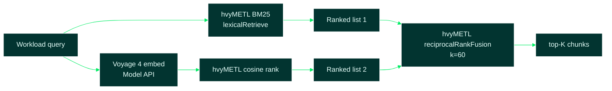

# 03 — Knowledge Base & RAG Retrieval

Sources: [`knowledge/`](../knowledge/), [`src/rag/chunker.ts`](../src/rag/chunker.ts),
[`src/rag/retrieval.ts`](../src/rag/retrieval.ts),
[`src/rag/retriever.ts`](../src/rag/retriever.ts),
[`src/rag/voyage.ts`](../src/rag/voyage.ts),
[`src/rag/voyageReranker.ts`](../src/rag/voyageReranker.ts),
[`src/rag/embeddings.ts`](../src/rag/embeddings.ts),
[`src/rag/promptBundle.ts`](../src/rag/promptBundle.ts),
[`src/ml_engine/memoryRetrieval.ts`](../src/ml_engine/memoryRetrieval.ts)

## 1. High-Level Summary

The RAG layer grounds the toolkit's schema decisions in concrete source material
instead of generic LLM training data. Fourteen curated markdown documents covering
the [MongoDB Manual Schema Design Patterns](https://www.mongodb.com/docs/manual/data-modeling/design-patterns/)
and the Building with Patterns series, each with applicability thresholds and
verified code blocks, are chunked at heading boundaries and ranked against a
workload-derived query. By default retrieval is **BM25 only** (no API keys, fully offline).
When `MONGODB_MODEL_KEY` is set, the retriever runs **hybrid search**: BM25 for exact keyword tokens plus
[Voyage 4](https://docs.voyageai.com/docs/embeddings) embeddings for conceptual
context, with scores merged via **Reciprocal Rank Fusion (RRF)**. The top chunks are
cited in the design report and assembled into three
"hardened production prompts" for LLM/Cursor use. The pattern content itself is
grounded in MongoDB's
[Building with Patterns series](https://www.mongodb.com/company/blog/building-with-patterns-a-summary).

## 2. Technical Details & Signature

### `chunkMarkdown(sourceFile: string, markdown: string): KnowledgeChunk[]`

| Name | Type | Required | Default | Description |
| --- | --- | --- | --- | --- |
| `sourceFile` | `string` | required | — | File name used for chunk attribution, e.g. `"bucket.md"` |
| `markdown` | `string` | required | — | Full markdown text of one knowledge document |

**Returns:** `KnowledgeChunk[]` where each chunk is one `##` section, carrying a
heading path like `"Bucket Pattern > Applicability rules"`.

### `loadKnowledgeBase(knowledgeDir: string): KnowledgeChunk[]`

Reads every `*.md` in the folder and flat-maps it through `chunkMarkdown`.

### `lexicalRetrieve(chunks, query, topK): ScoredChunk[]`

Classic BM25 (`k1 = 1.2`, `b = 0.75`): a chunk scores higher when it contains *rare*
query terms *many times*, with diminishing returns, normalized by chunk length.
Fully deterministic and dependency-free, so the toolkit always works offline.

### `hybridRetrieve(voyageProvider, chunks, query, topK): Promise<ScoredChunk[]>`

When `MONGODB_MODEL_KEY` is set:

1. Rank candidates with **BM25** (`lexicalRetrieve`).
2. Rank candidates with **Voyage 4** (`embedDocuments` + `embedQuery`, cosine similarity).
3. Fuse both ranked lists with **Reciprocal Rank Fusion**:

   `RRF_score(chunk) = Σ 1 / (k + rank_i)` across each list (default `k = 60`).

Chunks that match both exact pattern keywords *and* semantic workload context rise to
the top without normalizing incompatible score scales.

### `reciprocalRankFusion(rankedLists, k?): ScoredChunk[]`

Pure function in [`src/rag/retriever.ts`](../src/rag/retriever.ts); unit-tested in
`retriever.test.ts`. Merges any number of ranked lists. See
[Reciprocal Rank Fusion — whose implementation?](#reciprocal-rank-fusion--whose-implementation)
below for what runs RRF and what does not.

### Reciprocal Rank Fusion — whose implementation?

hvyMETL uses the **standard Reciprocal Rank Fusion (RRF) algorithm** from information
retrieval research — the score for each chunk is the sum of `1 / (k + rank)` across
every ranked list where it appears (1-based rank, default **`k = 60`**, the widely
used constant from the original RRF literature). The fusion itself is **implemented
entirely in hvyMETL**; it is **not** delegated to MongoDB Atlas hybrid search, Voyage
AI's APIs, or a third-party npm package.

| Component | Provided by | Role in hybrid retrieval |
| --- | --- | --- |
| **BM25 ranking** | hvyMETL (`lexicalRetrieve` in `retriever.ts`) | Leg 1 — exact keyword / pattern-token matches |
| **Voyage 4 embeddings** | Voyage via [MongoDB Model API](https://www.mongodb.com/docs/voyageai/api-and-clients/) (or direct Voyage endpoint when using a `pa-…` key) | Leg 2 — semantic similarity vectors |
| **Cosine ranking** | hvyMETL (`cosineSimilarity` in `retriever.ts`) | Ranks chunks by query–document vector similarity |
| **RRF merge** | hvyMETL (`reciprocalRankFusion` in `retriever.ts`) | Fuses the two ranked lists in-process after both legs complete |

**What `MONGODB_MODEL_KEY` does:** it enables the **embedding API call** for the
semantic leg. MongoDB does not perform RRF on hvyMETL's behalf — the Model Key is
only the credential path to Voyage 4 embeddings.

**What is not used for RRF:**

- MongoDB Atlas **`$vectorSearch`** or Atlas Search hybrid fusion
- A Voyage-side rank-fusion endpoint
- Elasticsearch, LangChain, or other library RRF helpers

Flow when hybrid retrieval is active:



**When RRF is not used:**

| `.env` configuration | Retrieval path |
| --- | --- |
| No API keys (default) | BM25 only — fully offline |
| `OPENAI_API_KEY` only (no Model Key) | OpenAI embeddings + cosine rank only — no RRF |
| `MONGODB_MODEL_KEY` set | Hybrid BM25 + Voyage 4 → **RRF** |
| Hybrid API failure | Falls back to BM25 only (console warning) |

Implementation reference:

```typescript
// src/rag/retriever.ts — both legs ranked locally, then fused in-process
const lexicalRanked = lexicalRetrieve(chunks, query, candidateCount);
const semanticRanked = /* Voyage embed + cosineSimilarity sort */;
return reciprocalRankFusion([lexicalRanked, semanticRanked]).slice(0, topK);
```

Each candidate list contributes up to `topK × 3` entries before fusion
(`HYBRID_CANDIDATE_MULTIPLIER`), so chunks with strong but not top-1 scores on both
legs can still surface after RRF.

### `vectorRetrieve(provider, chunks, query, topK): Promise<ScoredChunk[]>`

OpenAI-compatible vector path used **only when `MONGODB_MODEL_KEY` is unset** and
`OPENAI_API_KEY` is set. Ranks by cosine similarity.

### `retrieve(chunks, query, topK, config): Promise<ScoredChunk[]>`

Strategy priority (see `retrieval.ts`):

| Condition | Strategy |
| --- | --- |
| `MONGODB_MODEL_KEY` set | Hybrid BM25 + Voyage 4 → RRF |
| Only `OPENAI_API_KEY` set | Vector cosine similarity |
| No keys | BM25 only (default) |

API failures fall back to BM25 with a console warning.

### `retrieveWithLessonsLearned(chunks, query, topK, config, options?): Promise<RetrievalWithMemoryResult>`

Dual-space retrieval used by the [ML engine](17-ml-engine.md). Runs **in parallel**:

1. Standard pattern retrieval (`retrieve`) — bi-encoder / hybrid RRF.
2. `lessons_learned` memory query (`retrieveLessonsLearned`) — past migration failures stored in `hvymetl_lessons_learned`.

Returns `{ patternChunks, lessonChunks, historicalLessonsMarkdown }`. The markdown block is passed to `buildPromptBundle({ historicalLessonsMarkdown })` under the heading **HISTORICAL LESSONS LEARNED FROM PAST MIGRATIONS (DO NOT REPEAT THESE MISTAKES)**.

Lessons are **persisted in MongoDB** (`hvymetl_lessons_learned`) when `MONGODB_URI` is
set; otherwise an in-memory store is used. Retrieval loads documents from that store
and ranks them in-process (cosine on stored embeddings or BM25) — **not** Atlas
`$vectorSearch`. See [17-ml-engine.md § storage vs retrieval](17-ml-engine.md#lessons-learned-memory-storage-vs-retrieval).

When `MONGODB_MODEL_KEY` is set, the ML reranker uses [Voyage rerank-2.5](https://docs.voyageai.com/reference/reranker-api) (not Xenova) to rescore the top bi-encoder candidates against telemetry. See [17-ml-engine.md](17-ml-engine.md).

### `createRetrievalConfigFromEnv(): RetrievalConfig`

Loads `{ openaiProvider, voyageProvider }` from `.env`.

### `describeRetrievalStrategy(config): string`

Returns the log line printed by `design` and `prompt` commands.

### `npm run validate-hybrid-rag`

Live integration check for the hybrid path. See [12-validate-hybrid-rag.md](12-validate-hybrid-rag.md).

### Environment variables

| Name | Required | Default | Description |
| --- | --- | --- | --- |
| `MONGODB_MODEL_KEY` | optional | — | MongoDB Model Key (Atlas); enables hybrid BM25 + Voyage 4 + RRF |
| `MONGODB_MODEL_EMBEDDING_MODEL` | optional | `voyage-4` | Voyage 4 series model |
| `MONGODB_MODEL_BASE_URL` | optional | auto (`al-` → `ai.mongodb.com`) | Override Model API endpoint |
| `OPENAI_API_KEY` | optional | — | Vector-only retrieval when Model Key absent |
| `OPENAI_BASE_URL` | optional | `https://api.openai.com/v1` | OpenAI-compatible `/embeddings` endpoint |
| `EMBEDDING_MODEL` | optional | `text-embedding-3-small` | OpenAI embedding model |

### `buildPromptBundle(input: PromptBundleInput): PromptFile[]`

| Name | Type | Required | Description |
| --- | --- | --- | --- |
| `input.profile` | `WorkloadProfile` | required | Telemetry rendered into every prompt |
| `input.ddl` | `string` | required | Legacy SQL DDL dumped from the real source |
| `input.retrievedChunks` | `ScoredChunk[]` | required | Cited RAG context, highest score first |
| `input.historicalLessonsMarkdown` | `string` | optional | Lessons from `lessons_learned` memory (ML feedback loop) |

**Returns:** three `{ fileName, content }` markdown prompts:
`1-schema-design-architect.md`, `2-parallel-etl-generator.md`,
`3-repository-layer.md`.

### `buildRetrievalQuery(profile: WorkloadProfile): string`

Combines the profile label, read/write direction, telemetry numbers, and preferred
pattern names into one query string so both lexical and vector retrieval surface the
right documents.

## 3. Edge Cases & Error Handling

- **No API keys (default):** retrieval is BM25-only. The CLI reports
  `Retrieval strategy: lexical BM25 (no API key configured)`.
- **MongoDB Model Key takes precedence:** when both `MONGODB_MODEL_KEY` and
  `OPENAI_API_KEY` are set, hybrid RRF runs; OpenAI is ignored until the model key
  is removed. Legacy `VOYAGE_API_KEY` is still accepted as a fallback alias.
- **Hybrid API failure:** logs `Hybrid retrieval failed (...); falling back to lexical BM25.`
- **OpenAI-only API failure:** logs `Vector retrieval failed (...); falling back to lexical BM25.`
- **Out-of-order embedding responses:** the provider re-sorts response items by
  `index` before returning, guarding against APIs that batch asynchronously.
- **Zero-score chunks** are filtered out of BM25 results — a query with no overlap
  returns fewer than `topK` chunks rather than noise.
- **Token edge:** `tokenize` keeps `$` so MongoDB operator names like `$inc` and
  `$lookup` are searchable terms.

## 4. Code Breakdown

1. **Chunking at `##` boundaries** (`chunker.ts`) keeps each chunk on a single idea —
   "when to use", "anti-pattern guard", "index specs" — which is the right retrieval
   granularity for grounding one schema decision.
2. **Document frequency first** (`retriever.ts`): BM25 needs to know how many chunks
   contain each term (rarity = weight), so the retriever builds a `Map` of document
   frequencies before scoring any chunk.
3. **Length normalization** prevents long chunks from winning just by containing more
   words: the `1 - b + b * (len / avgLen)` denominator term scales term frequency by
   how unusually long the chunk is.
4. **Voyage query/document types** (`voyage.ts`): chunks embed with
   `input_type: "document"`; the workload query uses `input_type: "query"` per
   [Voyage retrieval guidance](https://docs.voyageai.com/docs/embeddings).
5. **RRF avoids score-scale problems** (`retriever.ts`): BM25 scores (unbounded) and
   cosine similarity (0–1) are never added directly — only ranks contribute.
6. **The provider is an interface, not a client** (`embeddings.ts` / `voyage.ts`):
   tests inject stubs without network access (`retriever.test.ts` covers RRF).
7. **Prompts are artifacts, not API calls** (`promptBundle.ts`): emitting markdown
   files keeps the toolkit useful without any LLM key — paste them into Cursor with
   `@`-references or pipe them to an API in a wrapper script.

## 5. Usage Example

```bash
# Default: BM25 only (no keys required)
npm run hvymetl -- design --source examples/iot/iot.db --profile iot --out out/iot
# Retrieval strategy: lexical BM25 (no API key configured).

# Hybrid: MONGODB_MODEL_KEY in .env (Atlas Model Key, al-… prefix)
npm run validate-hybrid-rag
npm run hvymetl -- design --source examples/iot/iot.db --profile iot --out out/iot
# Retrieval strategy: hybrid BM25 + voyage-4 (Reciprocal Rank Fusion).
```

```typescript
import { loadKnowledgeBase } from './rag/chunker.js';
import { createRetrievalConfigFromEnv, describeRetrievalStrategy, retrieve } from './rag/retrieval.js';
import { buildRetrievalQuery } from './rag/promptBundle.js';
import { getProfile } from './profiles/profiles.js';

const chunks = loadKnowledgeBase('knowledge');
const config = createRetrievalConfigFromEnv();
console.log(describeRetrievalStrategy(config));

const top = await retrieve(chunks, buildRetrievalQuery(getProfile('iot')), 3, config);
for (const chunk of top) console.log(chunk.score.toFixed(4), '-', chunk.heading);
```

## 6. Refactoring / Optimization Suggestions

- BM25 statistics are recomputed on every `lexicalRetrieve` call; pre-indexing once
  per process would matter if the knowledge base grew to hundreds of documents.
- For very large knowledge bases, persist embeddings to Atlas and query with
  `$vectorSearch` instead of in-memory cosine ranking — the `EmbeddingProvider`
  interface already isolates that change.
- The knowledge base lacks *Approximation* and *Document Versioning* docs from the
  MongoDB series; adding them would widen prompt grounding even before the design
  engine automates them.
