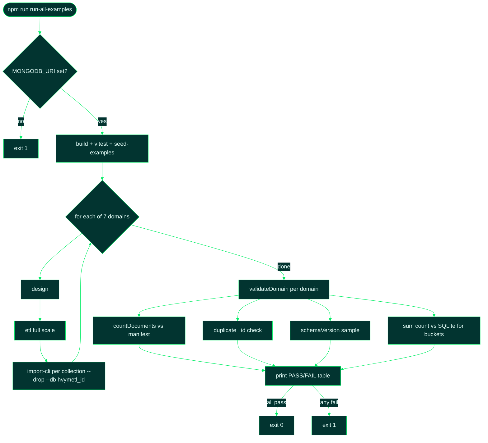

# 11 — Run All Examples & Validate in Atlas

Source: [`scripts/run-all-examples.mjs`](../scripts/run-all-examples.mjs)

## 1. High-Level Summary

`run-all-examples` is the end-to-end integration harness for hvyMETL. Given
`MONGODB_URI` and `CSV_TO_ATLAS_PATH` in `.env`, it seeds all seven example SQLite databases, runs design →
ETL → csvToAtlas import for every domain, then validates the Atlas imports against
the ETL manifest and SQLite source. Each domain lands in its own database
(`hvymetl_<domain>`) so collection names never collide across examples.

## 2. Technical Details & Signature

### Command

```bash
npm run run-all-examples
# equivalent: node scripts/run-all-examples.mjs
```

### Environment variables

| Name | Required | Default | Description |
| --- | --- | --- | --- |
| `MONGODB_URI` | **yes** | — | Atlas connection string (loaded from `.env`) |
| `CSV_TO_ATLAS_PATH` | **yes** | — | Path to [cvsToAtlas](https://github.com/7erry/cvsToAtlas) clone |
| `MONGODB_DB` | no | `csv_to_atlas` | **Not used** by this script; each domain gets `hvymetl_<id>` |
| `DRY_RUN` | no | — | Cleared internally so ETL always runs at full scale |

### Domain matrix (script input)

| Domain id | Profile | Source | Atlas database | Collections |
| --- | --- | --- | --- | --- |
| `catalog` | `catalog` | `examples/catalog/catalog.db` | `hvymetl_catalog` | 5 |
| `cms` | `cms` | `examples/cms/cms.db` | `hvymetl_cms` | 5 |
| `iot` | `iot` | `examples/iot/iot.db` | `hvymetl_iot` | 6 |
| `mobile` | `mobile` | `examples/mobile/mobile.db` | `hvymetl_mobile` | 4 |
| `personalization` | `personalization` | `examples/personalization/personalization.db` | `hvymetl_personalization` | 3 |
| `analytics` | `realtime-analytics` | `examples/analytics/analytics.db` | `hvymetl_analytics` | 6 |
| `singleview` | `single-view` | `examples/singleview/singleview.db` | `hvymetl_singleview` | 2 |

### Per-domain pipeline (automated)

1. `design --source … --profile … --out out/<id>`
2. `etl --plan out/<id>/migration-plan.json --out out/<id>`
3. For each collection in `etl-manifest.json`: `import-cli <chunk*.csv> <collection> --drop --db hvymetl_<id>`

### Validation checks (`validateDomain`)

| Check | What it proves |
| --- | --- |
| Document count | `countDocuments()` === manifest `rowCount` for every collection |
| Duplicate `_id` | Aggregation finds zero `_id` groups with `n > 1` |
| Schema Versioning | Sample document in each collection has `schemaVersion` |
| Bucket integrity | For bucket collections: `sum($count)` in Atlas === `COUNT(*)` in source SQL table |

**Returns:** exit code `0` when all domains pass; exit code `1` with per-domain issue list on failure.

### Dependencies

`dotenv`, `mongodb`, `better-sqlite3`, compiled `dist/cli.js`, external csvToAtlas at `CSV_TO_ATLAS_PATH`.

## 3. Edge Cases & Error Handling

- **Missing `MONGODB_URI` or `CSV_TO_ATLAS_PATH`:** script exits immediately with a clear message before any work.
- **`ERR_DLOPEN_FAILED` / `NODE_MODULE_VERSION` mismatch:** `better-sqlite3` was compiled for a different Node.js version (common after upgrading Node). Run `npm rebuild better-sqlite3` or `npm install` (postinstall rebuilds native deps). The script probes SQLite at startup and prints this fix before build/test/seed.
- **`DRY_RUN=true` in `.env`:** overridden for the ETL subprocesses so validation always exercises full extraction.
- **Isolated databases:** imports use `--db hvymetl_<domain>`, not `MONGODB_DB`, preventing cross-domain overwrites when two examples share a collection name (e.g. both could conceptually have a `sites` collection).
- **`--drop` on every import:** each collection is replaced wholesale; safe because database names are example-specific.
- **Missing CSV files:** throws with the expected file list rather than silently importing partial data.

## 4. Code Breakdown



1. **`run(cmd)`** wraps `execSync` with `DRY_RUN` cleared so child processes always extract full datasets.
2. **Import loop** reads `etl-manifest.json` and passes the manifest's `files` array (not the stale `importCommand` string, which omits the domain path).
3. **`validateDomain`** cross-references three artifacts: manifest row counts, migration-plan bucket metadata, and live SQLite `COUNT(*)`.
4. **Bucket integrity** is the strongest check: 60,000 `sensor_readings` SQL rows must equal `sum(count)` across 10,055 bucket documents in `hvymetl_iot.sensorReadings`.

## 5. Usage Example

```bash
cp .env.example .env
# Edit .env and set MONGODB_URI to your Atlas cluster

npm run run-all-examples
```

Expected output (abridged):

```text
=== hvyMETL full example run ===
Cluster: mongodb+srv://***@mycluster.mongodb.net/
Validation DB prefix: hvymetl_<domain>

 Test Files  4 passed (4)
      Tests  33 passed (33)

=== Validating MongoDB imports ===

PASS  catalog (hvymetl_catalog) — 5 collections OK
PASS  cms (hvymetl_cms) — 5 collections OK
PASS  iot (hvymetl_iot) — 6 collections OK
PASS  mobile (hvymetl_mobile) — 4 collections OK
PASS  personalization (hvymetl_personalization) — 3 collections OK
PASS  analytics (hvymetl_analytics) — 6 collections OK
PASS  singleview (hvymetl_singleview) — 2 collections OK

=== Summary ===
✓ catalog            hvymetl_catalog        5 collections
✓ cms                hvymetl_cms            5 collections
…
All examples passed validation.
```

### Verified document totals (reference run)

| Database | Documents | Notable bucket check |
| --- | --- | --- |
| `hvymetl_catalog` | 9,928 | Subset: `products.recentReviews` capped at 10; overflow in `reviews` (8,617) |
| `hvymetl_iot` | 10,604 | `sum(sensorReadings.count)` = 60,000 source rows |
| `hvymetl_mobile` | 15,527 | `sum(appEvents.count)` = 26,139 source rows |
| `hvymetl_analytics` | 4,948 | `sum(pageEvents.count)` = 60,000 source rows |

Browse results in Atlas → **Data Explorer** → databases `hvymetl_catalog` … `hvymetl_singleview`.

### Spot-check queries (MongoDB shell / Compass)

```javascript
// Catalog: Extended Reference + Subset + Computed on one document
db.getSiblingDB('hvymetl_catalog').products.findOne(
  { totalReviews: { $gt: 100 } },
  { brand: 1, recentReviews: 1, totalReviews: 1, attributes: 1, schemaVersion: 1 }
)

// IoT: bucket document with measurements array
db.getSiblingDB('hvymetl_iot').sensorReadings.findOne(
  {},
  { _id: 1, count: 1, measurements: 1, windowMinutes: 1 }
)
```

## 6. Refactoring / Optimization Suggestions

- Add a `--domain iot` flag to run a single example during development (~7× faster).
- Wire into CI with a dedicated Atlas project and ephemeral database names (`hvymetl_ci_${runId}`).
- Emit a JSON `validation-report.json` artifact for dashboards alongside the console summary.
