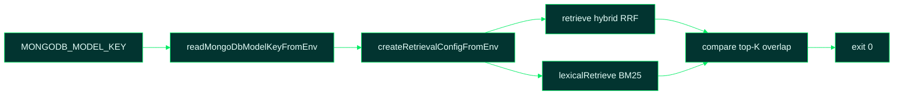

# 12 — Hybrid RAG Validation

Source: [`scripts/validate-hybrid-rag.mjs`](../scripts/validate-hybrid-rag.mjs),
[`src/rag/voyage.ts`](../src/rag/voyage.ts),
[`src/rag/retrieval.ts`](../src/rag/retrieval.ts)

## 1. High-Level Summary

This script confirms that hybrid RAG retrieval is wired correctly when a
**MongoDB Model Key** (`MONGODB_MODEL_KEY`) is present in `.env`. It exercises the
full BM25 + Voyage 4 + Reciprocal Rank Fusion (RRF) path against the live knowledge
base, compares results to BM25-only ranking, and exits non-zero on any failure. No
MongoDB database connection is required — only the Model API endpoint.

## 2. Technical Details & Signature

### Command

```bash
npm run validate-hybrid-rag
```

Runs `npm run build` then `node scripts/validate-hybrid-rag.mjs`.

### Environment variables

| Name | Required | Default | Description |
| --- | --- | --- | --- |
| `MONGODB_MODEL_KEY` | **yes** | — | MongoDB Model Key from Atlas (AI Services → Models → API Keys). Keys with `al-` prefix route to `https://ai.mongodb.com/v1` automatically. |
| `MONGODB_MODEL_EMBEDDING_MODEL` | no | `voyage-4` | Embedding model for semantic leg |
| `MONGODB_MODEL_BASE_URL` | no | auto by key prefix | Override Model API base URL |
| `VOYAGE_API_KEY` | no | — | Legacy alias for `MONGODB_MODEL_KEY` |

### Retrieval strategy (see [03-knowledge-rag.md](03-knowledge-rag.md))

RRF is **hvyMETL's in-process implementation** in `src/rag/retriever.ts` — it fuses
local BM25 ranks with Voyage 4 cosine ranks. The Model Key supplies embeddings only;
Atlas does not run the fusion step. Details:
[Reciprocal Rank Fusion — whose implementation?](03-knowledge-rag.md#reciprocal-rank-fusion--whose-implementation).

| Keys in `.env` | Strategy |
| --- | --- |
| none | BM25 only (script fails — expects Model Key) |
| `MONGODB_MODEL_KEY` | Hybrid BM25 + Voyage 4 → RRF |
| `MONGODB_MODEL_KEY` + `OPENAI_API_KEY` | Hybrid (Model Key wins) |
| `OPENAI_API_KEY` only | Vector-only (script fails — no Model Key) |

### Validation checks

| Check | Pass condition |
| --- | --- |
| Key present | `readMongoDbModelKeyFromEnv()` returns non-empty |
| Provider initialized | `createRetrievalConfigFromEnv().voyageProvider` is set |
| Strategy label | `describeRetrievalStrategy` contains `hybrid BM25` |
| Hybrid results | `retrieve()` returns ≥ 1 chunk with RRF score > 0 |
| Live API | Voyage embed calls succeed against resolved base URL |

**Returns:** exit `0` with `PASS` message, or exit `1` with `FAIL` and reason.

### Dependencies

`dotenv`, compiled `dist/rag/*`, `dist/profiles/*`. Network access to the Model API.

## 3. Edge Cases & Error Handling

- **Missing key:** `FAIL: MONGODB_MODEL_KEY is not set in .env` before any API call.
- **Quoted values in `.env`:** `readMongoDbModelKeyFromEnv()` strips surrounding `"` or `'`.
- **API errors:** bubble up as `FAIL: Model embedding API returned <status>: …`
- **Hybrid failure in production commands:** `design` and `prompt` fall back to BM25 with a console warning; this script does **not** fall back — it fails loudly so misconfiguration is caught early.

## 4. Code Breakdown



1. Loads the IoT workload profile query via `buildRetrievalQuery(getProfile('iot'))` — a write-heavy, bucket-oriented workload that should surface `bucket.md` and `embed-vs-reference.md`.
2. Runs hybrid and BM25 retrievals in parallel for the same query.
3. Prints both ranked lists so operators can see how RRF re-orders semantic matches.
4. Reports overlap count between hybrid and BM25 top-K as a sanity signal (typically 3–5 of 5).

## 5. Usage Example

```bash
# .env
MONGODB_MODEL_KEY=al-your-atlas-model-key

npm run validate-hybrid-rag
```

Expected output:

```text
MongoDB Model Key: configured
API base: https://ai.mongodb.com/v1
Strategy: hybrid BM25 + voyage-4 (Reciprocal Rank Fusion)

Hybrid top-5 (RRF scores):
  0.0325  [bucket.md] Bucket Pattern > Applicability rules
  0.0318  [bucket.md] Bucket Pattern > Problem it solves
  …

BM25-only top-5 (for comparison):
  13.10  [bucket.md] Bucket Pattern > Applicability rules
  …

Overlap with BM25 top-5: 4/5 chunks

PASS: hybrid BM25 + Voyage 4 (RRF) retrieval validated.
```

## 6. Refactoring / Optimization Suggestions

- Accept `--profile iot` to validate against other workload queries.
- Emit `validation-report.json` for CI dashboards.
- Add a `--offline` mode that only checks key format and base URL resolution without calling the API.
