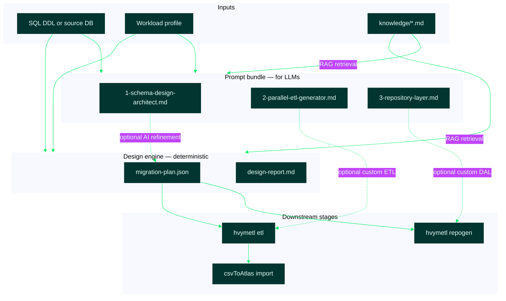

# 15 — Migration Artifacts & Production Prompts

Sources: [`src/design/designCommand.ts`](../src/design/designCommand.ts),
[`src/design/designFromModel.ts`](../src/design/designFromModel.ts),
[`src/rag/promptBundle.ts`](../src/rag/promptBundle.ts),
[`src/etl/runEtl.ts`](../src/etl/runEtl.ts),
[`src/repogen/generate.ts`](../src/repogen/generate.ts),
[`web/src/components/MigrationArtifactsView.tsx`](../web/src/components/MigrationArtifactsView.tsx)

## 1. High-Level Summary

hvyMETL produces two kinds of migration outputs:

| Kind | What it is | Who consumes it |
| --- | --- | --- |
| **Deterministic artifacts** | `migration-plan.json` and `design-report.md` | ETL, csvToAtlas import, `repogen`, human reviewers |
| **RAG production prompts** | Three markdown files filled with your DDL, telemetry, and retrieved pattern docs | Cursor, ChatGPT, or any LLM workflow |
| **Generated application code** | Typed repository modules from `repogen` | Your Node.js / TypeScript application |

The **Migration Studio** web UI and the CLI `design` / `prompt` commands emit the same
artifacts. After **AI Migration Export**, the full-screen artifact editor lets you review,
edit, and download every file.



---

## 2. Migration plan (`migration-plan.json`)

### Purpose

The migration plan is the **machine-readable contract** between every automated stage
of hvyMETL. It describes exactly how each SQL table becomes a MongoDB collection,
which [Building with Patterns](https://www.mongodb.com/company/blog/building-with-patterns-a-summary)
choices apply, and how data must be shaped before import.

Think of it as a build spec: the design engine writes it once; ETL, csvToAtlas, and
`repogen` read it without re-deriving decisions.

### What it contains

| Section | Purpose |
| --- | --- |
| `collections[]` | One entry per target MongoDB collection |
| `sourceTable` / `mergedTables` | Which SQL tables feed the collection |
| `idDerivation` | How to build deterministic `_id` values (`direct`, `composite`, or `bucket`) so parallel workers can upsert safely |
| `patterns[]` | Pattern decisions (Extended Reference, Subset, Bucket, …) with reasons and `knowledgeSource` citations |
| `jsonSchema` | MongoDB `$jsonSchema` validator for the document shape |
| `indexes[]` | Single and compound index specs tied to access patterns |
| `embeddedArrays[]` | Embed / Subset plans (field, source table, cap) |
| `extendedReferences[]` | Lookup columns to pre-join and duplicate |
| `computedFields[]` | Counters initialized during ETL, maintained with `$inc` |
| `bucket` | Time-window grouping for time-series collections |
| `writeConcern` / `pool` | Profile-tuned connection settings |

### Who uses it

- **`hvymetl etl`** — builds pattern-aware SQL SELECTs and splits extraction into parallel CSV chunks ([06-etl.md](06-etl.md))
- **csvToAtlas import** — merges chunks with idempotent upserts keyed on `_id`
- **`hvymetl repogen`** — emits typed repositories and index bootstrap scripts ([08-repogen.md](08-repogen.md))

### How to produce it

```bash
npm run hvymetl -- design --source examples/iot.db --profile iot --out out/iot
# → out/iot/migration-plan.json
```

In the web UI: **AI Migration Export** (header) or **Run Full Pipeline** (uses the plan internally).

### When to edit it

The plan is deterministic and diff-friendly. Teams often review it in PRs, tweak an
index or subset cap, then re-run ETL and import against the updated file.

---

## 3. Design report (`design-report.md`)

### Purpose

The design report is the **human-readable audit trail** for the same decisions encoded
in `migration-plan.json`. It answers: *why* was the Bucket pattern chosen for sensor
readings? *Which* knowledge document justified duplicating brand name into products?
*What* indexes support the stated read:write ratio?

Use it for architecture review, compliance documentation, and onboarding — anyone who
will not read JSON can understand the migration strategy from this file alone.

### What it contains

- **Header metadata** — source label, workload profile, write concern, pool tuning, generation timestamp
- **Per-collection sections** — source tables, `_id` strategy, pattern decisions with plain-English reasons, planned indexes
- **Retrieved RAG context** — the top-scoring knowledge-base chunks that grounded the run (heading, source file, relevance score, excerpt)

The report cites the same `knowledgeSource` filenames as the JSON plan, but adds the
full retrieved context so reviewers can trace decisions back to pattern documentation.

### Who uses it

- **Engineers and architects** — sign-off before production ETL
- **LLM workflows** — paste alongside prompts when asking an model to refine or extend the design
- **Operations** — understand write concern and pool settings chosen for the workload

### How to produce it

Written alongside the migration plan by `hvymetl design` or the web UI export:

```bash
npm run hvymetl -- design --source examples/iot.db --profile iot --out out/iot
# → out/iot/design-report.md
```

---

## 4. Schema design architect (`1-schema-design-architect.md`)

### Purpose

This is **Prompt 1** of the RAG production prompt bundle. It instructs an LLM to act
as an enterprise data architect: given your **legacy SQL DDL**, **workload telemetry**
(read:write ratio, peak RPM, growth rate), and **retrieved MongoDB pattern documents**,
synthesize a production-ready, pattern-driven MongoDB schema.

### When to use it

| Scenario | Use the prompt? |
| --- | --- |
| You want hvyMETL's deterministic plan as-is | No — use `migration-plan.json` directly |
| You need AI-assisted exploration of alternative layouts | Yes |
| Your target stack is not covered by hvyMETL's design engine | Yes |
| You want a JSON Schema + index spec draft to compare against the engine output | Yes |

The prompt enforces telemetry-driven rules (Extended Reference for heavy-read, Bucket
for heavy-write, Subset to bound arrays under the 16 MB limit) and requires every
decision to cite the retrieved pattern context.

### What hvyMETL already does without an LLM

The **design engine** ([05-design-engine.md](05-design-engine.md)) produces the same
class of output deterministically: `(SQL structure × workload profile) → migration plan`.
The schema-design-architect prompt is for **LLM-assisted** design when you want
natural-language reasoning, custom constraints, or tooling outside hvyMETL.

### How to produce it

```bash
npm run hvymetl -- prompt --source examples/iot.db --profile iot
# → out/prompts/1-schema-design-architect.md (path varies by --out)
```

Web UI: **AI Migration Export** includes this file in the artifact tabs.

---

## 5. Parallel ETL generator (`2-parallel-etl-generator.md`)

### Purpose

This is **Prompt 2** of the RAG bundle. It instructs an LLM to write a **high-concurrency,
pattern-aware extraction script** that shapes SQL rows into CSV documents matching the
planned patterns, then splits work across up to eight non-overlapping range workers with
deterministic `_id` upserts and a `DRY_RUN` safety gate.

### When to use it

| Scenario | Use the prompt? |
| --- | --- |
| You run hvyMETL's built-in ETL | No — use `hvymetl etl` ([06-etl.md](06-etl.md)) |
| Your source is not SQLite or needs custom extraction logic | Yes |
| You migrate with a different language or orchestrator (Python, Spark, …) | Yes |
| You want an LLM to scaffold ETL that mirrors hvyMETL's constraints | Yes |

### What hvyMETL already implements

`src/etl/` is the reference implementation of this prompt's architecture:

- Pattern formatting inside SQL (pre-joined Extended Reference, Computed counters, capped Subset arrays, Bucket `GROUP BY`)
- Non-overlapping PK or time-window range splits
- Up to `MAX_PARALLEL_WORKERS = 8` worker threads
- Streaming CSV output with O(1) memory
- `--dry-run` / `DRY_RUN=true` limited to 3 × 1,000-row validation chunks
- `etl-manifest.json` with csvToAtlas import commands

The prompt carries the same constraints so an LLM-generated script stays compatible with
csvToAtlas merge semantics.

### How to produce it

```bash
npm run hvymetl -- prompt --source examples/iot.db --profile iot
```

Web UI: **AI Migration Export** → tab `2-parallel-etl-generator`.

---

## 6. Repository layer

The name **repository layer** refers to two related outputs:

### 6a. Generated code (`hvymetl repogen`)

**Purpose:** Emit a **typed, concurrency-safe data access layer** your application
imports at runtime — not a prompt, but production TypeScript.

`repogen` reads `migration-plan.json` and writes:

| File | Role |
| --- | --- |
| `mongoClient.ts` | Singleton client with profile-tuned pool and write concern |
| `ensureIndexes.ts` | One-shot index creation from planned specs |
| `<collection>Repository.ts` | CRUD plus pattern maintainers (`$inc`, capped `$push`, bucket upserts, Extended Reference fan-out) |

Every write path uses **atomic MongoDB modifiers only**. There are no read-modify-write
loops, so parallel writers cannot corrupt Computed counters or Subset arrays.

```bash
npm run hvymetl -- repogen --plan out/iot/migration-plan.json --out out/iot/repositories
```

Full reference: [08-repogen.md](08-repogen.md).

### 6b. RAG prompt (`3-repository-layer.md`)

**Purpose:** **Prompt 3** instructs an LLM to rewrite a legacy SQL repository into
MongoDB using the native driver, with the same telemetry tuning and atomic modifier
rules as `repogen`.

### When to use which

| Scenario | Use |
| --- | --- |
| Node.js / TypeScript app, plan finalized | `hvymetl repogen` |
| Java, Go, C#, or another driver | `3-repository-layer.md` prompt |
| Existing ORM layer that needs a manual port | Prompt, using the migration plan as ground truth |
| You need compile-time types from `$jsonSchema` | `repogen` |

The prompt embeds pool sizes, write concern, and retrieved pattern context so generated
code respects the workload profile even when hvyMETL is not the codegen tool.

### How to produce the prompt

```bash
npm run hvymetl -- prompt --source examples/iot.db --profile iot
```

Web UI: **AI Migration Export** → tab `3-repository-layer`.

---

## 7. How the artifacts fit together

Typical **CLI-first** workflow:

1. **`design`** → `migration-plan.json` + `design-report.md` (review the report)
2. **`etl`** → pattern-shaped CSV chunks (reads the plan)
3. **csvToAtlas import** → MongoDB Atlas (deterministic `_id` upserts)
4. **`repogen`** → application repository layer (reads the plan)
5. **`prompt`** (optional) → three LLM files for custom tooling or refinement

Typical **Migration Studio** workflow:

1. Import DDL → arrange ER diagram → choose workload profile
2. **AI Migration Export** → review all five artifacts in the editor; download for your team or Cursor
3. **Run Full Pipeline** (optional) → design + csvToAtlas import from CSV exports in one step

The migration plan and design report are always paired. The three prompts share the
same RAG context and telemetry as the design run but do **not** replace the plan unless
you deliberately adopt LLM output over the engine output.

---

## 8. Web UI artifact editor

After **AI Migration Export**, the Migration Studio opens a full-screen view with tabs:

| Tab | File | Editable |
| --- | --- | --- |
| Migration plan | `migration-plan.json` | Yes |
| Design report | `design-report.md` | Yes |
| Schema design architect | `1-schema-design-architect.md` | Yes |
| Parallel ETL generator | `2-parallel-etl-generator.md` | Yes |
| Repository layer | `3-repository-layer.md` | Yes |

Artifacts persist in `sessionStorage` across browser refresh. Use **Download** or
**Download all** to save files for CLI follow-up or LLM sessions.

See [13-web-ui.md](13-web-ui.md) for API endpoints and [web/README.md](../web/README.md)
for screenshots.

---

## 9. Related documentation

| Topic | Document |
| --- | --- |
| Design engine and plan structure | [05-design-engine.md](05-design-engine.md) |
| RAG retrieval and prompt assembly | [03-knowledge-rag.md](03-knowledge-rag.md) |
| Parallel ETL implementation | [06-etl.md](06-etl.md) |
| Repository code generator | [08-repogen.md](08-repogen.md) |
| Plan JSON and pipeline diagrams | [diagrams.md](diagrams.md) |
