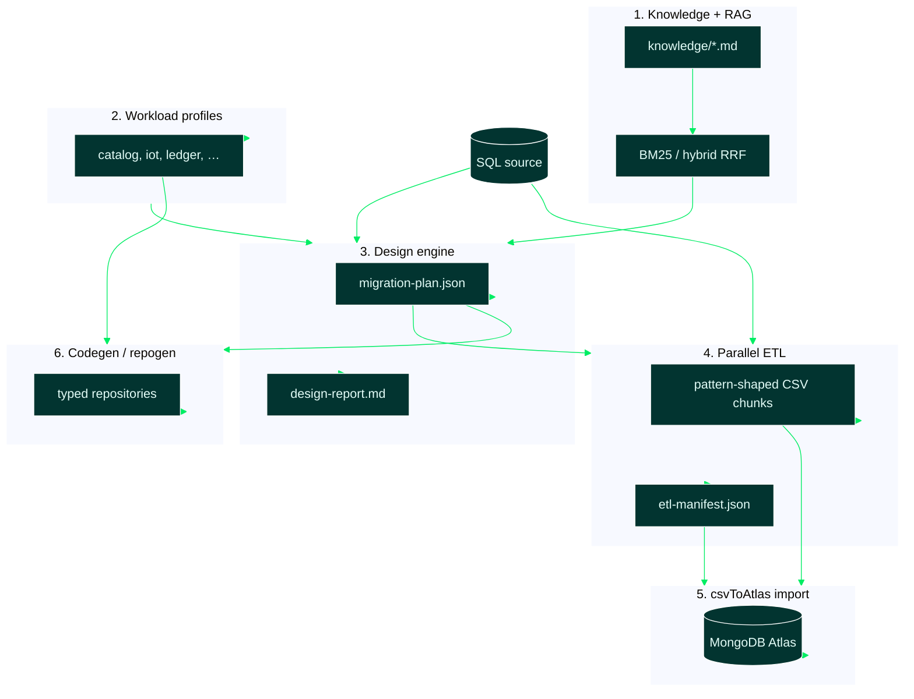

# 16 — The Six Pipeline Steps

Sources: [`knowledge/`](../knowledge/), [`src/profiles/`](../src/profiles/),
[`src/rag/`](../src/rag/), [`src/design/`](../src/design/), [`src/etl/`](../src/etl/),
[`scripts/import-cli.mjs`](../scripts/import-cli.mjs), [`src/repogen/`](../src/repogen/)

## Overview

hvyMETL is a **CLI toolchain** (not a long-running service). Six steps turn a SQL
schema plus workload telemetry into pattern-compliant MongoDB data and application
code. Each step reads and writes **artifacts on disk**, so you can run, inspect,
edit, and re-run any stage independently.



| Step | CLI / UI | Primary output | Consumed by |
| --- | --- | --- | --- |
| 1. Knowledge + RAG | `design`, `prompt` (automatic) | Retrieved pattern chunks in report / prompts | Design engine, prompt bundle |
| 2. Workload profiles | `--profile`, header dropdown | `WorkloadProfile` in plan | Design, ETL tuning, repogen |
| 3. Design engine | `hvymetl design` | `migration-plan.json`, `design-report.md` | ETL, import, repogen, reviewers |
| 4. Parallel ETL | `hvymetl etl` | `csv/*.csv`, `etl-manifest.json` | csvToAtlas import |
| 5. csvToAtlas import | `npm run import-cli` | Documents in Atlas | Your application |
| 6. Codegen (`repogen`) | `hvymetl repogen` | `*Repository.ts`, `mongoClient.ts`, `ensureIndexes.ts` | Your application |

Artifact purposes (plan, report, RAG prompts): [15-migration-artifacts.md](15-migration-artifacts.md).

---

## Step 1 — Knowledge base + RAG

### Purpose

Ground every schema decision in **curated MongoDB pattern documentation** instead of
generic LLM training data. Eleven markdown files in `knowledge/` (Bucket, Subset,
Extended Reference, Computed, …) are chunked and ranked against a workload-derived
query so design reports and prompts cite real source material.

This step does **not** call an LLM by default. Retrieval is deterministic **BM25**
(fully offline). Optional API keys enable semantic hybrid search.

### What it produces

| Output | Where it appears | Role |
| --- | --- | --- |
| `ScoredChunk[]` | `design-report.md` § Retrieved RAG Context | Audit trail for reviewers |
| RAG context blocks | `1-schema-design-architect.md`, `2-parallel-etl-generator.md`, `3-repository-layer.md` | LLM / Cursor prompts |
| Retrieval strategy log line | CLI stdout, Migration Studio artifacts header | e.g. `hybrid BM25 + voyage-4 (Reciprocal Rank Fusion)` |

### What happens under the hood

1. **Chunking** — each `knowledge/*.md` file splits on `##` headings into retrieval-sized pieces.
2. **Query building** — profile label, read:write ratio, peak RPM, growth rate, and preferred patterns form one query string.
3. **Ranking** — BM25 by default; with `MONGODB_MODEL_KEY`, BM25 + Voyage 4 cosine ranks merge via hvyMETL's in-process **Reciprocal Rank Fusion** ([03-knowledge-rag.md § RRF](03-knowledge-rag.md#reciprocal-rank-fusion--whose-implementation)).
4. **Citation** — top chunks flow into the design report and the three production prompts.

### How to run

RAG runs automatically inside **`design`** and **`prompt`** — no separate command.

```bash
# Offline (BM25 only)
npm run hvymetl -- design --source examples/iot.db --profile iot --out out/iot

# Hybrid RAG (requires MONGODB_MODEL_KEY in .env)
npm run validate-hybrid-rag
npm run hvymetl -- prompt --source examples/iot.db --profile iot
```

Web UI: **AI Migration Export** embeds the same retrieved context in generated artifacts.

### How it fits the pipeline

```
knowledge/*.md + workload query → top-K chunks → design report + prompts
                                              ↘ pattern selector (grounding citations)
```

Steps 3–6 do not re-run retrieval unless you invoke `design` or `prompt` again.

**Deep dive:** [03-knowledge-rag.md](03-knowledge-rag.md)

---

## Step 2 — Workload profiles

### Purpose

Encode **how the application accesses data** (not just how tables relate) as
configuration consumed by the design engine, RAG query, ETL worker count, and
generated connection pools. MongoDB schema choices depend on read:write ratio, peak
RPM, and growth — a catalog workload favors Extended Reference; IoT favors Bucket.

Profiles are **pure data** (no I/O). The same SQL source under different profiles
produces different `migration-plan.json` files.

### What it produces

| Field on `WorkloadProfile` | Used for |
| --- | --- |
| `telemetry` (R:W, peak RPM, growth) | Pattern selection, RAG query, report header |
| `preferredPatterns[]` | Retrieval query + design engine priority |
| `writeConcern`, `pool` | Plan JSON, generated `mongoClient.ts` |
| `label`, `id` | CLI menus, UI dropdown, plan metadata |

Eight presets: `catalog`, `cms`, `iot`, `mobile`, `personalization`,
`realtime-analytics`, `single-view`, `ledger`. Custom telemetry via `--custom`.

### What happens under the hood

1. **Selection** — CLI `--profile iot`, UI header dropdown, or `--custom` with explicit numbers.
2. **Tuning derivation** — write-heavy profiles prefer Bucket/reference; read-heavy prefer Extended Reference/Computed; `ledger` and `--critical` use `w: "majority"` + journal.
3. **Propagation** — the resolved profile is stamped on `migration-plan.json` and referenced by ETL manifests and repogen output.

### How to run

```bash
npm run hvymetl -- profiles                    # list presets
npm run hvymetl -- design --source examples/iot.db --profile iot --out out/iot
npm run hvymetl -- design --source examples/catalog.db --profile ledger --out out/ledger
```

Web UI: workload dropdown in the header before **AI Migration Export** or **Run Full Pipeline**.

### How it fits the pipeline

```
Profile → (structure × telemetry) → design engine
       → RAG retrieval query
       → pool / writeConcern on plan → repogen mongoClient.ts
```

**Deep dive:** [02-profiles.md](02-profiles.md)

---

## Step 3 — Design engine

### Purpose

The **brain** of hvyMETL: a deterministic, rule-based planner that maps
*(SQL structure × workload profile)* to MongoDB [Building with Patterns](https://www.mongodb.com/company/blog/building-with-patterns-a-summary)
choices and emits the **machine-readable contract** every downstream stage reads.

This is **not** an LLM call — identical inputs always produce identical plans (reviewable, diffable, testable).

### What it produces

| Artifact | Format | Role |
| --- | --- | --- |
| `migration-plan.json` | JSON | Contract for ETL, csvToAtlas, repogen |
| `design-report.md` | Markdown | Human audit trail + RAG citations |

Key plan sections per collection:

| Plan field | Purpose |
| --- | --- |
| `collections[]` | Target MongoDB collection definitions |
| `idDerivation` | Deterministic `_id` (`direct`, `composite`, `bucket`) for parallel upserts |
| `patterns[]` | Pattern decisions with `reason` + `knowledgeSource` |
| `jsonSchema` | MongoDB `$jsonSchema` validator |
| `indexes[]` | Single/compound index specs |
| `embeddedArrays[]`, `extendedReferences[]`, `computedFields[]`, `bucket` | Pattern-specific shaping instructions |

### What happens under the hood

1. **Introspection** — SQLite file adapter or DDL parser → `SqlStructuralModel` (tables, FKs, row counts, skew).
2. **RAG retrieval** — top knowledge chunks for the profile (Step 1).
3. **Pattern selection** — rule engine in `patternSelector.ts` applies Bucket, Subset, Extended Reference, etc. from structural signals + telemetry.
4. **Write artifacts** — JSON plan + markdown report to `--out`.

### How to run

```bash
npm run hvymetl -- design --source examples/iot.db --profile iot --out out/iot
# → out/iot/migration-plan.json
# → out/iot/design-report.md
```

Web UI: **AI Migration Export** (generates plan + report + prompts) or **Run Full Pipeline** (uses plan internally).

DDL paste / file import in the UI feeds the same engine via `designFromModel`.

### How it fits the pipeline

```
SQL + profile + RAG → migration-plan.json ─┬→ etl
                                           ├→ import-cli (via manifest)
                                           └→ repogen
         design-report.md → human review
```

**Deep dive:** [05-design-engine.md](05-design-engine.md), [15-migration-artifacts.md](15-migration-artifacts.md)

---

## Step 4 — Parallel ETL

### Purpose

Turn `migration-plan.json` into **pattern-compliant CSV chunks** using up to **eight
worker threads**, each extracting a non-overlapping slice of the source. Shaping
happens **inside SQL** (pre-joined Extended Reference columns, initialized Computed
counters, capped Subset arrays, grouped Bucket documents) so workers stream rows to
disk with **O(1) memory**.

Does **not** write to MongoDB — produces files for Step 5.

### What it produces

| Artifact | Role |
| --- | --- |
| `out/<domain>/csv/<collection>.chunkN.csv` | Partitioned, pattern-shaped rows |
| `out/<domain>/etl-manifest.json` | File list, row counts, columns, ready-to-paste `importCommand` per collection |
| Structural validation log | stdout on `--dry-run` (3 × 1,000-row safety gate) |

CSV conventions match csvToAtlas: dotted headers → nested objects, `field[]` → JSON array cells, deterministic `_id` column.

### What happens under the hood

1. **Load plan + re-introspect** source for column lists used in shaped SELECTs.
2. **Build shaped SQL** per collection (`shaper.ts`) — JOINs, subqueries, bucket `GROUP BY`.
3. **Split ranges** — non-overlapping PK ranges (or time-window-aligned ranges for buckets); up to 8 workers.
4. **Worker pool** — each thread opens its own SQLite connection, streams rows, writes CSV.
5. **Manifest** — aggregates chunk paths and import commands (requires `CSV_TO_ATLAS_PATH` validated at start).

### How to run

```bash
# Safe gate: 3 chunks × 1,000 rows
npm run hvymetl -- etl --plan out/iot/migration-plan.json --out out/iot --dry-run

# Full extraction (8 workers max)
npm run hvymetl -- etl --plan out/iot/migration-plan.json --out out/iot
```

Requires `CSV_TO_ATLAS_PATH` in `.env` (clone root with `package.json` + `dist/cli.js`).

Web UI: **Run Full Pipeline** runs design + csvToAtlas import from CSV exports (uses pre-exported CSVs, not `runEtl` worker pool in all paths — see [13-web-ui.md](13-web-ui.md)).

### How it fits the pipeline

```
migration-plan.json + SQL → csv/*.csv + etl-manifest.json → import-cli → Atlas
```

Codegen (Step 6) reads the same plan but does not need CSV files.

**Deep dive:** [06-etl.md](06-etl.md)

---

## Step 5 — csvToAtlas import

### Purpose

Load pattern-shaped CSV chunks into **MongoDB Atlas** with **concurrency-safe,
idempotent upserts** keyed on the deterministic `_id` from the plan. hvyMETL does
not implement import logic — it delegates to the standalone
[cvsToAtlas](https://github.com/7erry/cvsToAtlas) CLI via `CSV_TO_ATLAS_PATH`.

Parallel chunk imports can run simultaneously because every row targets the same
`_id` for a given source record — last writer wins without duplicates.

### What it produces

| Output | Role |
| --- | --- |
| MongoDB documents | One collection per plan entry, shaped per patterns |
| `$jsonSchema`-compatible field layout | Dotted columns merged, arrays parsed, nested objects built |
| Per-domain databases (in `run-all-examples`) | `hvymetl_catalog`, `hvymetl_iot`, … |

### What happens under the hood

1. **Resolve csvToAtlas** — `CSV_TO_ATLAS_PATH` must point at clone **root** (not `dist/`).
2. **Invoke external CLI** — `npm run import-cli -- <files…> <collection> [--drop] [--db name]`.
3. **Merge mode** — csvToAtlas upserts on `_id`; parallel chunks from Step 4 merge safely.
4. **Validation** (optional) — `run-all-examples` checks document counts, duplicate `_id` absence, bucket `sum(count)` integrity.

### How to run

```bash
# From etl-manifest importCommand, or manually:
npm run import-cli -- out/iot/csv/sensorReadings.chunk0.csv out/iot/csv/sensorReadings.chunk1.csv sensorReadings --drop --db hvymetl_iot

npm run validate-csv-to-atlas   # verify CSV_TO_ATLAS_PATH
npm run run-all-examples        # all seven domains end-to-end
```

Requires `MONGODB_URI` and `CSV_TO_ATLAS_PATH` in `.env`.

Web UI: **Run Full Pipeline** (design → csvToAtlas from CSV directory or uploaded files).

### How it fits the pipeline

```
etl-manifest.json → import-cli → MongoDB Atlas → your application (reads data)
migration-plan.json ─────────────────────────→ repogen (reads same plan, separate path)
```

**Deep dive:** [07-import-cli.md](07-import-cli.md), [14-validate-csv-to-atlas.md](14-validate-csv-to-atlas.md)

---

## Step 6 — Codegen (`repogen`)

### Purpose

The **codegen** stage reads `migration-plan.json` and emits a **typed TypeScript data
access layer** your application imports at runtime — not a prompt, but production
code. This is the final automated step; it does **not** run ETL or import data.

Every write path uses **atomic MongoDB modifiers only** (`$inc`, capped `$push`,
bucket upserts, Extended Reference fan-out). No read-modify-write loops.

### What it produces

| File | Role |
| --- | --- |
| `mongoClient.ts` | Singleton client with profile-tuned pool + write concern |
| `ensureIndexes.ts` | One-shot `createIndex` for every planned spec |
| `<collection>Repository.ts` | Typed `Document` type + CRUD + pattern maintainers per collection |

Generated methods vary by plan patterns:

| Method (examples) | When present | Mechanism |
| --- | --- | --- |
| `findById`, `list`, `insert`, `updateFields` | Always | Standard driver ops |
| `increment*` | Computed counters | `$inc` |
| `pushTo*` | Subset arrays | `$push` + `$position: 0` + `$slice` |
| `record*Measurement` | Bucket collections | Upsert by deterministic window `_id` |
| `fanOut*Update` | Extended References | `updateMany` on duplicated lookup fields |

Types derive from the plan's `$jsonSchema.properties` — compile-time field checking, no loose `Document` intersection.

### What happens under the hood

1. **Parse plan** — load `migration-plan.json`.
2. **Emit client module** — snapshot pool, write concern, journal from profile on plan.
3. **Emit repositories** — walk `jsonSchema` + pattern metadata; one function per pattern maintainer.
4. **Write files** — log each path; zero runtime dependency on hvyMETL (only `mongodb` driver).

### How to run

```bash
npm run hvymetl -- repogen --plan out/iot/migration-plan.json --out out/iot/repositories
```

Not included in **Run Full Pipeline** UI (run separately after reviewing the plan).

For non-TypeScript stacks, use RAG prompt `3-repository-layer.md` from **AI Migration Export** instead.

### How it fits the pipeline

```
migration-plan.json → repogen → repositories/*.ts → your Node.js app
                              ↘ ensureIndexes.ts (run once at deploy)
Atlas (Step 5) ← your app calls generated repositories at runtime
```

**Deep dive:** [08-repogen.md](08-repogen.md), [15-migration-artifacts.md § Repository layer](15-migration-artifacts.md#6-repository-layer)

---

## End-to-end CLI walkthrough

```bash
npm install && npm run build && cp .env.example .env
# Set MONGODB_URI, CSV_TO_ATLAS_PATH (clone root)

npm run seed-examples

# Steps 1–3 (RAG + profile + design)
npm run hvymetl -- design --source examples/iot.db --profile iot --out out/iot

# Step 4
npm run hvymetl -- etl --plan out/iot/migration-plan.json --out out/iot --dry-run
npm run hvymetl -- etl --plan out/iot/migration-plan.json --out out/iot

# Step 5 (per collection from etl-manifest.json)
npm run import-cli -- out/iot/csv/sensorReadings.chunk0.csv sensorReadings --drop --db hvymetl_iot

# Step 6
npm run hvymetl -- repogen --plan out/iot/migration-plan.json --out out/iot/repositories

# Optional: RAG prompts for LLM workflows
npm run hvymetl -- prompt --source examples/iot.db --profile iot
```

All seven domains in one command: `npm run run-all-examples` (Steps 3–5 for each domain; Steps 1–2 embedded in design; Step 6 manual).
