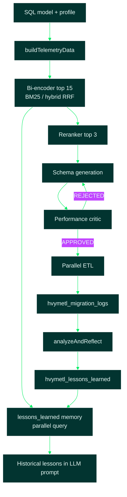

# 17 — ML Engine (Reranker, Critic & Self-Reflection)

Sources: [`src/ml_engine/`](../src/ml_engine/), [`src/rag/voyageReranker.ts`](../src/rag/voyageReranker.ts),
[`src/rag/retrieval.ts`](../src/rag/retrieval.ts), [`src/rag/promptBundle.ts`](../src/rag/promptBundle.ts)

## 1. High-Level Summary

The **ML engine** upgrades hvyMETL from a heuristic RAG pipeline into a
**telemetry-aware, self-improving migration router**. It adds three capabilities on top
of the existing design engine:

1. **Telemetry-aware reranking** — after bi-encoder retrieval (BM25 / hybrid RRF),
   rerank the top candidates using workload telemetry paired with each pattern document.
2. **Predictive performance critic** — score proposed document schemas against Atlas
   constraints (cache miss, IOPS, storage) before ETL handoff; regenerate with critic
   notes when rejected.
3. **In-context self-reflection** — log migration decisions, compare post-migration
   Atlas metrics to predictions, and upsert **lessons learned** into vector memory so
   future migrations avoid past mistakes.

The rule-based `buildMigrationPlan()` remains the default schema generator; the ML
engine wraps retrieval, gates the plan, and closes the feedback loop. LLM integrators
can swap in a custom `schemaGenerator` that reads reranked chunks and critic feedback.



---

## 2. Install

ML dependencies are included in the root `package.json`:

```bash
npm install
# Adds @xenova/transformers (offline reranker fallback) and onnxruntime-node (critic)
npm run build
```

| Package | Used when |
| --- | --- |
| `@xenova/transformers` | Local cross-encoder when `MONGODB_MODEL_KEY` is **unset** |
| `onnxruntime-node` | Tabular critic when `models/performance-critic.onnx` exists |
| Voyage API (via `MONGODB_MODEL_KEY`) | [rerank-2.5](https://docs.voyageai.com/reference/reranker-api) when Model Key **is set** |

---

## 3. Module Reference

| Module | Responsibility |
| --- | --- |
| [`reranker.ts`](../src/ml_engine/reranker.ts) | Telemetry + pattern pairing; Voyage or Xenova scoring |
| [`critic.ts`](../src/ml_engine/critic.ts) | ONNX / heuristic Atlas constraint prediction |
| [`pipelinePatch.ts`](../src/ml_engine/pipelinePatch.ts) | Full ML design orchestration |
| [`feedbackCollector.ts`](../src/ml_engine/feedbackCollector.ts) | Log decisions, fetch Atlas metrics, reflect |
| [`memoryEngine.ts`](../src/ml_engine/memoryEngine.ts) | Embed and retrieve `lessons_learned` |
| [`memoryRetrieval.ts`](../src/ml_engine/memoryRetrieval.ts) | Dual-space RAG (patterns + memory) |
| [`migrationStore.ts`](../src/ml_engine/migrationStore.ts) | MongoDB / in-memory persistence |
| [`voyageReranker.ts`](../src/rag/voyageReranker.ts) | Voyage `POST /v1/rerank` client |

### Reranker priority

| Condition | Backend |
| --- | --- |
| `MONGODB_MODEL_KEY` set | **Voyage `rerank-2.5`** (batch API call) |
| No Model Key | **Xenova/ms-marco-MiniLM-L-6-v2** (local) |
| Failure / `HVYMETL_DISABLE_ML_RERANKER=1` | Telemetry heuristic |

Telemetry is serialized into a dense string (e.g. `Read-Heavy (95:5) | High Throughput (60,000 RPM) | Growth: …`) and used as the reranker **query**; each pattern chunk is a **document**.

### Critic thresholds

| Prediction | Reject when |
| --- | --- |
| `predictedCacheMissRate` | > 0.15 |
| `predictedIopsUtilization` | > 0.85 |

Without `models/performance-critic.onnx`, a transparent heuristic critic runs automatically.

### Reflection thresholds

| Actual metric | Breach when |
| --- | --- |
| `slowQueryCount` | > 100 |
| `actualCacheMissRate` | > 0.15 |
| `actualIopsUtilization` | > 0.85 |
| Cache-miss prediction error | > 8% delta |

Breaches produce a lesson like: *"CRITICAL FAILURE: Table 'order_items' migrated using Embed Pattern resulted in 22% cache miss…"* stored under namespace `lessons_learned`.

---

## 4. Environment Variables

| Name | Required | Default | Description |
| --- | --- | --- | --- |
| `MONGODB_MODEL_KEY` | optional | — | Enables Voyage **rerank-2.5** + lesson embeddings |
| `MONGODB_MODEL_RERANK_MODEL` | optional | `rerank-2.5` | Override reranker model |
| `MONGODB_URI` | optional | — | Persist logs + lessons (in-memory if unset) |
| `MONGODB_DB` / `HVYMETL_MEMORY_DB` | optional | `hvymetl_memory` | Database for feedback collections |
| `HVYMETL_ATLAS_CLUSTER_ID` | optional | `local-dev` | Cluster id on logged decisions |
| `HVYMETL_ATLAS_STUB_MODE` | optional | — | `healthy` or `degraded` for stub metrics |
| `HVYMETL_CRITIC_MODEL_PATH` | optional | `models/performance-critic.onnx` | ONNX critic model |
| `HVYMETL_SCHEDULE_REFLECTION=1` | optional | off | Auto-schedule reflection after ML design |
| `HVYMETL_DISABLE_ML_RERANKER=1` | optional | off | Force heuristic reranking |
| `HVYMETL_DISABLE_ML_CRITIC=1` | optional | off | Force heuristic critic |
| `HVYMETL_RERANKER_MODEL` | optional | `Xenova/ms-marco-MiniLM-L-6-v2` | Local cross-encoder (no Model Key) |

### MongoDB collections

| Collection | Contents |
| --- | --- |
| `hvymetl_migration_logs` | Per-table decisions, telemetry, predictions, actuals |
| `hvymetl_lessons_learned` | Embedded failure lessons (`namespace: lessons_learned`) |

---

## 5. Usage Examples

### 5.1 ML-enhanced design (recommended entry point)

```typescript
import { designFromModelWithMlEngine } from './ml_engine/pipelinePatch.js';
import { parseDdlToModel } from './utilities/ddlParser.js'; // or introspect SQLite

const model = /* SqlStructuralModel */;
const { plan, designReport, ml } = await designFromModelWithMlEngine(
  model,
  profile,
  'knowledge',
);

console.log(ml.rerankBackend);              // 'voyage' | 'xenova' | 'heuristic'
console.log(ml.historicalLessonsMarkdown);  // injected into prompts
console.log(ml.migrationLogIds);            // logged to hvymetl_migration_logs
```

Equivalent lower-level call:

```typescript
import { runMlEnhancedDesign } from './ml_engine/pipelinePatch.js';

const result = await runMlEnhancedDesign({
  model,
  profile,
  knowledgeDir: 'knowledge',
  schedulePostMigrationReflection: true,
  clusterId: 'my-atlas-cluster',
});
```

### 5.2 Dual-space RAG retrieval (patterns + memory)

```typescript
import { loadKnowledgeBase } from './rag/chunker.js';
import { createRetrievalConfigFromEnv, retrieveWithLessonsLearned } from './rag/retrieval.js';
import { buildRetrievalQuery } from './rag/promptBundle.js';
import { getProfile } from './profiles/profiles.js';

const chunks = loadKnowledgeBase('knowledge');
const config = createRetrievalConfigFromEnv();
const query = buildRetrievalQuery(getProfile('iot'));

const { patternChunks, lessonChunks, historicalLessonsMarkdown } =
  await retrieveWithLessonsLearned(chunks, query, 15, config);

// Pass into prompt bundle
import { buildPromptBundle } from './rag/promptBundle.js';
const prompts = buildPromptBundle({
  profile: getProfile('iot'),
  ddl: 'CREATE TABLE …',
  retrievedChunks: patternChunks,
  historicalLessonsMarkdown,
});
```

When lessons match, the schema architect prompt includes:

```markdown
### HISTORICAL LESSONS LEARNED FROM PAST MIGRATIONS (DO NOT REPEAT THESE MISTAKES)
```

### 5.3 Post-migration feedback loop (cron / serverless)

```typescript
import {
  logMigrationDecision,
  analyzeAndReflect,
  scheduleReflection,
} from './ml_engine/feedbackCollector.js';
import { triggerPostMigrationReflection } from './ml_engine/feedbackHooks.js';

// 1. Log before ETL (also done automatically by runMlEnhancedDesign)
const { migrationId } = await logMigrationDecision(
  'orders',
  telemetry,
  chosenSchema,
  { predictedMetrics, clusterId: 'cluster-abc' },
);

// 2. After csvToAtlas import completes — fire-and-forget
scheduleReflection(migrationId, { clusterId: 'cluster-abc' });

// Or batch from a cron job (blocking)
const result = await analyzeAndReflect(migrationId);
if (result.lessonPersisted) {
  console.log('Lesson written to lessons_learned vector space');
}

// Or trigger many IDs after pipeline
triggerPostMigrationReflection(migrationLogIds, { clusterId: 'cluster-abc' });
```

### 5.4 Stub Atlas metrics for local testing

```bash
# Simulate healthy post-migration metrics (no lesson written)
HVYMETL_ATLAS_STUB_MODE=healthy node -e "
  import { analyzeAndReflect } from './dist/ml_engine/feedbackCollector.js';
  await analyzeAndReflect('your-migration-id');
"

# Simulate degraded metrics (lesson upserted)
HVYMETL_ATLAS_STUB_MODE=degraded node -e "
  import { analyzeAndReflect } from './dist/ml_engine/feedbackCollector.js';
  await analyzeAndReflect('your-migration-id');
"
```

### 5.5 Custom LLM schema generator

```typescript
import { runMlEnhancedDesign, type SchemaGenerationContext } from './ml_engine/index.js';

await runMlEnhancedDesign({
  model,
  profile,
  knowledgeDir: 'knowledge',
  schemaGenerator: async (ctx: SchemaGenerationContext) => {
    // ctx.rerankedChunks     — top 3 telemetry-matched patterns
    // ctx.historicalLessonsMarkdown — past failures
    // ctx.criticFeedback     — set on regeneration loops
    // Call your LLM here; return a MigrationPlan
    return myLlmSynthesize(ctx);
  },
});
```

---

## 6. Pipeline Integration

### Replacing `designFromModel` retrieval

```typescript
// Before (src/design/designFromModel.ts)
const retrieved = await retrieve(chunks, buildRetrievalQuery(profile), 8, retrievalConfig);
const plan = buildMigrationPlan(model, profile);

// After
import { designFromModelWithMlEngine } from '../ml_engine/pipelinePatch.js';
const { plan, designReport, ml } = await designFromModelWithMlEngine(model, profile, knowledgeDir);
```

### ML-enhanced flow (step-by-step)

| Step | Function | Output |
| --- | --- | --- |
| 1 | `buildTelemetryData(profile, model)` | Normalized `TelemetryData` |
| 2 | `retrieveWithLessonsLearned(…, 15)` | Top 15 patterns + historical lessons |
| 3 | `rerankPatterns(…, { topK: 3 })` | Top 3 telemetry-matched patterns |
| 4 | `schemaGenerator(context)` | `MigrationPlan` (default: `buildMigrationPlan`) |
| 5 | `evaluateAllSchemaCandidates(…)` | APPROVED or REJECTED (+ max 2 regen loops) |
| 6 | `logMigrationPlanDecisions(…)` | Rows in `hvymetl_migration_logs` |
| 7 | `scheduleReflection(migrationId)` | Async post-ETL lesson upsert |

See also [16-pipeline-steps.md](16-pipeline-steps.md) for how this fits the six-stage CLI pipeline.

---

## 7. ONNX Critic Model Contract

When training a custom `performance-critic.onnx`, use **8 normalized float features**:

1. `nestingDepth` (÷ 5)
2. `hasArrays` (0 or 1)
3. `indexCount` (÷ 12)
4. `isSharded` (0 or 1)
5. `readWriteRatio` (÷ 10)
6. `peakRpm` (log-normalized)
7. `dataGrowthMbPerMonth` (log-normalized)
8. `cardinality` (log-normalized)

**Outputs (3 floats):** `predictedCacheMissRate`, `predictedIopsUtilization`, `storageFootprintMultiplier`.

---

## 8. Edge Cases & Logging

- **`MONGODB_URI` unset:** migration logs and lessons use an in-process `InMemoryMigrationStore` (fine for unit tests; not durable across restarts).
- **Voyage rerank failure:** falls back to telemetry heuristic (Xenova is **not** loaded when Model Key is set).
- **Xenova failure (no Model Key):** falls back to heuristic.
- **ONNX missing:** heuristic critic; migrations still proceed.
- **No lessons in memory:** `historicalLessonsMarkdown` renders a neutral placeholder; pattern retrieval is unchanged.

Console logs to watch:

```
[ml_engine/reranker] Voyage rerank-2.5 scored N pattern(s)…
[ml_engine/memoryRetrieval] Injected N historical lesson(s) into RAG context…
[ml_engine/feedbackCollector] Migration underperformed — lesson … persisted
[ml_engine/memoryEngine] Lexical memory hit — pulled N lesson(s) protecting current run
```

---

## 9. Refactoring Notes

- Wire `designFromModelWithMlEngine` behind `HVYMETL_ML_ENGINE=1` in the web UI pipeline when ready for default-on behavior.
- Replace `StubAtlasMetricsConnector` with a real Atlas Performance Advisor / Query Profiler API client in production.
- Persist lesson embeddings in Atlas with `$vectorSearch` when the lessons collection grows beyond in-memory cosine ranking.
- Add a CLI subcommand (`hvymetl reflect --migration-id …`) for cron operators.
