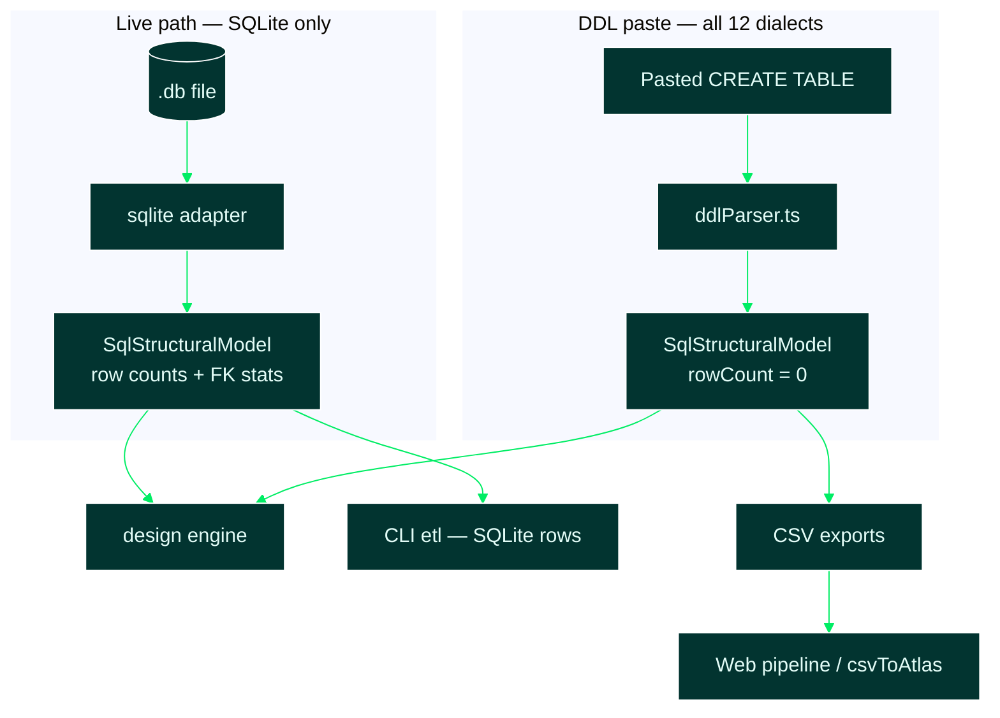

# 18 — Supported SQL Dialects & DDL Import

Sources: [`src/dialects.ts`](../src/dialects.ts),
[`src/utilities/ddlParser.ts`](../src/utilities/ddlParser.ts),
[`src/adapters/sqlite.ts`](../src/adapters/sqlite.ts),
[`src/server/index.ts`](../src/server/index.ts)

## 1. High-Level Summary

hvyMETL supports **twelve SQL dialects** for schema import. They fall into two
capability tiers:

1. **Live database** — **SQLite only** (`better-sqlite3` adapter): real row counts,
   FK cardinality, range splits, and direct CLI ETL from the `.db` file.
2. **DDL paste** — **all twelve dialects**: paste `CREATE TABLE` scripts; a shared
   parser builds the same `SqlStructuralModel` the design engine consumes. Row counts
   default to zero; relationship stats use conservative defaults.

For the **web Full Pipeline**, row data for every dialect is supplied as **CSV
exports** (one file per table). The CLI `etl` command reads rows directly from SQLite
only.

Oracle sample DDL and CSVs ship under [`examples/oracle/`](../examples/oracle/).

## 2. Dialect Matrix

Definitions: [`src/dialects.ts`](../src/dialects.ts) · UI/API: `GET /api/dialects`

| Dialect ID | Label | Schema import | Live adapter | Parser / notes |
| --- | --- | --- | --- | --- |
| `sqlite` | SQLite | File upload **or** DDL paste | **Yes** | `better-sqlite3` introspection |
| `postgresql` | PostgreSQL | DDL paste | No | `CREATE TABLE`, inline and table-level FKs |
| `mysql` | MySQL | DDL paste | No | Backtick-quoted identifiers |
| `mssql` | Microsoft SQL Server | DDL paste | No | T-SQL `CREATE TABLE` |
| `sybase` | SAP ASE (Sybase) | DDL paste | No | T-SQL-like DDL; `IDENTITY` columns, `dbo.` prefixes, `database..table` shorthand |
| `clickhouse` | ClickHouse | DDL paste | No | Column-oriented DDL subset |
| `oracle` | Oracle | DDL paste | No | `VARCHAR2`, `NUMBER`, identity columns, `CONSTRAINT … FOREIGN KEY` |
| `db2` | IBM Db2 | DDL paste | No | Schema-qualified names (`"SALES"."ORDERS"`) |
| `cockroachdb` | CockroachDB | DDL paste | No | PostgreSQL-compatible; `IF NOT EXISTS`, `INT8`, `UUID` |
| `aurora-postgresql` | Amazon Aurora (PostgreSQL) | DDL paste | No | Same rules as PostgreSQL |
| `aurora-mysql` | Amazon Aurora (MySQL) | DDL paste | No | Same rules as MySQL |
| `spanner` | Google Cloud Spanner | DDL paste | No | Trailing `PRIMARY KEY (…)`, `INT64` / `STRING` / `BYTES` |

The dialect selector in Migration Studio sets the model `source` label (e.g.
`ddl:oracle`) and documents which SQL syntax to paste; parsing is shared with
dialect-specific handling for qualified names, quoted FK targets, and Spanner-style
primary keys.



## 3. Technical Details

### `DIALECTS` and `isLiveSourceDialect(dialectId)`

| Export | Description |
| --- | --- |
| `DIALECTS` | Array of `{ id, label, live }` — `live: true` only for SQLite |
| `getDialectLabel(id)` | Display name for UI and pipeline hints |
| `isLiveSourceDialect(id)` | `true` only when a database file can be uploaded |
| `inferSchemaDialect(model, sessionDialect)` | Resolves dialect from UI session or `model.source` |
| `getCsvSourceHint(dialect)` | User-facing CSV export instructions per dialect |

### `parseDdlToModel(ddl, sourceLabel): SqlStructuralModel`

[`src/utilities/ddlParser.ts`](../src/utilities/ddlParser.ts) — lightweight parser for
instant schema import. Extracts:

- Table names (including schema-qualified and quoted identifiers)
- Columns and SQL types → BSON type hints via `sqlTypeToBsonType`
- Primary keys (inline, table-level, and Spanner trailing `PRIMARY KEY (…)`)
- Foreign keys (inline `REFERENCES` and `CONSTRAINT … FOREIGN KEY`)

Does **not** execute DDL, connect to a server, or infer live statistics.

### Live SQLite adapter

[`createSqliteAdapter(path)`](../src/adapters/sqlite.ts) implements `SqlSourceAdapter`:
`introspect`, `dumpDdl`, `getKeyRange`, `iterate`, `close`. Used by CLI `design`,
`etl`, and `prompt` commands. See [04-adapters.md](04-adapters.md).

## 4. Edge Cases & Limitations

- **DDL-only dialects:** `rowCount` is `0` on every table; embed vs reference decisions
  lean on structure and workload profile, not measured cardinality.
- **Spanner `INTERLEAVE IN PARENT`:** not modeled as automatic parent-child embeds;
  interleaved tables appear as separate ER nodes (FK-like edges when declared).
- **Parser scope:** `CREATE TABLE` focus — views, procedures, and exotic constraints
  may be ignored if not expressed in supported forms.
- **ETL data path:** web Full Pipeline always uses CSV for row data
  (`pipelineUsesCsvExports` returns `true` for every dialect). CLI `etl` reads SQLite
  directly.
- **Future adapters:** PostgreSQL/MySQL live introspection would implement the same
  `SqlSourceAdapter` contract ([04-adapters.md §6](04-adapters.md#6-refactoring--optimization-suggestions)).

## 5. Usage Examples

### CLI (SQLite live file)

```bash
npm run seed-examples
npm run hvymetl -- design --source examples/iot/iot.db --profile iot --out out/iot
npm run hvymetl -- etl --plan out/iot/migration-plan.json --out out/iot
```

### Web UI — DDL paste (any dialect)

1. Select dialect in the sidebar (e.g. **Oracle**).
2. Paste `CREATE TABLE` scripts → **Import Query**, or choose a `.sql` / `.ddl` file.
3. Run design or Full Pipeline; export table data as CSV for import.

```bash
# API equivalent
curl -X POST http://localhost:3847/api/schema/import-ddl \
  -H 'Content-Type: application/json' \
  -d '{"dialect":"oracle","ddl":"CREATE TABLE orders (id NUMBER PRIMARY KEY, …);"}'
```

### Web UI — SQLite file upload

```bash
curl -X POST http://localhost:3847/api/schema/import-sqlite \
  -F database=@examples/iot/iot.db
```

### Oracle example bundle

```text
examples/oracle/
  oracle-all.ddl          # combined DDL
  oracle-*.ddl            # domain splits (HR, sales, …)
  generate_mock_data.py   # writes *.csv locally (not in git)
  hvymetl-diagram-Oracle.json   # pre-arranged Migration Studio ER export
```

Generate Oracle mock CSVs before pipeline import:

```bash
cd examples/oracle && python generate_mock_data.py
```

## 6. Refactoring / Roadmap

- Add `SqlSourceAdapter` implementations for PostgreSQL (`pg`) and MySQL to unlock
  live introspection and CLI ETL without CSV intermediates.
- Expand DDL parser coverage for dialect-specific index and partition clauses when
  they affect MongoDB design decisions.
- Document per-dialect `CREATE TABLE` minimal examples in `examples/` (PostgreSQL,
  MySQL) mirroring the Oracle bundle.
