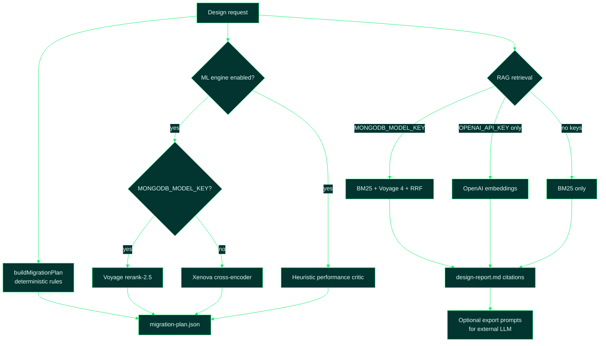

# 19 — LLM and Model Usage

Sources: [`src/design/patternSelector.ts`](../src/design/patternSelector.ts),
[`src/rag/retrieval.ts`](../src/rag/retrieval.ts),
[`src/ml_engine/reranker.ts`](../src/ml_engine/reranker.ts),
[`src/ml_engine/pipelinePatch.ts`](../src/ml_engine/pipelinePatch.ts),
[`.env.example`](../.env.example)

## 1. High-Level Summary

**hvyMETL does not call a chat LLM (GPT, Claude, Gemini, etc.) to build your migration plan by default.**

Schema design is **deterministic rule-based code** (`buildMigrationPlan`) plus optional **embedding and rerank APIs** for retrieval and telemetry-aware pattern scoring. The same structural inputs always produce the same `migration-plan.json`, which keeps migrations reviewable, diffable, and testable.

When people describe hvyMETL as "AI-driven," they usually mean:

1. **RAG** — ranked retrieval from the curated `knowledge/` pattern library.
2. **ML engine** — telemetry-aware reranking and a heuristic performance critic.
3. **Optional external LLMs** — prompt bundles exported for Cursor, ChatGPT, or custom tooling.

There is no required generative model in the core pipeline.

## 2. What Runs at Each Layer

| Layer | Model / approach | When |
| --- | --- | --- |
| **Migration plan** | Rule engine (`buildMigrationPlan`) | Always — same inputs → same plan |
| **RAG retrieval** | **Voyage 4** embeddings via MongoDB Model API | When `MONGODB_MODEL_KEY` is set — hybrid BM25 + Voyage + RRF |
| **RAG fallback** | **OpenAI `text-embedding-3-small`** | When Model Key is unset and `OPENAI_API_KEY` is set — vector-only cosine |
| **RAG offline** | **BM25** lexical search | No API keys — fully offline |
| **ML reranker** | **Voyage `rerank-2.5`** | When `MONGODB_MODEL_KEY` is set |
| **Reranker offline** | **`Xenova/ms-marco-MiniLM-L-6-v2`** cross-encoder | No Model Key — local Transformers.js |
| **Reranker last resort** | Telemetry heuristic | When Voyage or Xenova fails |
| **Performance critic** | Heuristic rules (IOPS, cache-miss risk) | ML path — not a generative LLM |
| **Lessons-learned memory** | Cosine on stored embeddings, else BM25 | Optional; uses same embedding providers when keys are set |

See [05-design-engine.md](05-design-engine.md) for the deterministic planner and [17-ml-engine.md](17-ml-engine.md) for the ML wrapper.

## 3. Environment Variables and Models

| Variable | Default model | Role |
| --- | --- | --- |
| `MONGODB_MODEL_KEY` | — | Enables Voyage via [MongoDB Model API](https://www.mongodb.com/docs/voyageai/api-and-clients/) or direct Voyage platform (`pa-…` keys) |
| `MONGODB_MODEL_EMBEDDING_MODEL` | `voyage-4` | Semantic leg of hybrid RAG retrieval |
| `MONGODB_MODEL_RERANK_MODEL` | `rerank-2.5` | ML engine cross-encoder reranker |
| `OPENAI_API_KEY` | — | Vector-only RAG when Model Key is absent |
| `EMBEDDING_MODEL` | `text-embedding-3-small` | OpenAI-compatible embedding model |
| `OPENAI_BASE_URL` | `https://api.openai.com/v1` | Override for OpenAI-compatible `/embeddings` endpoints |

Retrieval priority (first match wins):

1. `MONGODB_MODEL_KEY` → hybrid BM25 + Voyage 4 → **Reciprocal Rank Fusion**
2. `OPENAI_API_KEY` only → vector cosine similarity
3. Neither → **BM25 only** (no network)

Implementation: [`src/rag/retrieval.ts`](../src/rag/retrieval.ts).

## 4. What Is *Not* an LLM Call

These core steps are **deterministic code**, not chat completions:

- **`buildMigrationPlan()`** — maps SQL structure × workload telemetry to MongoDB patterns.
- **CSV enrichment** — row counts and relationship cardinality from CSV exports.
- **ETL splitting and `_id` derivation** — idempotent, rule-based.
- **`repogen`** — template-driven repository generation for 13 languages.
- **Performance critic** — rule-based evaluation of schema candidates.

From [05-design-engine.md](05-design-engine.md):

> The design engine is intentionally **not** an LLM call: the same inputs always produce the same plan.

## 5. Where External LLMs Fit

hvyMETL **exports** RAG-grounded markdown prompts for human or external LLM workflows; it does **not** invoke them itself unless you plug in a custom generator.

| Artifact | Purpose |
| --- | --- |
| `1-schema-design-architect.md` | Optional LLM-assisted design refinement |
| `2-parallel-etl-generator.md` | Scaffold ETL scripts aligned with hvyMETL constraints |
| `3-repository-layer.md` | Rewrite legacy SQL repositories for MongoDB |

Produced by `hvymetl export prompts` or the Migration Studio **AI export** flow. See [15-migration-artifacts.md](15-migration-artifacts.md).

### Custom LLM schema generator

The ML pipeline accepts an optional `schemaGenerator` hook in `designFromModelWithMlEngine()` so you can replace the default rule-based planner with your own LLM-backed synthesis while keeping reranking, critic, and lessons-learned injection. See [17-ml-engine.md § Custom LLM schema generator](17-ml-engine.md#55-custom-llm-schema-generator).

## 6. Decision Flow



## 7. Usage Examples

### Offline (no API keys)

```bash
hvymetl design --source examples/iot/iot.db --profile iot --out out/iot
# Retrieval strategy: lexical BM25 (no API key configured)
# Plan: deterministic buildMigrationPlan()
```

### Hybrid RAG + Voyage reranker

```bash
# .env
MONGODB_MODEL_KEY=al-…
MONGODB_MODEL_EMBEDDING_MODEL=voyage-4

hvymetl design --source examples/catalog/catalog.db --profile catalog --out out/catalog
# Retrieval strategy: hybrid BM25 + voyage-4 (Reciprocal Rank Fusion)
# ML reranker: Voyage rerank-2.5
```

### OpenAI embeddings only (legacy path)

```bash
# .env — no MONGODB_MODEL_KEY
OPENAI_API_KEY=sk-…
EMBEDDING_MODEL=text-embedding-3-small

hvymetl design --source examples/cms/cms.db --profile cms --out out/cms
# Retrieval strategy: vector (text-embedding-3-small)
```

## 8. Refactoring Notes

- **Do not assume a chat model** when reading logs or design reports — citations come from RAG chunks, not from GPT completions.
- **Model Key wins over OpenAI** when both are set; OpenAI is ignored until the Model Key is removed.
- **Voyage rerank failure** falls back to telemetry heuristic; Xenova is not loaded when the Model Key is set.
- **Production self-reflection** needs `MONGODB_URI` for persistent lessons; embedding keys alone store vectors only in memory during the process.
- For stakeholder context (non-technical), see also [`whatdoesllmthinkofthisproject.md`](../whatdoesllmthinkofthisproject.md).
