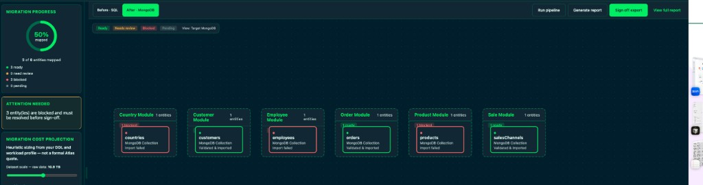
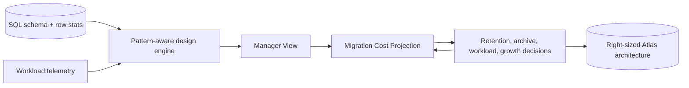

# 20 — Manager View and Cloud Cost Control

Sources: [`web/src/components/ManagerView.tsx`](../web/src/components/ManagerView.tsx), [`web/src/components/ManagerSidebar.tsx`](../web/src/components/ManagerSidebar.tsx), [`web/src/components/ManagerCostPanel.tsx`](../web/src/components/ManagerCostPanel.tsx), [`web/src/managerCostEstimate.ts`](../web/src/managerCostEstimate.ts), [`src/design/patternSelector.ts`](../src/design/patternSelector.ts)

## 1. High-Level Summary

The **Manager View** turns a SQL-to-MongoDB migration from an engineering-only design
exercise into a cost-control workflow. Before any production migration runs, managers
can see the proposed MongoDB architecture, review risky pattern decisions, and adjust
cloud cost drivers such as workload shape, projected growth, and data retention.

The goal is simple: prevent expensive architectural errors before they become
production infrastructure. A naive SQL migration often maps each relational table to
one MongoDB collection. That can create too many collections, too many indexes, large
working sets, `$lookup`-heavy reads, and oversized Atlas tiers. hvyMETL analyzes SQL
constraints, row statistics, foreign keys, and workload telemetry, then recommends
MongoDB-native document structures that keep hot reads local and infrastructure right-sized.

## 2. Why This Saves Money

| Cost risk | What usually happens | How Manager View helps |
| --- | --- | --- |
| **1-to-1 table migration** | Teams recreate the old relational model in MongoDB, then pay for slower joins, more indexes, and bigger clusters. | The design engine recommends embedded arrays, Extended Reference, Subset, Bucket, Archive, and Single Collection patterns where they reduce working set or query cost. |
| **Oversized hot storage** | All historical data lands in the expensive operational tier even when only recent data is queried daily. | Managers can enable Archive per collection and tune how many years stay hot before older data routes to cheaper cold storage. |
| **Hidden RAM pressure** | A design looks fine functionally but requires a larger Atlas tier because the working set no longer fits memory. | The Migration Cost Projection shows active storage, RAM fit, recommended Atlas tier, and monthly cost impact while the design is still editable. |
| **Legacy clutter** | Obsolete tables, jump tables, or one-off audit history inflate the migration target. | The before/after diagram and manager review flow make it visible which SQL tables are folded, referenced, archived, or still standalone. |
| **Late cost surprises** | Finance sees infrastructure costs after the migration has already been built. | Cost projection is available before migration, so teams can compare scenarios before committing engineering time or cloud spend. |

## 3. Manager Features

| Feature | Location | What it answers |
| --- | --- | --- |
| **Role toggle** | Header / app shell | Switch between developer detail and manager summary views. |
| **Migration progress** | Manager sidebar | How many schemas are mapped, reviewed, or still need sign-off? |
| **Review queue** | Manager sidebar → review call-to-action | Which collections use manager-significant patterns such as Archive, Bucket, Subset, Single Collection, or Outlier? |
| **Migration Cost Projection** | Manager sidebar | What Atlas tier, storage footprint, RAM fit, and monthly run cost does this design imply? |
| **Workload scenario controls** | Cost panel | What happens if the workload is read-heavy, balanced, or write-heavy? |
| **Growth slider** | Cost panel | What will the projected monthly cost look like next year? |
| **Collection Archive controls** | Cost panel | Which dated collections should keep only recent data hot, and how many years should be retained before archive routing? |
| **Model API usage** | Manager sidebar | Did this run use hybrid/vector retrieval or BM25-only design, and what token volume was consumed? |
| **Cloud resource summary** | Manager sidebar | Which collection/index/archive choices affect Atlas infrastructure sizing? |

The **Model API usage** panel also estimates list-price token spend using MongoDB
Voyage AI billing rates: `voyage-4` embeddings at **$0.06 / 1M tokens** and
`rerank-2.5` at **$0.05 / 1M tokens**. MongoDB lists 200M free tokens for each model
in the public preview billing table; hvyMETL shows list price before organization-level
free tier credits are applied in Atlas billing.

## 4. Dynamic Cost Projections

The **Migration Cost Projection** panel estimates cloud cost from three inputs:

- **Schema statistics**: table row counts, column widths, document expansion from embeds,
  planned indexes, and archive mirror collections.
- **Workload telemetry**: read/write mix, RAM working-set ratio, peak operational pressure,
  and expected growth.
- **Manager controls**: total estimated rows when stats are unavailable, workload type,
  annual growth percentage, and per-collection archive retention.

The projection is intentionally directional, not a formal Atlas quote. It exists to
compare architecture choices quickly:

- Increase write intensity and see how RAM requirements change.
- Reduce hot retention on a dated collection and see active storage shrink.
- Compare a no-archive design against an Online Archive design.
- See one-time migration egress separately from monthly operational cost.
- Spot when a collection/index plan pushes the design into a larger Atlas tier.

The cost model separates **active hot Atlas storage** from **archived cold storage**.
That distinction matters because the expensive tier is the data serving operational
reads and writes. Older data can remain queryable through Atlas Data Federation without
forcing the primary cluster to carry the full historical footprint.

## 5. Data Pruning and Archival

Archive is offered on a **collection basis** for date-bearing collections. Each eligible
collection shows:

- The collection name and source table.
- The top-level date field used as the archive trigger.
- Whether hvyMETL already recommended Archive in the migration plan.
- The partition fields used for archived queries.
- A hot retention input in years.

Practical cost workflows:

- **Retention adjustments**: compare seven years hot versus five years hot. On large
  history-heavy collections, moving two years of data out of the hot tier can materially
  reduce active storage and may lower the recommended Atlas tier.
- **Cold storage routing**: keep recent operational data in Atlas while routing older
  documents to an archive collection/cold snapshot model.
- **Legacy data pruning**: identify tables that should not become hot operational
  collections at all, such as old audits, import staging tables, or obsolete jump tables.
- **TTL instead of Archive**: for disposable data such as sessions, short-lived logs, or
  temporary tokens, use TTL indexes rather than Online Archive so data is deleted instead
  of retained.

## 6. Archive Rule Guidance

hvyMETL encodes the operational guardrails for MongoDB Atlas Online Archive into the
generated plan metadata:

| Rule | hvyMETL behavior |
| --- | --- |
| **Use a single top-level date trigger** | Archive plans identify one `timeColumn`, converted to the MongoDB document field used by archive sweeps. |
| **Keep a safe active window** | Plans include `activeDataMinimumDays` and default manager retention in years so teams do not archive too aggressively. |
| **Partition by date first** | Archive partition fields always start with the date field, then add common query filters such as tenant, account, customer, region, status, or type. |
| **Support complex conditions** | If a status column exists, the plan adds a `customFilterDescription` suggesting terminal-state filters such as completed or closed. |
| **Preserve complete documents** | Archive mirrors keep the same embedded document shape so historical data is not fragmented across orphaned references. |
| **Make trade-offs visible** | Manager View explains that archive queries are slower than hot-cluster queries because they scan cloud object storage through Data Federation. |

Recommended operational practice:

- Keep at least 30 to 90 days of active data on the primary cluster.
- Do not update records right at the archive threshold; let Atlas capture a consistent
  document snapshot.
- Use the Atlas Data Federation unified connection string for queries that must span hot
  and archived data.
- Partition archives by the date trigger first, then by fields that match frequent
  filters, so archive queries avoid broad scans.

## 7. Preventing Inefficient Architectures

The biggest cost savings often come from avoiding the wrong data model. hvyMETL prevents
the common "SQL tables copied 1-to-1 into MongoDB" mistake by applying MongoDB design
patterns before ETL:

- **Embed** bounded child records so reads do not pay repeated join costs.
- **Subset** unbounded child histories so the hot parent document keeps only the recent
  or most useful slice.
- **Extended Reference** duplicates stable lookup fields to avoid `$lookup`-heavy reads.
- **Bucket** groups high-volume time-series/event rows, reducing document and index
  overhead.
- **Archive** moves older dated data out of the hot operational tier.
- **Single Collection** can consolidate junction-linked entities when the workload needs
  graph-like reads without duplicating payloads.

These choices are made from structural signals: primary keys, foreign keys, child
cardinality, date columns, row counts, table names, and workload telemetry. The Manager
View exposes the result in business terms: what changed, why it matters, and how it
affects cloud cost.

## 8. Suggested Manager Workflow

1. Import DDL or a SQLite database in Migration Studio.
2. Select or infer the workload profile.
3. Run design or the full pipeline to generate the migration plan.
4. Switch to Manager View.
5. Review the before/after architecture and sign off on collections that use high-impact
   patterns.
6. Open **Migration Cost Projection** and test workload, growth, and retention scenarios.
7. Enable Archive on date-bearing collections where older data does not need hot-cluster
   latency.
8. Record the target retention policy before engineering starts the production migration.

## 9. Implementation Notes

| Area | Source |
| --- | --- |
| Manager shell and sidebar | [`web/src/components/ManagerView.tsx`](../web/src/components/ManagerView.tsx), [`web/src/components/ManagerSidebar.tsx`](../web/src/components/ManagerSidebar.tsx) |
| Cost projection math | [`web/src/managerCostEstimate.ts`](../web/src/managerCostEstimate.ts) |
| Archive controls | [`web/src/components/ManagerCostPanel.tsx`](../web/src/components/ManagerCostPanel.tsx) |
| Manager review flags | [`web/src/managerReview.ts`](../web/src/managerReview.ts) |
| Archive pattern selection | [`src/design/patternSelector.ts`](../src/design/patternSelector.ts) |
| Plan shape | [`src/types.ts`](../src/types.ts), [`web/src/migrationPlanTypes.ts`](../web/src/migrationPlanTypes.ts) |

Related references:

- [13-web-ui.md](13-web-ui.md) — Migration Studio API and UI reference.
- [15-migration-artifacts.md](15-migration-artifacts.md) — `migration-plan.json`,
  design reports, and generated artifacts.
- [16-pipeline-steps.md](16-pipeline-steps.md) — end-to-end pipeline stages.
- [05-design-engine.md](05-design-engine.md) — how the pattern selector chooses
  document structures.
