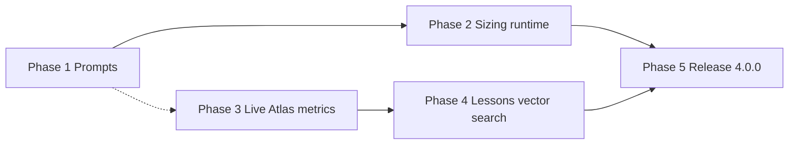

# Release 4.0 — multi-phase roadmap

Release **4.0** expands hvyMETL in two tracks that share Atlas credentials and memory
database patterns but serve different user flows:

| Track | Goal |
| --- | --- |
| **Sizing assistant** | Conversational Atlas cluster sizing (parameters, transcripts, tier engine, architecture briefs) |
| **ML lessons learned (production)** | Replace stub post-migration metrics and in-process lesson retrieval with live Atlas data and `$vectorSearch` |

Package version remains **3.2.x** until Phase 5 ships; [`RELEASE.md`](../RELEASE.md) documents progress under **4.0.0 (in development)**.

Phases 2 and 3–4 can proceed in parallel after Phase 1.

---

## Phase 1 — Sizing assistant prompts ✅ (foundation shipped)

**Status:** System prompts and logic reference are in the repo; no studio runtime yet.

**Deliverables**

| Item | Location |
| --- | --- |
| Tool-use + presentation rules | [`src/copilot/sizingAssistantPrompt.ts`](../src/copilot/sizingAssistantPrompt.ts) |
| Sizing engine **Logic Abstract** | [`src/copilot/sizingAssistantLogicReference.ts`](../src/copilot/sizingAssistantLogicReference.ts) |
| Infrastructure Architect brief template | [`src/copilot/sizingAssistantInfrastructureFramework.ts`](../src/copilot/sizingAssistantInfrastructureFramework.ts) |
| Docs | [21-sizing-assistant.md](21-sizing-assistant.md) |

**Verification:** `npm test -- src/copilot/sizingAssistantPrompt.test.ts`

---

## Phase 2 — Sizing assistant runtime

**Goal:** Wire prompts to a stateful chat flow, tool schemas, sizing engine, and (optional) studio entry point.

**Deliverables**

1. **Sizing state machine** — session store for cluster-level parameters, shard penalty, resource curator handoff status.
2. **Tool implementations** (names fixed by Phase 1 prompt):
   - `update_sizing_parameters`, `update_shard_penalty`, `abort_sizing_process`
   - `handoff_to_resource_curator`, `get_session_transcripts`, `extract_sizing_from_transcripts`
   - `find_optimal_cluster_tier`, `prompt_for_missing_info`
3. **Sizing engine module** — implement or import tier catalog + Sections 1–10 from [Logic Abstract](../src/copilot/sizingAssistantLogicReference.ts) (distinct from Manager cost heuristics in `web/src/managerCostEstimate.ts` unless explicitly unified).
4. **Grove / API route** — dedicated preset using `buildSizingAssistantSystemPrompt()` (separate from migration Agent Copilot in [20-agent-copilot.md](20-agent-copilot.md)).
5. **Tests** — engine unit tests, tool handler tests, prompt snapshot tests.
6. **Docs** — extend [21-sizing-assistant.md](21-sizing-assistant.md) with API, env vars, and UX.

**Exit criteria:** End-to-end chat can collect parameters, run `find_optimal_cluster_tier`, and present results per prompt rules (parameters shown, no cost breakdown in assistant text).

---

## Phase 3 — Live Atlas metrics (lessons learned feedback loop)

**Goal:** Replace default [`StubAtlasMetricsConnector`](../src/ml_engine/feedbackCollector.ts) with production metrics for [`analyzeAndReflect()`](../src/ml_engine/feedbackCollector.ts) while keeping the stub for local dev.

**Prerequisites**

- `MONGODB_URI` + `HVYMETL_MEMORY_DB` for durable logs/lessons ([17-ml-engine.md](17-ml-engine.md)).
- Atlas Admin API: reuse OAuth pattern from [`src/utilities/atlasLogs.ts`](../src/utilities/atlasLogs.ts) (`ATLAS_CLIENT_ID`, `ATLAS_CLIENT_SECRET`, `ATLAS_GROUP_ID`).
- `HVYMETL_ATLAS_CLUSTER_ID` aligned with Atlas API cluster **name** for measurements/advisor paths.

**Deliverables**

1. **`AtlasApiMetricsConnector`** — implements `AtlasMetricsConnector.fetch()`; maps Atlas signals to [`AtlasActualPerformance`](../src/ml_engine/feedbackTypes.ts):

   | Field | Target source | Design note |
   | --- | --- | --- |
   | `slowQueryCount` | Performance Advisor / slow-operation stats (windowed) | Primary “real” signal |
   | `actualIopsUtilization` | Process measurements vs tier IOPS cap | Ratio 0–1 |
   | `actualCacheMissRate` | WiredTiger cache used/max **or** revised breach metric | Not a single Atlas API; document derivation or change `analyzeMetrics()` |

2. **Correlation metadata** — extend migration logs (optional fields): target database, collection, `projectId`, observation window, `processId`.
3. **Deferred reflection** — reflection must not run only at instant post-import; add soak delay (`HVYMETL_REFLECTION_DELAY_MS`) and/or **`hvymetl reflect --migration-id`** CLI for cron ([17-ml-engine.md §9](17-ml-engine.md)).
4. **Wiring** — `setAtlasMetricsConnector()` when Atlas creds present; `HVYMETL_ATLAS_STUB_MODE` unchanged for tests.
5. **Tests** — mocked Atlas API fixtures (mirror `atlasLogs.test.ts`); integration test optional.

**Exit criteria:** Pipeline or CLI reflection persists lessons using `source: atlas-api` metrics when breaches occur; stub remains default without creds.

**Depends on:** Existing feedback loop (Phase 0 / 3.x) — no sizing assistant dependency.

---

## Phase 4 — Atlas Vector Search for lessons retrieval

**Goal:** Rank `hvymetl_lessons_learned` with Atlas **`$vectorSearch`** instead of loading all documents and scoring in Node ([`retrieveLessonsLearned()`](../src/ml_engine/memoryEngine.ts)).

**Prerequisites**

- Phase 3 not required; needs memory DB + embeddings on write (`MONGODB_MODEL_KEY` or `OPENAI_API_KEY` in `upsertLessonLearned()`).
- Vector Search–capable Atlas tier on the **memory** cluster/database.
- Fixed embedding model and dimension across all lessons.

**Deliverables**

1. **Vector index** on `hvymetl_lessons_learned` — precomputed `embedding` field (not autoEmbed); filter field `namespace: lessons_learned`. Bootstrap via store startup or setup script (pattern: [`mongoVectorIndexService.ts`](../src/copilot/mongoVectorIndexService.ts), target `resolveMemoryDbName()`).
2. **Retrieval path** — feature flag `HVYMETL_LESSONS_VECTOR_SEARCH=1`: embed query → `$vectorSearch` → `ScoredLesson[]`; fallback chain to current cosine → embed-on-read → BM25.
3. **Scale** — stop using full `listLessons()` for design-time retrieval; keep for admin/backfill.
4. **Backfill script** — embed missing lessons; optional `embeddingModelVersion` on documents.
5. **Env/docs** — `HVYMETL_LESSONS_VECTOR_INDEX`, `HVYMETL_LESSONS_EMBEDDING_DIMENSIONS`; update [17-ml-engine.md § Lessons-learned memory](17-ml-engine.md#lessons-learned-memory-storage-vs-retrieval), `.env.example`, README.

**Exit criteria:** ML design run injects historical lessons via `$vectorSearch` when flag and index are enabled; offline/tests unchanged with flag off.

---

## Phase 5 — Release 4.0.0

**Goal:** Tag and version bump when agreed scope is complete.

**Typical checklist**

- [ ] Phase 2 sizing runtime meets exit criteria (minimum bar for “4.0” product story).
- [ ] Phase 3 and/or Phase 4 per product priority (can ship 4.0 with Phase 3 only if vector search deferred to 4.1 — document in `RELEASE.md`).
- [ ] `package.json` / `web/package.json` → **4.0.0**; GitHub release notes.
- [ ] Full `npm test`; web build green.
- [ ] Cross-links: [README.md](../README.md), [docs/README.md](README.md), [RELEASE.md](../RELEASE.md).

---

## Environment variables (4.0 cumulative)

| Variable | Phase | Purpose |
| --- | --- | --- |
| *(Grove / sizing)* | 2 | TBD with sizing API route |
| `ATLAS_CLIENT_ID`, `ATLAS_CLIENT_SECRET`, `ATLAS_GROUP_ID` | 3 | Admin API (metrics; shared with logs) |
| `HVYMETL_ATLAS_CLUSTER_ID` | 3 | Cluster name for metrics/advisor |
| `HVYMETL_ATLAS_STUB_MODE` | 3 | `healthy` / `degraded` local stub |
| `HVYMETL_REFLECTION_DELAY_MS` | 3 | Soak before `analyzeAndReflect` |
| `HVYMETL_SCHEDULE_REFLECTION` | 3 | Design-only reflection (existing) |
| `HVYMETL_LESSONS_VECTOR_SEARCH` | 4 | Enable `$vectorSearch` path |
| `HVYMETL_LESSONS_VECTOR_INDEX` | 4 | Index name on lessons collection |
| `HVYMETL_LESSONS_EMBEDDING_DIMENSIONS` | 4 | Must match index + embed model |
| `MONGODB_URI`, `HVYMETL_MEMORY_DB` | 3–4 | Durable logs + lessons |

---

## Related documentation

| Topic | Document |
| --- | --- |
| Sizing assistant detail | [21-sizing-assistant.md](21-sizing-assistant.md) |
| ML engine + lessons today | [17-ml-engine.md](17-ml-engine.md) |
| Atlas Admin API (logs) | [21-atlas-logs.md](21-atlas-logs.md) |
| Migration Copilot (separate agent) | [20-agent-copilot.md](20-agent-copilot.md) |
