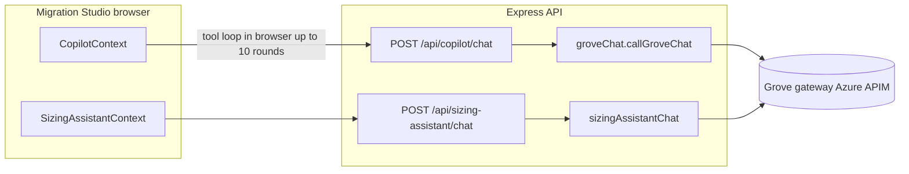

# 24 — Grove API Integration Audit

Sources: [`src/copilot/groveChat.ts`](../src/copilot/groveChat.ts),
[`src/copilot/sizingAssistantChat.ts`](../src/copilot/sizingAssistantChat.ts),
[`src/server/copilotRoutes.ts`](../src/server/copilotRoutes.ts),
[`src/routes/sizingAssistantRoute.ts`](../src/routes/sizingAssistantRoute.ts),
[`web/src/copilot/CopilotContext.tsx`](../web/src/copilot/CopilotContext.tsx)

## 1. High-Level Summary

**Grove** is MongoDB's internal OpenAI-compatible chat gateway (Azure APIM). hvyMETL uses it **only** for Migration Studio LLM chat — not for schema import, pipeline execution, design planning, or SQL translation.

All Grove traffic is **server-side**. The browser never receives `GROVE_API_KEY`. When Grove is unset, Copilot falls back to offline heuristics and slash commands; the sizing assistant shows a configuration hint and still exposes deterministic `/tools` endpoints.

See also [20-agent-copilot.md](20-agent-copilot.md) (Copilot configuration) and [21-sizing-assistant.md](21-sizing-assistant.md) (sizing chat).

## 2. Architecture



| Surface | Grove usage | Tool loop |
| --- | --- | --- |
| **Agent Copilot** (`POST /api/copilot/chat`) | One completion per HTTP request | **Client-side** — `CopilotContext.runLlmTurn` (max 10 iterations) |
| **Atlas Sizing** (`POST /api/sizing-assistant/chat`) | Server-side loop (default max 6 rounds) | **Server-side** — `runSizingAssistantChat` |
| **Query Translator** | None — offline [`sqlTranslator.ts`](../web/src/copilot/sqlTranslator.ts) | N/A |
| **Pipeline / design / ETL** | None | N/A |
| **Atlas Connectivity Architect** | Planned — prompt exists; runtime not wired ([23-atlas-connectivity-architect.md](23-atlas-connectivity-architect.md)) | TBD |

**Central module:** `src/copilot/groveChat.ts`

## 3. Configuration

| Variable | Required | Default | Role |
| --- | --- | --- | --- |
| `GROVE_API_KEY` | Yes (for LLM chat) | — | Azure APIM `api-key` header value |
| `GROVE_API_URL` | No | `https://grove-gateway-prod.azure-api.net/grove-foundry-prod/openai/v1/chat/completions` | Chat completions endpoint override |
| `GROVE_MODEL` | No | `gpt-5.6-luna` | Model id sent in request body |

Example (from [`.env.example`](../.env.example)):

```bash
GROVE_API_KEY=your_grove_api_key
# GROVE_API_URL=https://grove-gateway-prod.azure-api.net/grove-foundry-prod/openai/v1/chat/completions
# GROVE_MODEL=gpt-5.6-luna
```

**Status endpoints** (no secrets exposed):

- `GET /api/copilot/status` → `{ configured, model, mongoInspect, googleDrive }`
- `GET /api/sizing-assistant/status` → `{ configured, model }`

Both require `admin` or `developer` role on hosted studio (`requireRole` on `/api/copilot` and `/api/sizing-assistant`).

## 4. Request Payload

Each Grove call sends:

1. **System prompt** — built per feature:
   - **Copilot:** SQL schema, relationships, guardrails, migration plan collections, manager sizing, search index metadata (`buildCopilotSystemPrompt`).
   - **Sizing:** sizing instructions + optional studio seed (`buildSizingAssistantSystemPrompt`).
2. **Conversation history** — client-supplied `user` / `assistant` / `tool` messages.
3. **Tools** (when enabled) — OpenAI function definitions:
   - Copilot: `COPILOT_OPENAI_TOOLS` (canvas, workflow, Mongo inspect/index).
   - Sizing: `SIZING_ASSISTANT_OPENAI_TOOLS`.

HTTP details:

- Method: `POST`
- Header: `api-key: <GROVE_API_KEY>` (not `Authorization: Bearer`)
- Body: OpenAI chat completions shape (`model`, `messages`, optional `tools`, `tool_choice`)

## 5. Tool-Calling Design

### Migration Copilot

- `POST /api/copilot/chat` performs **one** Grove completion per request.
- The browser orchestrates the tool loop (max **10** Grove round-trips per user message):
  - Canvas mutations run locally via `executeTool`.
  - Mongo inspect/index tools call server routes.
  - Workflow tools invoke app handlers (import, pipeline panel, etc.).

### Atlas Sizing Assistant

- `POST /api/sizing-assistant/chat` runs a **server-side** tool loop (default max **6** rounds).
- Tool execution stays on the server (`executeSizingAssistantTool`); pricing fields are stripped before the client sees results.

This split is intentional but creates two Grove HTTP clients and two loop implementations to maintain.

## 6. Security Assessment

### Strengths

| Control | Implementation |
| --- | --- |
| API key isolation | `GROVE_API_KEY` read only in Node; never sent to browser or logged in `/status` |
| Route authorization | `requireRole(['admin', 'developer'])` on copilot and sizing-assistant mounts |
| Offline fallback | Copilot heuristics when Grove unset; sizing `/tools` works without LLM |
| Query Translator | Fully offline — no Grove dependency |

### Risks and Gaps

| Issue | Severity | Notes |
| --- | --- | --- |
| No fetch timeout | Medium | Hung Grove gateway can block Express workers indefinitely |
| No rate limiting on `/chat` | Medium | Authenticated users can drive unbounded LLM cost |
| Full schema in every turn | Medium (privacy/cost) | Large imports inflate prompts; may include customer table/column names |
| `GROVE_API_URL` unconstrained | Low | Env override can point anywhere — acceptable for self-hosted; document for hosted deployments |
| Sizing HTML error handling | Medium | Copilot path detects HTML 502 pages; sizing path uses `response.json()` directly |
| Client-side tool loop | Low | Up to 10 × (Grove + inspect) round trips per message; harder to cap cost server-side |

## 7. Reliability and Error Handling

### Copilot path (`groveChat.ts`) — reference implementation

- Reads response body as **text** first.
- Detects HTML error pages (common on 502/gateway failures) and throws a clear message.
- Maps HTTP errors to `502` via `handleCopilotError`; missing config → `503`.

### Sizing path (`sizingAssistantChat.ts`) — gap

`callGroveSizingCompletion` calls `response.json()` directly. If Grove returns HTML (the failure mode fixed for Copilot in Release 4.2.15), sizing chat can still throw `Unexpected token '<'`.

### Other gaps

- No retries or backoff on transient 502/503.
- No `AbortSignal` when the user closes a panel mid-request.
- Default model string duplicated in `groveChat.ts`, `copilotRoutes.ts`, and `sizingAssistantRoute.ts`.

## 8. Test Coverage

| Area | Tests |
| --- | --- |
| `groveChat.ts` config, `api-key` header, HTML errors | [`groveChat.test.ts`](../src/copilot/groveChat.test.ts) |
| Copilot routes status + chat proxy | [`copilotRoutes.test.ts`](../src/server/copilotRoutes.test.ts) |
| Sizing routes (mocked Grove) | [`sizingAssistantRoute.test.ts`](../src/routes/sizingAssistantRoute.test.ts) |
| Sizing Grove HTML error path | **Not covered** |
| End-to-end tool loops | **Not covered** (fetch mocked only) |
| Timeouts / rate limits | **Not covered** |

## 9. Code Map

| Module | Role |
| --- | --- |
| [`src/copilot/groveChat.ts`](../src/copilot/groveChat.ts) | Config, types, `callGroveChat`, HTML-safe JSON parsing |
| [`src/copilot/copilotPrompt.ts`](../src/copilot/copilotPrompt.ts) | Copilot system prompt for Grove |
| [`src/copilot/sizingAssistantChat.ts`](../src/copilot/sizingAssistantChat.ts) | Sizing Grove client + server-side tool loop |
| [`src/server/copilotRoutes.ts`](../src/server/copilotRoutes.ts) | `POST /api/copilot/chat` proxy |
| [`src/routes/sizingAssistantRoute.ts`](../src/routes/sizingAssistantRoute.ts) | `POST /api/sizing-assistant/chat` |
| [`web/src/copilot/CopilotContext.tsx`](../web/src/copilot/CopilotContext.tsx) | Client-side Grove tool loop (max 10) |
| [`web/src/sizing/SizingAssistantContext.tsx`](../web/src/sizing/SizingAssistantContext.tsx) | Sizing chat UI → `/chat` API |

## 10. Recommendations

Priority order for future hardening:

1. **Unify Grove HTTP client** — Route sizing through `callGroveChat` (or extract shared `callGroveCompletion`) so error handling and timeouts live in one place.
2. **Add fetch timeout** — e.g. 60–120s `AbortSignal`; return HTTP 504 with a clear client message.
3. **Port HTML detection to sizing** — Mirror `groveChat.ts` text-first parsing; add a test like `groveChat.test.ts`.
4. **Server-side cost guards** — Optional env cap on copilot tool rounds; per-tenant rate limiting on `/chat`.
5. **Centralize defaults** — Export `DEFAULT_GROVE_MODEL` / `DEFAULT_GROVE_URL` once; import in status routes.
6. **Prompt size awareness** — Log or metric approximate prompt size; optionally summarize very large schemas before Grove calls.
7. **Atlas Connectivity Architect** — When wired, reuse the same Grove module ([22-release-4.0-roadmap.md](22-release-4.0-roadmap.md) Phase 2+).

Phase 0 guardrails shipped in **4.3.0** are documented in [25-copilot-security.md](25-copilot-security.md).

## 11. Related Documentation

| Document | Relationship |
| --- | --- |
| [19-llm-and-models.md](19-llm-and-models.md) | Voyage/rerank vs Grove chat — different model stack |
| [20-agent-copilot.md](20-agent-copilot.md) | Copilot features, Grove env vars, API table |
| [21-sizing-assistant.md](21-sizing-assistant.md) | Sizing assistant Grove `/chat` and `/tools` |
| [23-atlas-connectivity-architect.md](23-atlas-connectivity-architect.md) | Planned Grove preset (not yet runtime) |
