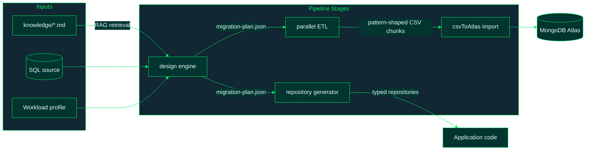

# hvyMETL Documentation

**hvyMETL** (**H**igh **V**olume **M**ongoDB **ETL**) is a RAG-driven SQL-to-MongoDB
migration toolkit. It grounds every schema decision in a retrievable knowledge base of
MongoDB schema design patterns (including all six patterns from the
[MongoDB Manual](https://www.mongodb.com/docs/manual/data-modeling/design-patterns/))
and the application's workload telemetry (read:write ratio, peak RPM, data growth),
then executes a parallel, pattern-aware ETL into MongoDB Atlas and generates a
concurrency-safe data access layer.

This documentation set follows one consistent template per module: high-level summary,
technical signatures, edge cases, conceptual code breakdown, usage example, and
refactoring notes.

**Visual reference:** [diagrams.md](diagrams.md) — Mermaid workflow, schema
transformation, `migration-plan.json` structure, ETL concurrency, CSV modeling, and
merge-mode diagrams.

## Document Map

| Document | Covers | Source |
| --- | --- | --- |
| [01-cli.md](01-cli.md) | The `hvymetl` command-line interface and runtime profile selection | `src/cli.ts` |
| [02-profiles.md](02-profiles.md) | Workload telemetry profiles, write concern, and pool tuning | `src/profiles/profiles.ts` |
| [03-knowledge-rag.md](03-knowledge-rag.md) | Pattern knowledge base, BM25 / hybrid RRF retrieval, prompt bundles | `knowledge/`, `src/rag/` |
| [12-validate-hybrid-rag.md](12-validate-hybrid-rag.md) | Validate MongoDB Model Key + hybrid BM25 + Voyage 4 + RRF | `scripts/validate-hybrid-rag.mjs` |
| [13-web-ui.md](13-web-ui.md) | Optional MongoDB-branded Migration Studio (ER diagrams, templates, AI export) | [web/README.md](../web/README.md), `src/server/` |
| [14-validate-csv-to-atlas.md](14-validate-csv-to-atlas.md) | External csvToAtlas path (`CSV_TO_ATLAS_PATH`) and validation | `src/utilities/csvToAtlas.ts` |
| [04-adapters.md](04-adapters.md) | The pluggable SQL source adapter and SQLite implementation | `src/adapters/` |
| [05-design-engine.md](05-design-engine.md) | Introspection-to-pattern decision engine and `migration-plan.json` | `src/design/` |
| [06-etl.md](06-etl.md) | Parallel worker-thread extraction, range splitting, CSV shaping | `src/etl/` |
| [07-import-cli.md](07-import-cli.md) | csvToAtlas import via `CSV_TO_ATLAS_PATH` (external [cvsToAtlas](https://github.com/7erry/cvsToAtlas)) | `scripts/import-cli.mjs` |
| [08-repogen.md](08-repogen.md) | Generated repository layer (13 MongoDB client languages) | `src/repogen/` |
| [09-utilities.md](09-utilities.md) | CSV dialect, deterministic ids, naming conversions, DDL parser | `src/utilities/` |
| [15-migration-artifacts.md](15-migration-artifacts.md) | Migration plan, design report, RAG prompts, and repository layer — purpose and when to use each | `src/design/`, `src/rag/`, `src/repogen/` |
| [16-pipeline-steps.md](16-pipeline-steps.md) | All six pipeline steps — purpose, outputs, commands, and how each stage connects | full pipeline |
| [17-ml-engine.md](17-ml-engine.md) | ML reranker (Voyage rerank-2.5), performance critic, lessons-learned self-reflection | `src/ml_engine/` |
| [18-sql-dialects.md](18-sql-dialects.md) | Eleven supported SQL dialects — SQLite live adapter vs DDL paste import | `src/dialects.ts`, `src/utilities/ddlParser.ts` |
| [10-examples.md](10-examples.md) | The seven example SQL domains and the deterministic seeder | `examples/`, `src/examples/` |
| [11-run-all-examples.md](11-run-all-examples.md) | End-to-end Atlas run for all seven domains with automated validation | `scripts/run-all-examples.mjs` |

## Architectural Role

hvyMETL is a CLI toolchain (not a service). Its six steps communicate through
artifacts on disk, so each stage can be run, inspected, and re-run independently:



## Design Pattern References

The decision rules in the design engine and the documents in `knowledge/` are grounded
in MongoDB's official **Building with Patterns** series. The summary article —
[Building with Patterns: A Summary](https://www.mongodb.com/company/blog/building-with-patterns-a-summary)
— recaps each pattern's problem, benefits, and trade-offs, and is the recommended
starting point for understanding *why* the design engine makes the choices it makes.

| hvyMETL `PatternId` | Knowledge doc | MongoDB series pattern | Trade-off noted by MongoDB |
| --- | --- | --- | --- |
| `attribute` | `knowledge/attribute.md` | Attribute | Fewer indexes, simpler queries; reshaped field access |
| `computed` | `knowledge/computed.md` | Computed | Less CPU on reads; risk of overuse, slight staleness |
| `extended-reference` | `knowledge/extended-reference.md` | Extended Reference | Fewer JOINs/$lookups; data duplication to maintain |
| `outlier` | `knowledge/outlier.md` | Outlier | Typical case stays fast; outlier handling lives in app code |
| `preallocation` | `knowledge/preallocation.md` | Pre-allocation | Simpler known structures; trades space for performance |
| `polymorphic` | `knowledge/polymorphic.md` | Polymorphic | Single-collection queries across similar shapes |
| `schema-versioning` | `knowledge/schema-versioning.md` | Schema Versioning | Zero-downtime migrations; transient dual indexes |
| `subset` | `knowledge/subset.md` | Subset | Smaller working set; the subset must be managed |
| `tree` | `knowledge/tree.md` | Tree | No recursive JOINs; app-managed graph updates |
| `bucket` | `knowledge/bucket.md` | Group Data ([Manual](https://www.mongodb.com/docs/manual/data-modeling/design-patterns/)) | Far fewer documents/index entries for time-series |
| `embed` / `reference` | `knowledge/embed-vs-reference.md` | Foundational modeling guidance | Locality vs. unbounded growth (16MB limit) |
| `archive` | `knowledge/archive.md` | [Archive Pattern](https://www.mongodb.com/docs/manual/data-modeling/design-patterns/archive/) | Hot working set stays fast; cold tier holds history |
| `single-collection` | `knowledge/single-collection.md` | [Single Collection Pattern](https://www.mongodb.com/docs/manual/data-modeling/design-patterns/single-collection/) | One copy of each entity; graph reads without `$lookup` |

Two patterns from the Building with Patterns series are intentionally **not** automated: *Approximation*
(requires application-level statistical writes) and *Document Versioning* (revision
history — distinct from *Schema Versioning*, which is automated on every collection).
Both remain candidates for future rules; see the refactoring notes in [05-design-engine.md](05-design-engine.md).

The [MongoDB Manual Schema Design Patterns](https://www.mongodb.com/docs/manual/data-modeling/design-patterns/)
page lists six first-class patterns; hvyMETL automates all six (Computed → `computed`,
Group Data → `bucket`/`outlier`, Polymorphic → `polymorphic`, Document and Schema
Versioning → `schema-versioning`, Archive → `archive`, Single Collection →
`single-collection`) plus additional Building with Patterns entries (Extended Reference,
Subset, Attribute, Tree, Pre-allocation, embed/reference).

## Quick Start

```bash
npm install && npm run build
npm run seed-examples
npm run hvymetl -- design --source examples/iot.db --profile iot --out out/iot
npm run hvymetl -- etl --plan out/iot/migration-plan.json --out out/iot --dry-run
```

### Optional: hybrid RAG with MongoDB Model Key

```bash
# Add MONGODB_MODEL_KEY to .env (Atlas → AI Services → Models → API Keys)
npm run validate-hybrid-rag
```

See [12-validate-hybrid-rag.md](12-validate-hybrid-rag.md) and [03-knowledge-rag.md](03-knowledge-rag.md).

### Optional: ML engine (reranker, critic, self-reflection)

```bash
# MONGODB_MODEL_KEY enables Voyage rerank-2.5 + lesson embeddings
# MONGODB_URI enables durable migration logs and lessons_learned memory
npm run build
# Programmatic: designFromModelWithMlEngine() — see docs/17-ml-engine.md
```

See [17-ml-engine.md](17-ml-engine.md) for the full ML pipeline, feedback loop, and cron hooks.

See the root [README.md](../README.md) for the complete end-to-end walkthrough.
