# hvyMETL — Architecture Diagrams

Visual reference for the **H**igh **V**olume **M**ongoDB **ETL** pipeline. All diagrams
render in GitHub Markdown and in the [docs index](README.md).

Pattern semantics are grounded in MongoDB's
[Building with Patterns series](https://www.mongodb.com/company/blog/building-with-patterns-a-summary).

All diagrams use the official MongoDB **LeafyGreen** dark palette
([mongodb.design palette](https://www.mongodb.design/foundations/palette),
[@leafygreen-ui/palette](https://github.com/mongodb/leafygreen-ui/tree/main/packages/palette)):

| Token | Hex | Role in diagrams |
| --- | --- | --- |
| MongoDB Black | `#001E2B` | Canvas / page background |
| Gray Dark 4 | `#112733` | Subgraph (cluster) background |
| Green Dark 3 | `#023430` | Primary node background |
| Green Dark 2 | `#00684A` | Secondary nodes / actors |
| MongoDB Green | `#00ED64` | Borders, edges, titles |
| Spring Green | `#E3FCF7` | Labels and body text |

Re-apply after editing: `node scripts/apply-mermaid-theme.mjs`

---

## 1. End-to-end migration workflow

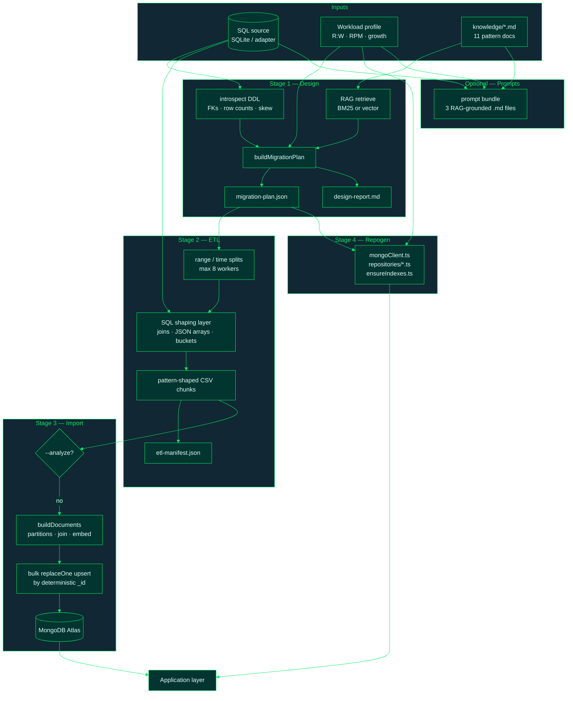

---

## 2. CLI command sequence

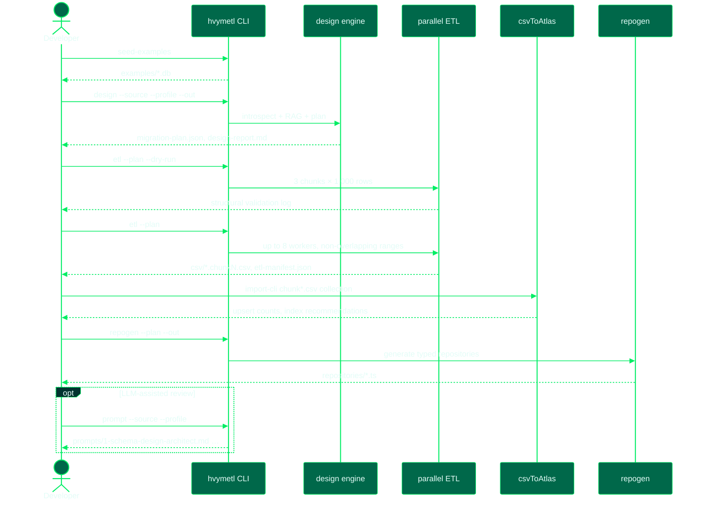

---

## 3. RAG retrieval flow

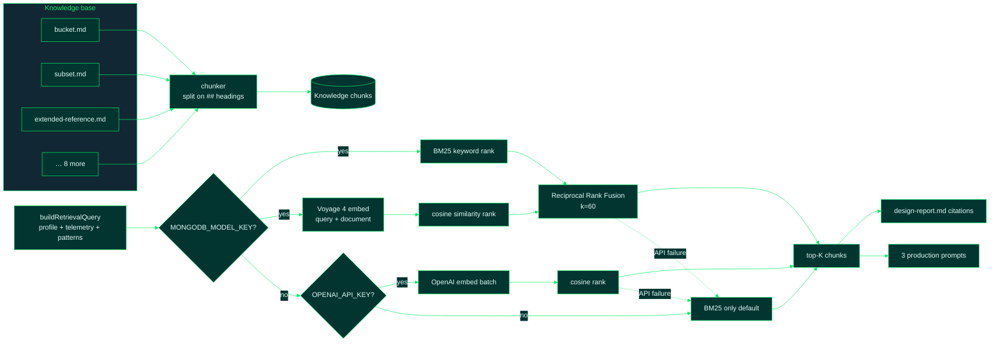

---

## 4. Design engine decision flow

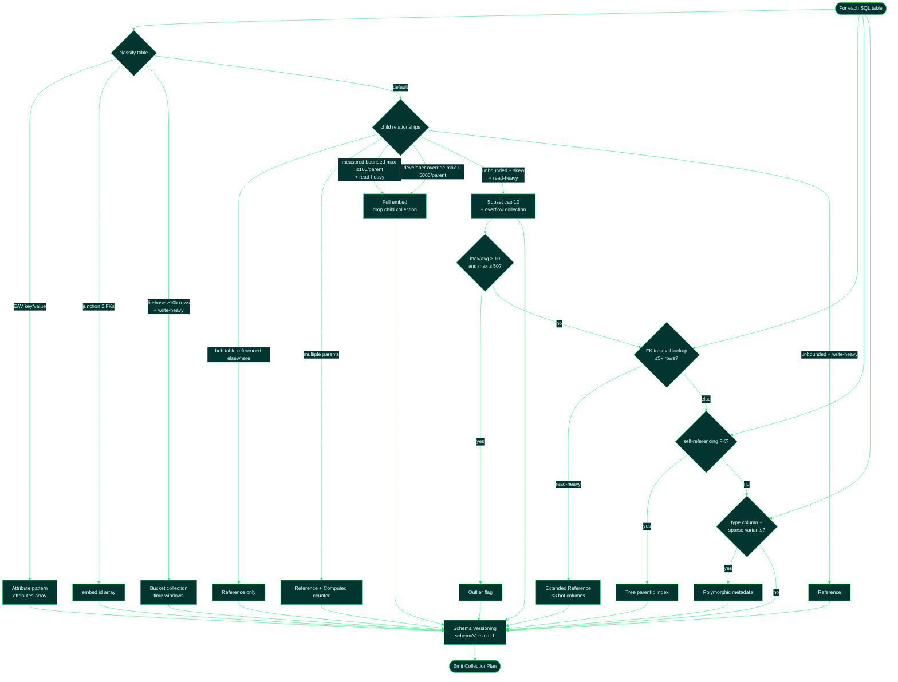

---

## 5. SQL → MongoDB schema transformation (catalog example)

Relational source on the left; pattern-driven MongoDB layout on the right.

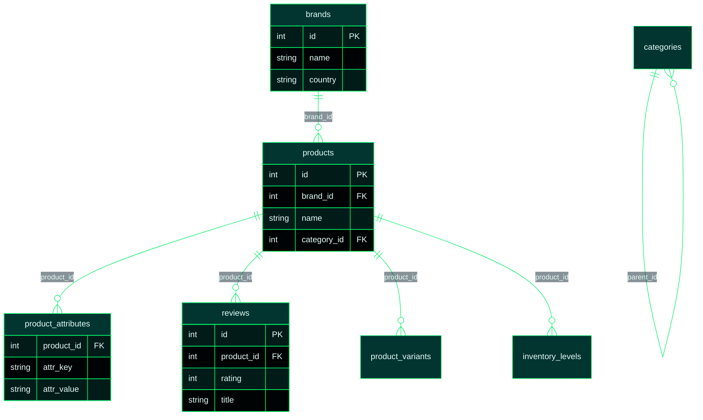

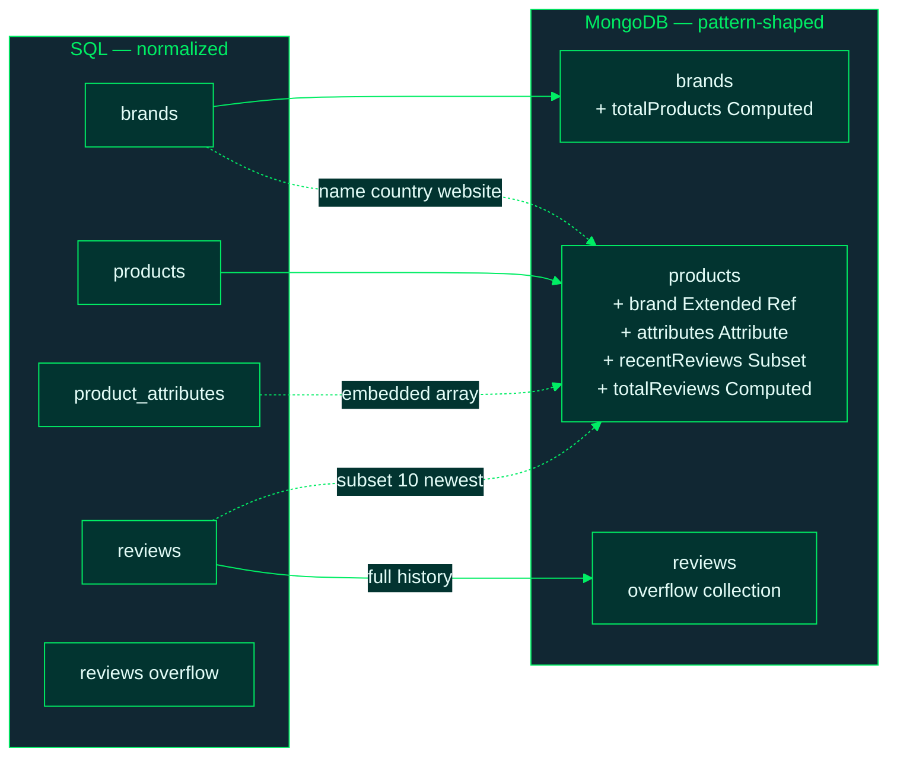

---

## 6. `migration-plan.json` structure

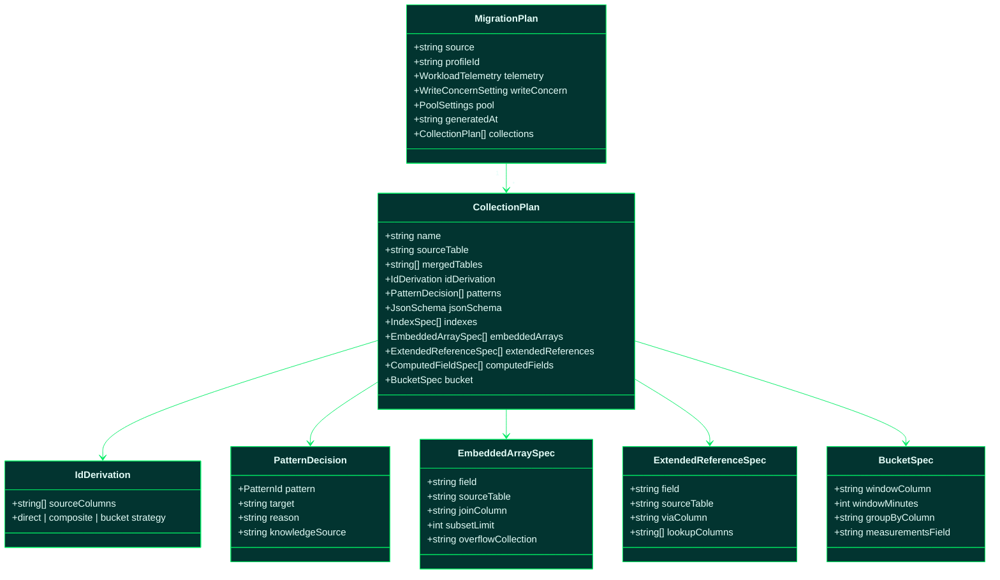

Example excerpt (products collection):

```json
{
  "name": "products",
  "idDerivation": { "sourceColumns": ["id"], "strategy": "direct" },
  "patterns": [
    { "pattern": "extended-reference", "target": "products.brand", "knowledgeSource": "extended-reference.md" },
    { "pattern": "subset", "target": "products.recentReviews", "knowledgeSource": "subset.md" },
    { "pattern": "attribute", "target": "products.attributes", "knowledgeSource": "attribute.md" }
  ],
  "embeddedArrays": [
    { "field": "recentReviews", "subsetLimit": 10, "overflowCollection": "reviews" }
  ],
  "extendedReferences": [
    { "field": "brand", "lookupColumns": ["name", "country", "website"] }
  ]
}
```

---

## 7. Parallel ETL worker pool

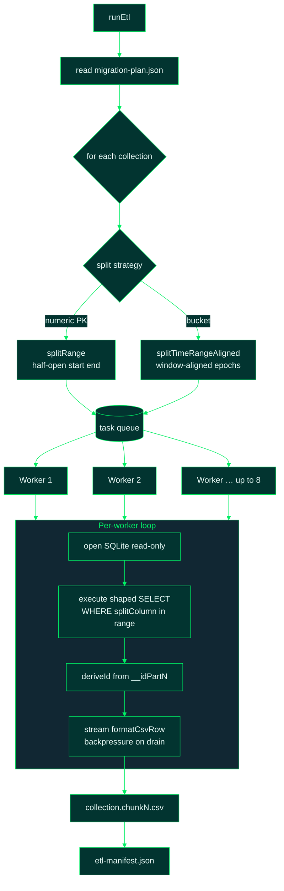

**Dry-run gate:** `DRY_RUN=true` or `--dry-run` → exactly 3 chunks × 1,000 rows per
collection with structural validation only.

---

## 8. CSV → MongoDB document modeling

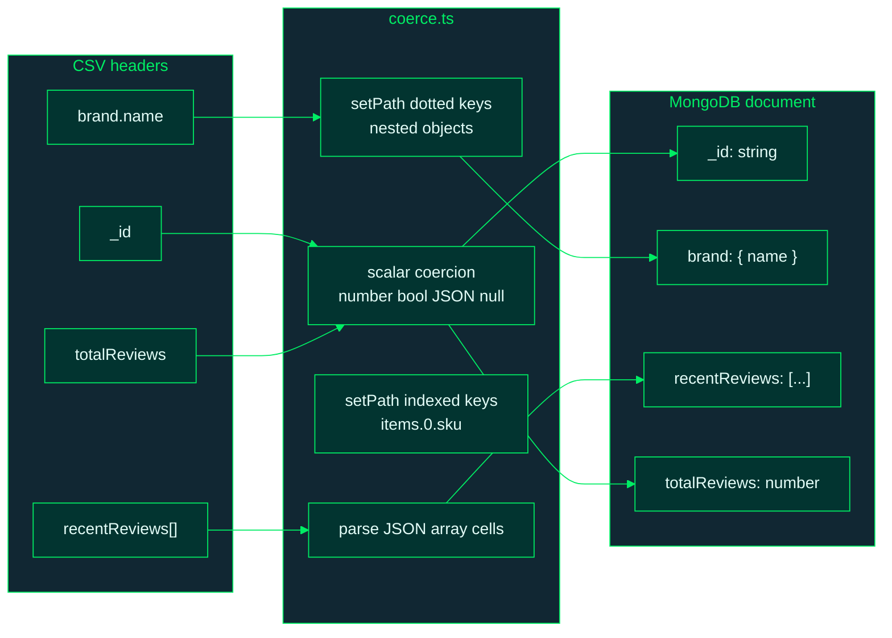

Deterministic `_id` derivation:

```mermaid
%%{init:{"theme":"base","themeVariables":{"darkMode":true,"background":"#001E2B","mainBkg":"#023430","secondBkg":"#00684A","tertiaryBkg":"#112733","primaryColor":"#00684A","primaryTextColor":"#E3FCF7","primaryBorderColor":"#00ED64","secondaryColor":"#023430","secondaryTextColor":"#E3FCF7","secondaryBorderColor":"#00A35C","tertiaryColor":"#112733","tertiaryTextColor":"#C0FAE6","tertiaryBorderColor":"#00ED64","lineColor":"#00ED64","textColor":"#E3FCF7","nodeTextColor":"#E3FCF7","clusterBkg":"#112733","clusterBorder":"#00ED64","titleColor":"#00ED64","edgeLabelBackground":"#023430","nodeBorder":"#00ED64","actorBkg":"#00684A","actorBorder":"#00ED64","actorTextColor":"#E3FCF7","signalColor":"#00ED64","labelBoxBkgColor":"#023430","labelBoxBorderColor":"#00ED64","labelTextColor":"#E3FCF7","loopTextColor":"#E3FCF7","noteBkgColor":"#112733","noteBorderColor":"#00ED64","noteTextColor":"#E3FCF7","activationBkgColor":"#00A35C","activationBorderColor":"#00ED64","sequenceNumberColor":"#E3FCF7","attributeBackgroundColorOdd":"#023430","attributeBackgroundColorEven":"#112733","classText":"#E3FCF7","classLabelColor":"#00ED64"}}}%%
flowchart LR
    PK[SQL primary key parts] --> JOIN["join with | separator"]
    JOIN --> ID["_id string"]
    ID --> UPSERT["replaceOne filter upsert true"]
    UPSERT --> SAFE[Idempotent under<br/>parallel chunk imports]
```

| Strategy | `_id` example | When |
| --- | --- | --- |
| `direct` | `"42"` | Single-column PK |
| `composite` | `"7\|2026-01-01"` | Multi-column PK or bucket group key |
| `bucket` | `"deviceId\|windowStart"` | Time-window bucket documents |

---

## 9. csvToAtlas merge modes

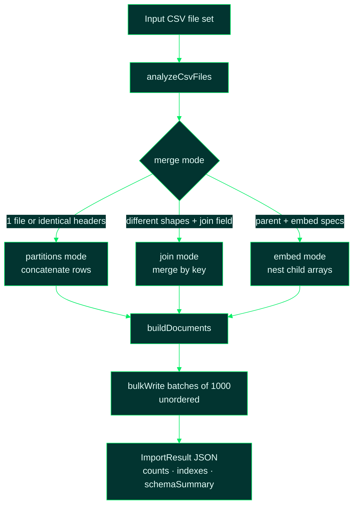

---

## 10. Generated repository atomic operations

Read-modify-write loops are forbidden; each pattern maps to one server-side modifier.

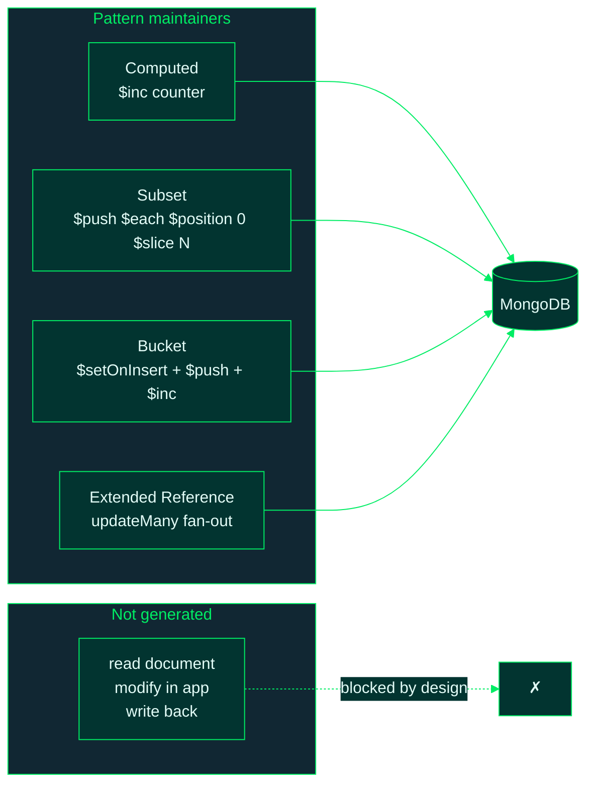

---

## 11. Workload profile → tuning mapping

```mermaid
%%{init:{"theme":"base","themeVariables":{"darkMode":true,"background":"#001E2B","mainBkg":"#023430","secondBkg":"#00684A","tertiaryBkg":"#112733","primaryColor":"#00684A","primaryTextColor":"#E3FCF7","primaryBorderColor":"#00ED64","secondaryColor":"#023430","secondaryTextColor":"#E3FCF7","secondaryBorderColor":"#00A35C","tertiaryColor":"#112733","tertiaryTextColor":"#C0FAE6","tertiaryBorderColor":"#00ED64","lineColor":"#00ED64","textColor":"#E3FCF7","nodeTextColor":"#E3FCF7","clusterBkg":"#112733","clusterBorder":"#00ED64","titleColor":"#00ED64","edgeLabelBackground":"#023430","nodeBorder":"#00ED64","actorBkg":"#00684A","actorBorder":"#00ED64","actorTextColor":"#E3FCF7","signalColor":"#00ED64","labelBoxBkgColor":"#023430","labelBoxBorderColor":"#00ED64","labelTextColor":"#E3FCF7","loopTextColor":"#E3FCF7","noteBkgColor":"#112733","noteBorderColor":"#00ED64","noteTextColor":"#E3FCF7","activationBkgColor":"#00A35C","activationBorderColor":"#00ED64","sequenceNumberColor":"#E3FCF7","attributeBackgroundColorOdd":"#023430","attributeBackgroundColorEven":"#112733","classText":"#E3FCF7","classLabelColor":"#00ED64"}}}%%
flowchart TD
    P[WorkloadProfile] --> TEL[telemetry]
    P --> WC[writeConcern]
    P --> POOL[pool settings]
    P --> PREF[preferredPatterns]

    TEL --> DESIGN[design engine<br/>pattern gating]
    PREF --> RAG[RAG retrieval query]
    WC --> CLIENT[generated mongoClient.ts]
    POOL --> CLIENT
    WC --> IMPORT[import-cli --write-concern]

    TEL -->|read ≥ 70%| READ[embed · subset · extended-ref · computed]
    TEL -->|write ≥ 60%| WRITE[bucket · reference]
    TEL -->|peakRpm ≥ 100k| BIGPOOL[large maxPoolSize]
    TEL -->|critical / ledger| MAJ[w majority + journal]
```

---

## 12. Example domain coverage

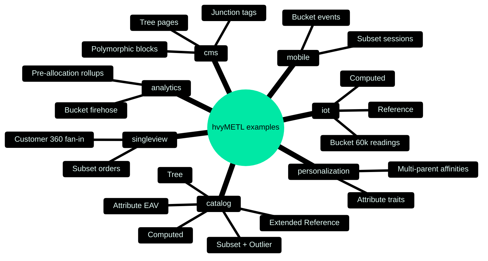
