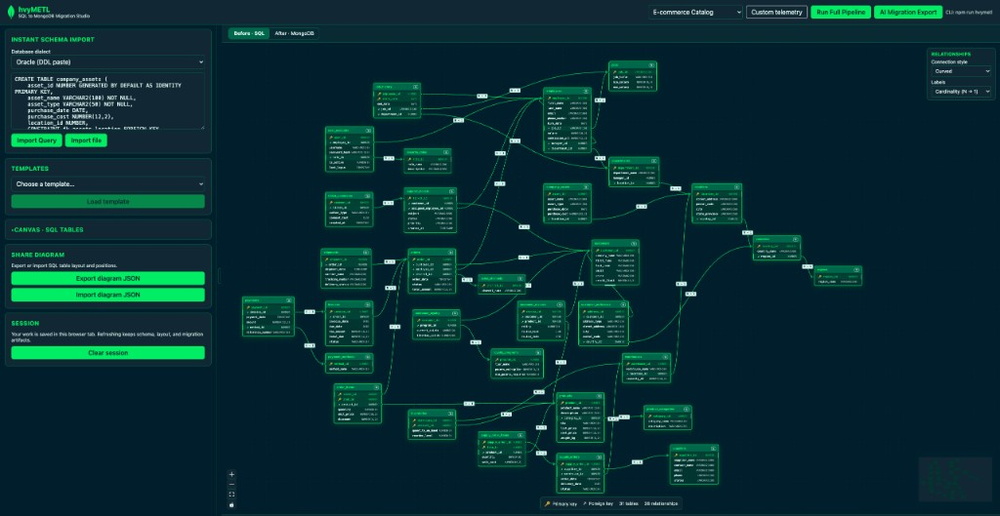
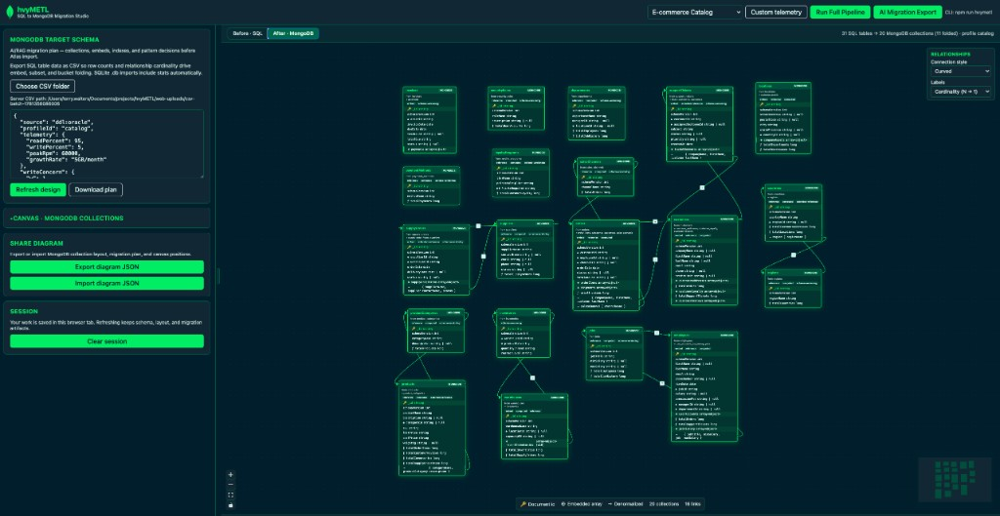
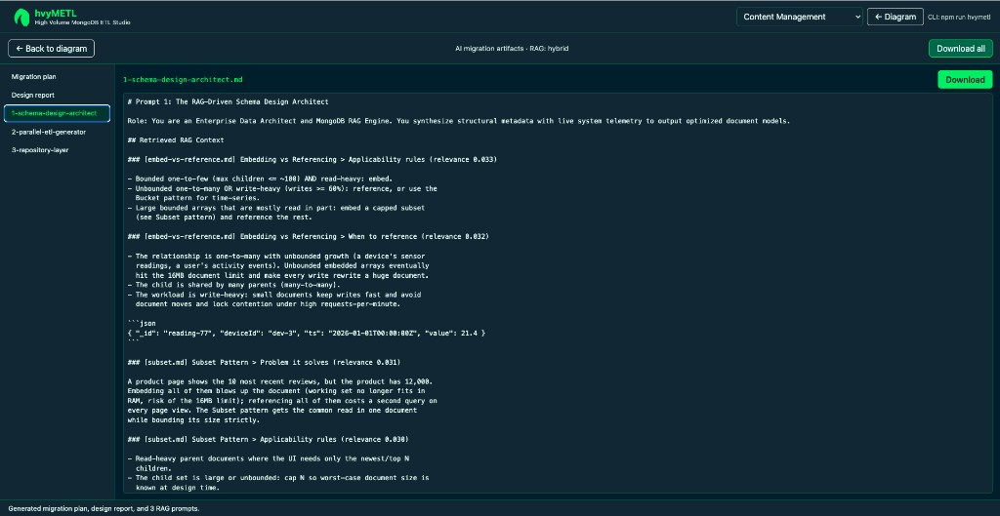
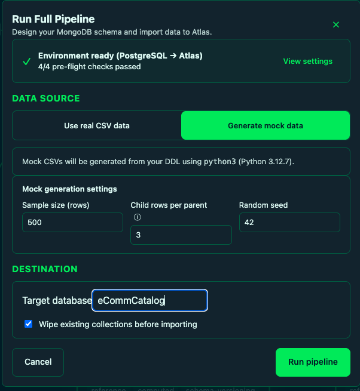

# hvyMETL Migration Studio

Optional MongoDB-branded web UI for visual schema design, ER diagrams, and AI-powered
migration export. The **CLI remains fully available** — every UI action uses the same
design engine, RAG layer, and artifacts as `npm run hvymetl`.

**Before · SQL** — source relational schema (Oracle E-commerce Catalog, 31 tables).



**After · MongoDB** — AI/RAG migration plan (20 collections, 11 tables folded).



## Quick start

From the **repository root** (not this folder alone):

```bash
npm install
cp .env.example .env   # optional: MONGODB_MODEL_KEY for hybrid RAG exports
npm run dev:ui         # http://localhost:5173  (API on :3847)
```

Production (single port):

```bash
npm run start:ui       # http://localhost:3847
```

| Command | Description |
| --- | --- |
| `npm run dev:ui` | Vite dev server + Express API (hot reload) |
| `npm run start:ui` | Build web assets and serve from API |
| `npm run build:ui` | Build API + static `web/dist` only |

Set `HVYMETL_UI_PORT` in `.env` to change the API port (default `3847`).

## Screenshots

### Before · SQL and After · MongoDB

Toggle between the source SQL ER diagram and the ML/RAG-driven MongoDB target schema.
The **Before** view shows tables, primary keys, foreign keys, and relationship cardinality.
The **After** view shows folded collections, embeds, denormalized fields, and transform
summary (e.g. `31 SQL tables → 20 MongoDB collections (11 folded)`).


### AI migration artifacts

**AI Migration Export** opens a full-screen editor for every generated artifact —
editable text, per-file download, and **Download all**. Artifacts persist in
`sessionStorage` across browser refresh.



### Repository language picker

After **AI Migration Export**, choose one of **13 MongoDB officially supported client
languages** from the **Repository language** dropdown, then click **Generate
repositories**. Generated connection, index, and repository files appear as tabs;
use **Download repositories** to save the full set.



| Language | `--lang` id | Driver |
| --- | --- | --- |
| Node.js (TypeScript) | `node` | `mongodb` |
| Python | `python` | `pymongo` |
| Go | `go` | `mongo-go-driver` |
| Java | `java` | `mongodb-driver-sync` |
| Kotlin | `kotlin` | `mongodb-driver-sync` |
| C# | `csharp` | `MongoDB.Driver` |
| Ruby | `ruby` | `mongo` gem |
| PHP | `php` | `mongodb/mongodb` |
| Rust | `rust` | `mongodb` crate |
| Scala | `scala` | `mongodb-scala` |
| Swift | `swift` | `MongoSwift` |
| C | `c` | `libmongoc` |
| C++ | `cpp` | `mongocxx` |

## Features

| Feature | How to use |
| --- | --- |
| **Instant Schema Import** | Paste DDL in the sidebar → **Import Query**, or **Import file** (`.sql`, `.ddl`, `.txt` auto-imports; `.db` for SQLite) |
| **Broad database support** | Dialect selector: PostgreSQL, MySQL, SQLite, MSSQL, ClickHouse, Oracle, IBM Db2, CockroachDB, Amazon Aurora (PostgreSQL/MySQL), Google Cloud Spanner (DDL paste); **SQLite file** upload is live |
| **Templates** | Dropdown (Laravel, Django, Twitter, catalog, iot, cms) → **Load template** |
| **Customizable ER diagrams** | Drag/zoom canvas, FK edges, minimap (React Flow) |
| **Before / After toggle** | **Before · SQL** source schema vs **After · MongoDB** migration plan canvas |
| **Table details** | Click a table on the canvas or in the sidebar list |
| **Duplicate table** | ⧉ on canvas header or sidebar |
| **Snap to grid** | Checkbox; hold **Shift** while dragging for free move |
| **Share diagrams** | Export / import diagram JSON (SQL layout or MongoDB plan + positions) |
| **Example diagrams** | Import bundled `examples/*/hvymetl-diagram-*.json` — see [10-examples.md](../docs/10-examples.md) |
| **Session state** | Auto-saved in `sessionStorage`; use **Clear session** to reset |
| **Workload profiles** | Header dropdown (catalog, cms, iot, …) |
| **AI Migration Export** | Generates migration plan JSON, design report, and 3 RAG prompts |
| **Repository codegen** | After export: pick language (C, C++, C#, Go, Java, Kotlin, Node.js, PHP, Python, Ruby, Rust, Scala, Swift) → generate + download repositories |
| **Run Full Pipeline** | Header button — design → csvToAtlas import from CSV exports |

See **[docs/15-migration-artifacts.md](../docs/15-migration-artifacts.md)** for what each
artifact is for (migration plan, design report, schema design architect prompt,
parallel ETL generator prompt, repository layer prompt vs `repogen` code).

**Six pipeline steps** (purpose, outputs, commands): **[docs/16-pipeline-steps.md](../docs/16-pipeline-steps.md)**.

## Typical workflow

1. **Import schema** — paste `CREATE TABLE` DDL, upload SQLite, load a template, or **import a bundled example diagram** (`examples/<domain>/hvymetl-diagram-*.json`).
2. **Arrange the ER diagram** — position tables on **Before · SQL**, inspect details, duplicate as needed.
3. **Switch to After · MongoDB** — run design (CSV enrichment recommended) to see folded collections.
4. **Choose a workload profile** — e.g. Content Management, IoT, Catalog.
5. **Run Full Pipeline** (optional) — prompts for missing `.env` values, runs ETL + Atlas import.
6. **AI Migration Export** — review artifacts; **Generate repositories** in your target language (13 MongoDB drivers).
7. **Optional: share** — export Before or After diagram JSON for collaboration.

### Full pipeline from the UI

Configure in `.env` (recommended):

```bash
CSV_TO_ATLAS_PATH=/path/to/cvsToAtlas
MONGODB_URI=mongodb+srv://…
MONGODB_DB=hvymetl_iot
HVYMETL_CSV_SOURCE=/path/to/csv-exports   # directory of table CSV exports
```

Then **Run Full Pipeline** in the header. Export row data from your source database
(PostgreSQL, MySQL, Oracle, Db2, etc.) as CSV files — one per table, named after the
table or collection. The modal shows what is configured vs missing and accepts
overrides for this session only (Mongo URI is never stored in `sessionStorage`).
The **schema source dialect** is taken from your schema import automatically.

### Supported SQL dialects

| Dialect | Import |
| --- | --- |
| SQLite | **File upload** or DDL paste |
| PostgreSQL, MySQL, MSSQL, ClickHouse, Oracle | DDL paste |
| IBM Db2 | DDL paste — schema-qualified tables (`SALES.ORDERS`), quoted FKs |
| CockroachDB | DDL paste — PostgreSQL-compatible (`IF NOT EXISTS`, `INT8`) |
| Amazon Aurora (PostgreSQL / MySQL) | DDL paste — same rules as PostgreSQL or MySQL |
| Google Cloud Spanner | DDL paste — trailing `PRIMARY KEY`, `INT64` / `STRING` / `BYTES` |

Full dialect IDs and parser notes: [docs/13-web-ui.md §5](../docs/13-web-ui.md#5-supported-sql-dialects).

### CLI parity

The UI covers **design**, **export**, and **full pipeline**. Individual stages remain on the CLI:

```bash
npm run hvymetl -- design --source examples/iot/iot.db --profile iot --out out/iot
npm run hvymetl -- etl --plan out/iot/migration-plan.json --out out/iot
npm run import-cli -- out/iot/csv/*.csv sensorReadings --db hvymetl_iot
```

See the root [README](../README.md) and [docs/13-web-ui.md](../docs/13-web-ui.md).

## Environment

Loaded by the Express API (`src/server/index.ts`):

| Variable | Required | Purpose |
| --- | --- | --- |
| `MONGODB_MODEL_KEY` | no | Hybrid RAG (BM25 + Voyage 4 + RRF) on AI export |
| `OPENAI_API_KEY` | no | Vector-only RAG when Model Key is unset |
| `HVYMETL_UI_PORT` | no | API port (default `3847`) |

Schema import and diagram editing work **offline** with no API keys.

## Project structure

```
web/
├── src/
│   ├── App.tsx                 # Main layout, sidebar, routing between views
│   ├── api.ts                  # Fetch helpers for /api/*
│   ├── sessionState.ts         # sessionStorage persistence
│   ├── theme.css               # MongoDB LeafyGreen palette
│   └── components/
│       ├── SchemaCanvas.tsx    # React Flow ER canvas
│       ├── TableNode.tsx       # Table card on canvas
│       ├── TableDetails.tsx    # Column / PK / FK panel
│       ├── MigrationArtifactsView.tsx
│       └── MongoLogo.tsx
├── public/templates/           # SQL templates served by API
├── docs/screenshots/           # README images
└── vite.config.ts              # Dev proxy: /api → :3847
```

## API (dev proxy)

During `npm run dev:ui`, Vite proxies `/api/*` to the Express server. Endpoints:

| Method | Path | Purpose |
| --- | --- | --- |
| `GET` | `/api/health` | Health check |
| `GET` | `/api/profiles` | Workload presets |
| `GET` | `/api/dialects` | Database dialect labels |
| `GET` | `/api/templates` | Template DDL + parsed model |
| `POST` | `/api/schema/import-ddl` | Parse pasted DDL |
| `POST` | `/api/schema/import-sqlite` | Upload `.db` file |
| `POST` | `/api/design` | Run design engine |
| `POST` | `/api/export/migration` | Migration plan + design report |
| `POST` | `/api/export/prompts` | RAG prompt bundle |

## Diagram export format

```json
{
  "version": 1,
  "name": "ddl:postgresql",
  "dialect": "postgresql",
  "ddl": "CREATE TABLE …",
  "model": { "tables": [], "relationships": [] },
  "positions": { "users": { "x": 40, "y": 40 } },
  "exportedAt": "2026-06-11T00:00:00.000Z"
}
```

## Branding

Official MongoDB **LeafyGreen** colors per [mongodb.design](https://www.mongodb.design/foundations/palette):

- `#001E2B` — black
- `#00ED64` — green base
- `#00684A` — green dark
- `#E3FCF7` — spring green (text on dark)

## Local development (this package only)

```bash
cd web
npm install
npm run dev          # Vite only — needs API running separately on :3847
```

For full-stack dev, always use `npm run dev:ui` from the repo root.
