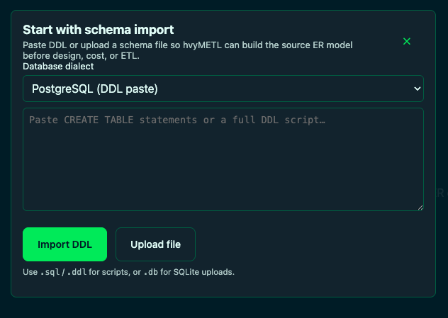
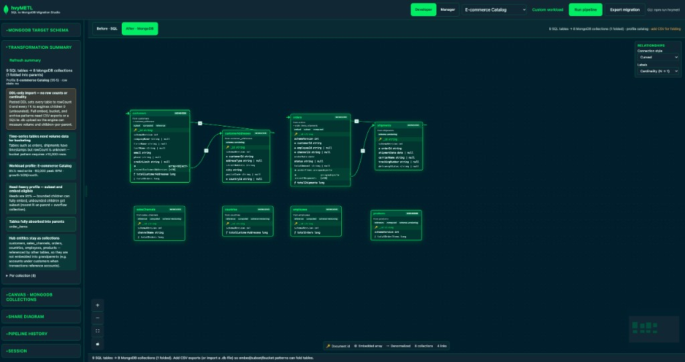
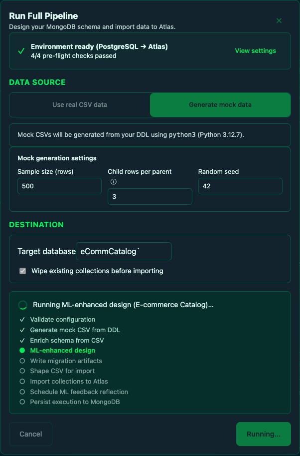

# hvyMETL Migration Studio

Optional MongoDB-branded web UI for visual schema design, ER diagrams, and AI-powered
migration export. The **CLI remains fully available** — every UI action uses the same
design engine, RAG layer, and artifacts as `npm run hvymetl`.

**Before · SQL** — source relational schema with the new developer wizard sidebar.


**After · MongoDB** — AI/RAG migration plan with collapsible controls and transformation summary.


## Prerequisites

Run Migration Studio from the **repository root**. Install these first:

| Requirement | Version / Notes | Needed for |
| --- | --- | --- |
| **Node.js** | `20` or newer | API server, Vite UI, TypeScript build |
| **npm** | Installed with Node.js | Dependency install and scripts |
| **Git** | Any current version | Clone/update the project |
| **MongoDB Atlas URI** | Set `MONGODB_URI` in `.env` | Full pipeline import, execution history, ML feedback persistence |
| **[csvToAtlas](https://github.com/7erry/cvsToAtlas) clone** | Set `CSV_TO_ATLAS_PATH` in `.env` | Full pipeline CSV import into Atlas |
| **MongoDB Model Key or OpenAI key** | Optional | Hybrid/vector RAG; UI still works offline with BM25 |

Minimum local UI workflow:

```bash
node --version      # must be 20+
npm --version
npm install
```

After upgrading Node.js, rebuild the native SQLite dependency:

```bash
npm rebuild better-sqlite3
```

## Quick start

From the **repository root**:

```bash
npm install
cp .env.example .env   # optional for design; required values depend on pipeline features
npm run dev:ui         # http://localhost:3847
```

Production (single port):

```bash
npm run start:ui       # http://localhost:3847
```

| Command | Description |
| --- | --- |
| `npm run dev:ui` | Single server on `:3847` — API + Vite hot reload |
| `npm run start:ui` | Build web assets and serve from API |
| `npm run build:ui` | Build API + static `web/dist` only |

Set `HVYMETL_UI_PORT` in `.env` to change the API port (default `3847`).

## Hosted Studio (https://hvymetl.studio)

The public hosted Migration Studio uses **Auth0 Universal Login** (Google, Facebook,
and other social/enterprise connections configured in your Auth0 tenant).

| Role | Access |
| --- | --- |
| **admin** | Developer + Manager views; can switch interface role |
| **developer** | Schema import, design, export, pipeline, repogen |
| **manager** | Manager review dashboard and cost projections |

Assign roles in Auth0 (custom claim `https://hvymetl.studio/roles` by default). Local
development skips login when Auth0 env vars are unset.

**API (server `.env`):**

| Variable | Description |
| --- | --- |
| `AUTH0_ISSUER_BASE_URL` | Auth0 tenant URL, e.g. `https://YOUR_TENANT.us.auth0.com/` |
| `AUTH0_AUDIENCE` | API identifier, e.g. `https://api.hvymetl.studio` |
| `AUTH0_SPA_CLIENT_ID` | Auth0 SPA client ID (served to the web UI via `/api/auth/config`) |
| `AUTH0_ROLES_CLAIM` | JWT claim for roles (default `https://hvymetl.studio/roles`) |
| `HVYMETL_AUTH_DISABLED` | Set to `1` to bypass JWT checks locally |

**Web (Vite build env, e.g. `web/.env.local`):**

| Variable | Description |
| --- | --- |
| `VITE_AUTH0_DOMAIN` | Auth0 tenant domain |
| `VITE_AUTH0_CLIENT_ID` | SPA client ID |
| `VITE_AUTH0_AUDIENCE` | Same API audience as the server |
| `VITE_AUTH0_ROLES_CLAIM` | Optional; defaults to `https://hvymetl.studio/roles` |

Configure Auth0 **Allowed Callback URLs** and **Allowed Logout URLs** for
`http://localhost:3847` and `https://hvymetl.studio`.

### Auth0 setup walkthrough

Follow these steps once in the [Auth0 Dashboard](https://manage.auth0.com/) to enable
login on local dev and [https://hvymetl.studio](https://hvymetl.studio).

**1. Create the API (server audience)**

- **Applications → APIs → Create API**
- Name: `hvyMETL API`
- Identifier: `https://api.hvymetl.studio` (use this exact string)
- Signing algorithm: RS256
- Under **RBAC Settings**, enable **Enable RBAC** → **Save** (required so Login Actions see assigned roles)
- Copy the identifier into root `.env` as `AUTH0_AUDIENCE` and into `web/.env.local` as
  `VITE_AUTH0_AUDIENCE`

**2. Create the SPA application (web login)**

- **Applications → Applications → Create Application**
- Name: `hvyMETL Studio`
- Type: **Single Page Application**
- Copy **Domain** → `VITE_AUTH0_DOMAIN` (domain only, e.g. `dev-xxxxx.us.auth0.com`)
- Copy **Client ID** → `VITE_AUTH0_CLIENT_ID`
- Set **Allowed Callback URLs**:
  ```
  http://localhost:3847, https://hvymetl.studio
  ```
- Set **Allowed Logout URLs** (same as above)
- Set **Allowed Web Origins** (same as above)

**3. Authorize the SPA to call the API**

Without this step, login fails with *Client "…" is not authorized to access resource server
"https://api.hvymetl.studio"*.

- **Applications → APIs → hvyMETL API → Settings**
- Under **Application Access Policy**, set **User-Delegated Access** to **All apps allowed**
  (simplest), or **Per-app authorization** if you prefer explicit grants
- Enable **Allow Skipping User Consent** (recommended for your own first-party SPA)
- Save

If you chose **Per-app authorization**:

- Open the **Application Access** tab on the same API
- Find **hvyMETL Studio** (`VITE_AUTH0_CLIENT_ID` / `AUTH0_SPA_CLIENT_ID`)
- **Grant Access** for **User-Delegated Access** (scopes can be empty — hvyMETL uses custom role
  claims, not API scopes)
- Save

**4. Configure the server issuer**

In the repo root `.env`:

```bash
AUTH0_ISSUER_BASE_URL=https://YOUR_TENANT.us.auth0.com/
AUTH0_AUDIENCE=https://api.hvymetl.studio
AUTH0_ROLES_CLAIM=https://hvymetl.studio/roles
```

`AUTH0_ISSUER_BASE_URL` is the tenant URL **with** `https://` and a trailing `/`.
`VITE_AUTH0_DOMAIN` is the same tenant **without** `https://`.

**5. Configure the web build**

Create `web/.env.local`:

```bash
VITE_AUTH0_DOMAIN=YOUR_TENANT.us.auth0.com
VITE_AUTH0_CLIENT_ID=your_spa_client_id
VITE_AUTH0_AUDIENCE=https://api.hvymetl.studio
VITE_AUTH0_ROLES_CLAIM=https://hvymetl.studio/roles
```

Rebuild or restart after changing Vite env vars (`npm run dev:ui` or redeploy hosted UI).

**6. Enable social logins (optional)**

- **Authentication → Social** → enable Google, Facebook, GitHub, etc.
- Each provider needs its own OAuth app credentials in Auth0

**7. Add roles and inject them into tokens**

Role names must match **exactly** (lowercase): `admin`, `developer`, `manager`.

1. **User Management → Roles → Create Role** — create all three (or at least one for your user).
   The role **name** must be exactly `admin`, `developer`, or `manager` (lowercase — not `Admin` or
   `adming`).
2. **User Management → Users** → open your user → **Roles** tab → assign **`admin`** (full access) or
   `developer` / `manager` as needed
3. **Actions → Library → Build Custom** → trigger **Login / Post Login** → name e.g. `Add hvyMETL roles`

Use this Action to inject roles into tokens. It also grants **`developer`** automatically when a user
has no roles yet (first Google/social login):

```javascript
exports.onExecutePostLogin = async (event, api) => {
  const namespace = 'https://hvymetl.studio/roles';
  const defaultRole = 'developer';
  let roles = event.authorization?.roles ?? [];

  if (roles.length === 0) {
    roles = [defaultRole];
  }

  api.accessToken.setCustomClaim(namespace, roles);
  api.idToken.setCustomClaim(namespace, roles);
};
```

This works on the **first login** without a separate post-registration Action. Roles are written
directly into the token; you do not need to manually assign `developer` in the dashboard for each
new user.

Optional — also persist the role in Auth0 (visible under **Users → Roles**): add Action secrets
`AUTH0_DOMAIN`, `M2M_CLIENT_ID`, `M2M_CLIENT_SECRET`, and `DEVELOPER_ROLE_ID` (from
**User Management → Roles → developer**), then extend the Action:

```javascript
exports.onExecutePostLogin = async (event, api) => {
  const namespace = 'https://hvymetl.studio/roles';
  const defaultRole = 'developer';
  let roles = event.authorization?.roles ?? [];

  if (roles.length === 0) {
    roles = [defaultRole];
    if (event.secrets.DEVELOPER_ROLE_ID) {
      const { ManagementClient } = require('auth0');
      const management = new ManagementClient({
        domain: event.secrets.AUTH0_DOMAIN,
        clientId: event.secrets.M2M_CLIENT_ID,
        clientSecret: event.secrets.M2M_CLIENT_SECRET,
      });
      await management.users.assignRoles(
        { id: event.user.user_id },
        { roles: [event.secrets.DEVELOPER_ROLE_ID] },
      );
    }
  }

  api.accessToken.setCustomClaim(namespace, roles);
  api.idToken.setCustomClaim(namespace, roles);
};
```

Create the M2M app under **Applications → Create → Machine to Machine** → authorize **Auth0
Management API** with scopes `read:roles` and `update:users`.

4. **Deploy** the Action
5. Attach the Action to the **post-login** trigger (Auth0 moved this; there is no separate **Flows** menu in newer tenants):
   - **Option A:** After **Deploy**, click **Add to flow** on the success banner (if shown)
   - **Option B:** **Actions → Triggers** → under **Signup and Login**, open **post-login** (or **Login / Post Login**) → drag your Action from **Custom** into the pipeline → **Apply**
   - Older tenants: **Actions → Flows → Login** → drag → **Apply**
6. **Sign out** of hvymetl.studio and **sign in again** (roles are baked in at login; refreshing is not enough)

If you still see *Access pending*, decode your ID token at [jwt.io](https://jwt.io) and confirm it
contains `"https://hvymetl.studio/roles": ["admin"]` (or `developer` / `manager`). Missing claim
→ Action not in the Login flow or no role assigned to the user.

**8. Verify**

| Check | Expected |
| --- | --- |
| Local with Auth0 env unset | No login gate; full access as `local-dev` tenant |
| Local with Auth0 configured | Sign-in screen; API calls include Bearer token |
| User with `developer` role | Developer UI only |
| User with `manager` role | Manager UI only |
| User with `admin` role | Can switch Developer / Manager |
| `GET /api/auth/config` | `{ "authEnabled": true, ... }` when server Auth0 vars are set |

For hosted deploys, set `AUTH0_*` on the API server (including `AUTH0_SPA_CLIENT_ID` so the
UI can load Auth0 settings from `GET /api/auth/config` without build-time `VITE_AUTH0_*`).
Optionally set `VITE_AUTH0_*` at web build time instead. Set `HVYMETL_AUTH_DISABLED=1` only for local
testing without JWT checks.

**Production deploy (https://hvymetl.studio):** use `npm run start:ui` so the server
serves static `web/dist`. Do **not** run `npm run dev:ui` or set `HVYMETL_DEV_PROXY=1` in
production — that serves the Vite dev client and requires `VITE_AUTH0_*` in the **runtime**
environment instead of at build time. If `/` references `/@vite/client`, the site is in dev
mode and Auth0 login will not work unless those runtime vars are set.

**Multi-tenant isolation:** Each authenticated user is scoped by Auth0 `sub`. Uploads,
design/pipeline artifacts, and workspace settings live under
`web-uploads/tenants/{user}/` and `out/tenants/{user}/`. Pipeline execution history
and Atlas import defaults are filtered per user so tenants cannot read each other's
files or settings. Local development uses the shared `local-dev` tenant when Auth0
env vars are unset.

**MongoDB from hvymetl.studio:** The pipeline connects to Atlas from the **hosted
server**, not your laptop. If the URI works locally but fails on
[https://hvymetl.studio](https://hvymetl.studio), open Atlas → **Network Access** and
allow the studio server's egress IP (shown in the pipeline dialog when the check
fails), or add **Allow Access from Anywhere** (`0.0.0.0/0`) while testing. Your
home/office IP being allowed is not enough.

**Terms and Conditions:** [https://hvymetl.studio/terms](/terms) — also linked from the
app header and login screen.

The UI layout is responsive for phone-sized screens: header controls wrap, sidebars
stack above the canvas, and modals expand to full screen on narrow viewports.

## Screenshots

### Schema import wizard

Every developer workflow starts with source schema import. Paste DDL or upload a
`.sql`, `.ddl`, `.txt`, `.db`, `.sqlite`, or `.sqlite3` file before design, cost, or
pipeline actions.



### Before · SQL and After · MongoDB

Toggle between the source SQL ER diagram and the ML/RAG-driven MongoDB target schema.
The **Before** view shows tables, primary keys, foreign keys, and relationship cardinality.
The **After** view shows folded collections, embeds, denormalized fields, and transform
summary (e.g. `31 SQL tables → 20 MongoDB collections (11 folded)`).


### Full pipeline with mock data

The pipeline dialog validates MongoDB, csvToAtlas, dialect, and mock CSV generation
before running design → CSV shaping → Atlas import.



During execution, the modal shows each pipeline stage so teams can see whether the run
is validating, generating mock CSVs, designing, shaping, importing, reflecting, or
persisting execution history.



### Manager review and cost visibility

Manager View highlights migration readiness, blocked collections, and cost-projection
controls so business owners can review architecture and savings before cutover.


### AI migration artifacts

**AI Migration Export** opens a full-screen editor for every generated artifact —
editable text, per-file download, and **Download all**. Artifacts persist in
`sessionStorage` across browser refresh.


### Repository language picker

After **AI Migration Export**, choose one of **13 MongoDB officially supported client
languages** from the **Repository language** dropdown, then click **Generate
repositories**. Generated connection, index, and repository files appear as tabs;
use **Download repositories** to save the full set.


| Language | `--lang` id | Driver |
| --- | --- | --- |
| Node.js (TypeScript) | `node` | `mongodb` |
| Python | `python` | `pymongo` |
| Go | `go` | `mongo-go-driver` |
| Java | `java` | `mongodb-driver-sync` |
| Kotlin | `kotlin` | `mongodb-driver-sync` |
| C# | `csharp` | `MongoDB.Driver` |
| Ruby | `ruby` | `mongo` gem |
| PHP | `php` | `mongodb/mongodb` |
| Rust | `rust` | `mongodb` crate |
| Scala | `scala` | `mongodb-scala` |
| Swift | `swift` | `MongoSwift` |
| C | `c` | `libmongoc` |
| C++ | `cpp` | `mongocxx` |

## Features

| Feature | How to use |
| --- | --- |
| **Instant Schema Import** | Paste DDL in the sidebar → **Import Query**, or **Import file** (`.sql`, `.ddl`, `.txt` auto-imports; `.db` for SQLite) |
| **Broad database support** | Dialect selector: PostgreSQL, MySQL, SQLite, MSSQL, ClickHouse, Oracle, IBM Db2, CockroachDB, Amazon Aurora (PostgreSQL/MySQL), Google Cloud Spanner (DDL paste); **SQLite file** upload is live |
| **Embed Overrides** | Before view → **Embed Overrides** → enter max child rows per parent and/or check **Force embed** for linked FK relationships when CSV/live stats are unavailable |
| **Templates** | Dropdown (Laravel, Django, Twitter, catalog, iot, cms) → **Load template** |
| **Customizable ER diagrams** | Drag/zoom canvas, FK edges, minimap (React Flow) |
| **Before / After toggle** | **Before · SQL** source schema vs **After · MongoDB** migration plan canvas |
| **Transformation summary** | After view explains why patterns/embeds were or were not applied (profile gates, CSV stats, hub tables, subset vs fold) |
| **Pipeline history** | Sidebar lists recent runs from `GET /api/pipeline/executions` (requires `MONGODB_URI` on API server) |
| **Table details** | Click a table on the canvas or in the sidebar list |
| **Duplicate table** | ⧉ on canvas header or sidebar |
| **Snap to grid** | Checkbox; hold **Shift** while dragging for free move |
| **Share diagrams** | Export / import diagram JSON (SQL layout or MongoDB plan + positions) |
| **Example diagrams** | Import bundled `examples/*/hvymetl-diagram-*.json` — see [10-examples.md](../docs/10-examples.md) |
| **Session state** | Auto-saved in `sessionStorage`; use **Clear session** to reset |
| **Workload profiles** | Header dropdown (catalog, cms, iot, …) |
| **AI Migration Export** | Generates migration plan JSON, design report, and 3 RAG prompts |
| **Repository codegen** | After export: pick language (C, C++, C#, Go, Java, Kotlin, Node.js, PHP, Python, Ruby, Rust, Scala, Swift) → generate + download repositories |
| **Run Full Pipeline** | Header button — design → csvToAtlas import from CSV exports |

See **[docs/15-migration-artifacts.md](../docs/15-migration-artifacts.md)** for what each
artifact is for (migration plan, design report, schema design architect prompt,
parallel ETL generator prompt, repository layer prompt vs `repogen` code).

**Six pipeline steps** (purpose, outputs, commands): **[docs/16-pipeline-steps.md](../docs/16-pipeline-steps.md)**.

## Typical workflow

1. **Import schema** — paste `CREATE TABLE` DDL, upload SQLite, load a template, or **import a bundled example diagram** (`examples/<domain>/hvymetl-diagram-*.json`).
2. **Arrange the ER diagram** — position tables on **Before · SQL**, inspect details, duplicate as needed.
3. **Optional: guide embedding** — if you do not have CSV/live stats yet, open **Embed Overrides** and either enter max child rows per parent or check **Force embed** for linked tables you intentionally want folded into one collection.
4. **Switch to After · MongoDB** — run design (CSV enrichment recommended) to see folded collections.
5. **Choose a workload profile** — e.g. Content Management, IoT, Catalog.
6. **Run Full Pipeline** (optional) — prompts for missing `.env` values, runs ETL + Atlas import.
7. **AI Migration Export** — review artifacts; **Generate repositories** in your target language (13 MongoDB drivers).
8. **Optional: share** — export Before or After diagram JSON for collaboration.

### Embed overrides without CSV

Pasted DDL does not include row counts or `max children per parent`, so hvyMETL defaults
to conservative reference/subset choices. In the Before view, use **Embed Overrides**
to supply a developer-known max for a relationship, such as
`locations -> company_assets (location_id) = 5`. Values from `1` through `5000` are
treated as bounded developer intent and can force full embedding for that relationship
when you refresh design.

When the design intent is known but row counts are not, check **Force embed** on one or
more linked FK relationships. hvyMETL will fold each selected child table into its
parent collection and drop the standalone child collection from the generated plan.
Force embed is only offered for relationships discovered from actual foreign keys, so
it cannot create unrelated table merges.

Changing overrides clears the old migration plan so stale After-view results are not
reused.

CSV exports or SQLite introspection are still preferred for production validation
because they measure row counts and fan-out directly.

### Full pipeline from the UI

Configure in `.env` (recommended):

```bash
CSV_TO_ATLAS_PATH=/path/to/cvsToAtlas
MONGODB_URI=mongodb+srv://…
MONGODB_DB=hvymetl_iot
HVYMETL_CSV_SOURCE=/path/to/csv-exports   # directory of table CSV exports
```

Then **Run Full Pipeline** in the header. Export row data from your source database
(PostgreSQL, MySQL, Oracle, Db2, etc.) as CSV files — one per table, named after the
table or collection. The modal shows what is configured vs missing and accepts
overrides for this session only (Mongo URI is never stored in `sessionStorage`).
The **schema source dialect** is taken from your schema import automatically.

### Supported SQL dialects

| Dialect | Import |
| --- | --- |
| SQLite | **File upload** or DDL paste |
| PostgreSQL, MySQL, MSSQL, ClickHouse, Oracle | DDL paste |
| IBM Db2 | DDL paste — schema-qualified tables (`SALES.ORDERS`), quoted FKs |
| CockroachDB | DDL paste — PostgreSQL-compatible (`IF NOT EXISTS`, `INT8`) |
| Amazon Aurora (PostgreSQL / MySQL) | DDL paste — same rules as PostgreSQL or MySQL |
| Google Cloud Spanner | DDL paste — trailing `PRIMARY KEY`, `INT64` / `STRING` / `BYTES` |

Full dialect IDs and parser notes: [docs/13-web-ui.md §5](../docs/13-web-ui.md#5-supported-sql-dialects).

### CLI parity

The UI covers **design**, **export**, and **full pipeline**. Individual stages remain on the CLI:

```bash
npm run hvymetl -- design --source examples/iot/iot.db --profile iot --out out/iot
npm run hvymetl -- etl --plan out/iot/migration-plan.json --out out/iot
npm run import-cli -- out/iot/csv/*.csv sensorReadings --db hvymetl_iot
```

See the root [README](../README.md) and [docs/13-web-ui.md](../docs/13-web-ui.md).

## Environment

Loaded by the Express API (`src/server/index.ts`):

| Variable | Required | Purpose |
| --- | --- | --- |
| `MONGODB_MODEL_KEY` | no | Hybrid RAG (BM25 + Voyage 4 + RRF) on AI export |
| `OPENAI_API_KEY` | no | Vector-only RAG when Model Key is unset |
| `HVYMETL_UI_PORT` | no | API port (default `3847`) |

Schema import and diagram editing work **offline** with no API keys.

## Project structure

```
web/
├── src/
│   ├── App.tsx                 # Main layout, sidebar, routing between views
│   ├── api.ts                  # Fetch helpers for /api/*
│   ├── sessionState.ts         # sessionStorage persistence
│   ├── theme.css               # MongoDB LeafyGreen palette
│   └── components/
│       ├── SchemaCanvas.tsx    # React Flow ER canvas
│       ├── TableNode.tsx       # Table card on canvas
│       ├── TableDetails.tsx    # Column / PK / FK panel
│       ├── MigrationArtifactsView.tsx
│       └── MongoLogo.tsx
├── public/templates/           # SQL templates served by API
├── docs/screenshots/           # README images
└── vite.config.ts              # Dev proxy: /api → :3847
```

## API (dev proxy)

During `npm run dev:ui`, Vite proxies `/api/*` to the Express server. Endpoints:

| Method | Path | Purpose |
| --- | --- | --- |
| `GET` | `/api/health` | Health check |
| `GET` | `/api/profiles` | Workload presets |
| `GET` | `/api/dialects` | Database dialect labels |
| `GET` | `/api/templates` | Template DDL + parsed model |
| `POST` | `/api/schema/import-ddl` | Parse pasted DDL |
| `POST` | `/api/schema/import-sqlite` | Upload `.db` file |
| `POST` | `/api/design/explain` | Explain pattern decisions for model + optional plan |
| `POST` | `/api/design` | Run design engine |
| `GET` | `/api/pipeline/executions?limit=20` | Recent pipeline runs from memory DB |
| `GET` | `/api/pipeline/executions/:executionId` | One run (plan, design report, manifest) |
| `POST` | `/api/export/migration` | Migration plan + design report |
| `POST` | `/api/export/prompts` | RAG prompt bundle |

## Diagram export format

```json
{
  "version": 1,
  "name": "ddl:postgresql",
  "dialect": "postgresql",
  "ddl": "CREATE TABLE …",
  "model": { "tables": [], "relationships": [] },
  "positions": { "users": { "x": 40, "y": 40 } },
  "exportedAt": "2026-06-11T00:00:00.000Z"
}
```

## Branding

Official MongoDB **LeafyGreen** colors per [mongodb.design](https://www.mongodb.design/foundations/palette):

- `#001E2B` — black
- `#00ED64` — green base
- `#00684A` — green dark
- `#E3FCF7` — spring green (text on dark)

## Local development (this package only)

```bash
cd web
npm install
npm run dev          # Vite only — needs API running separately on :3847
```

For full-stack dev, always use `npm run dev:ui` from the repo root.
